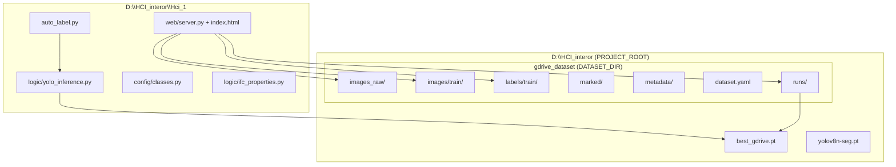
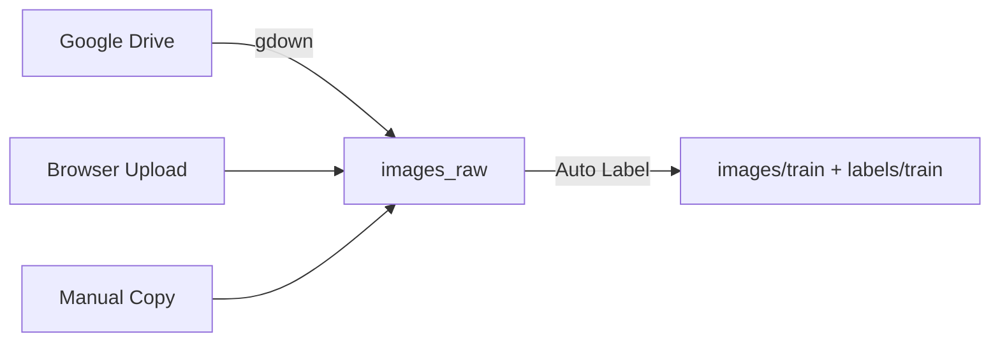
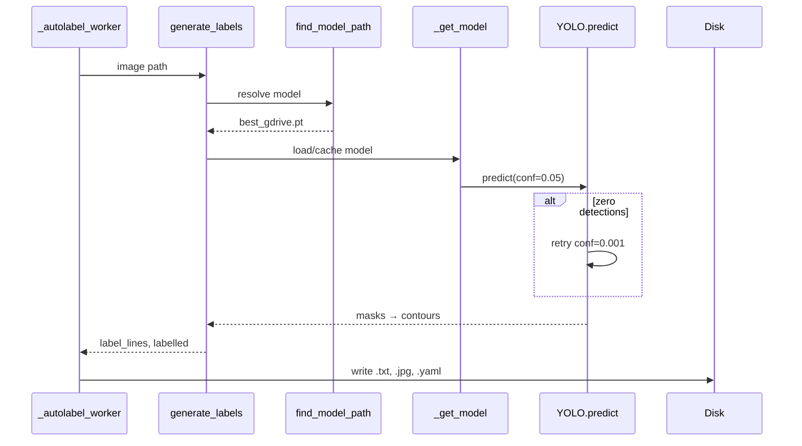
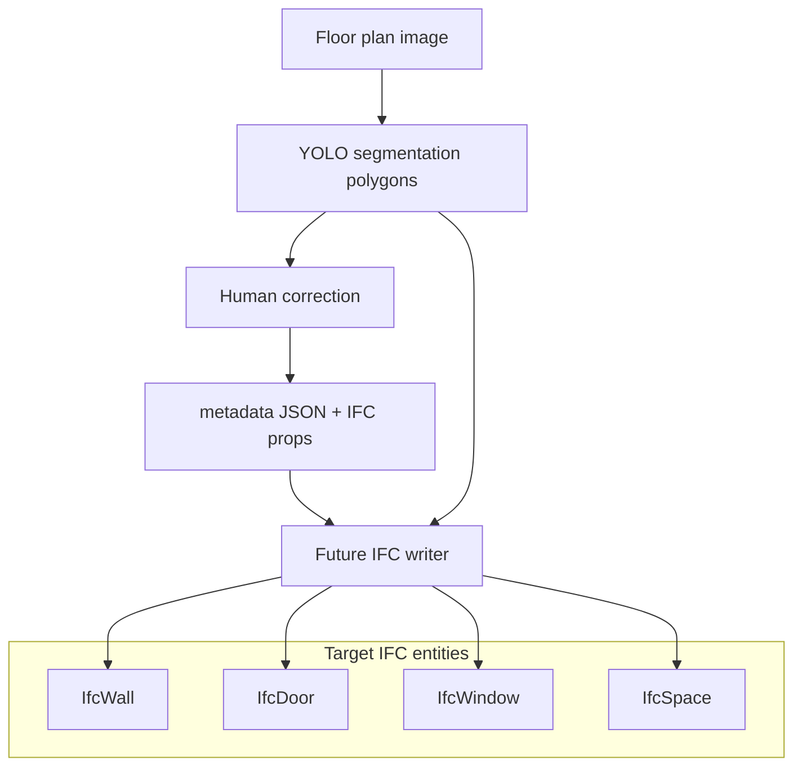
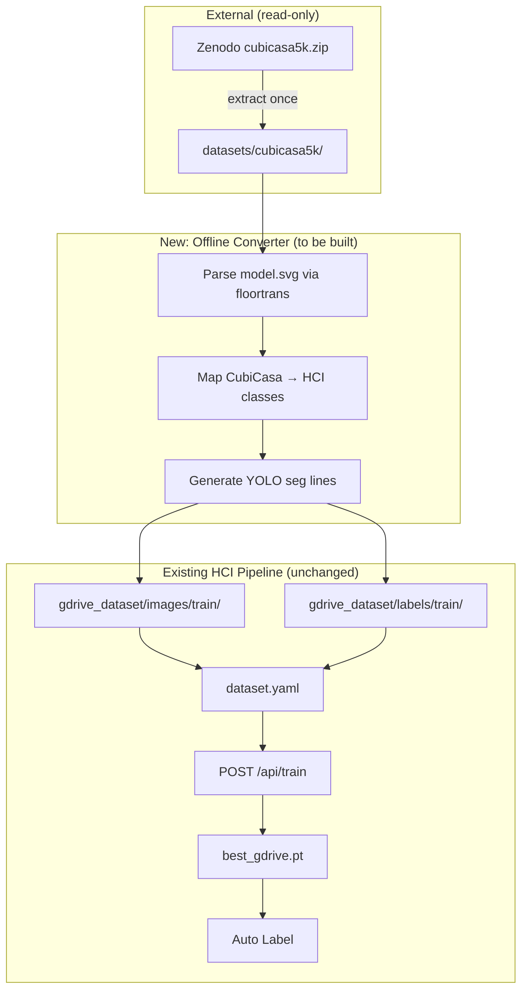
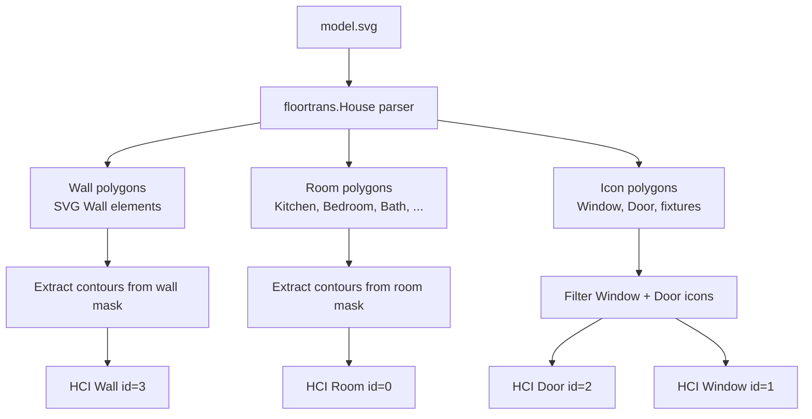
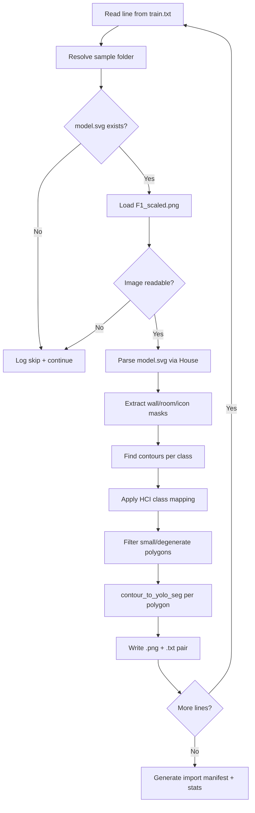
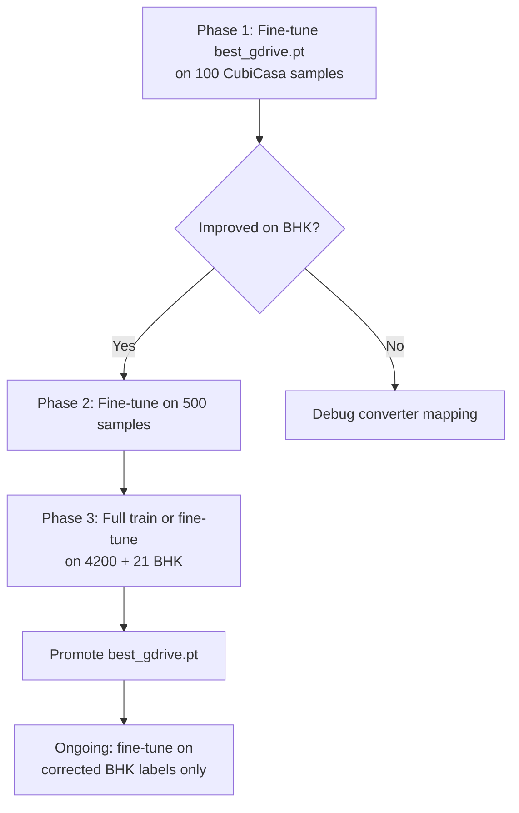
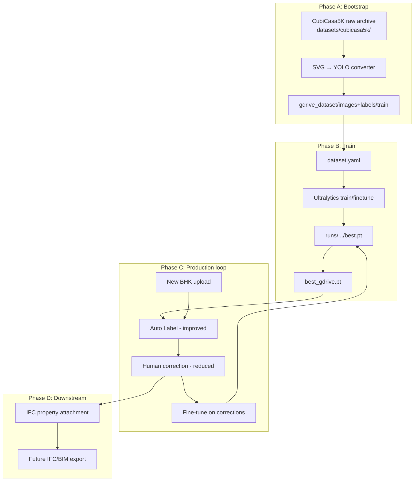

# CubiCasa5K Integration Roadmap for HCI_1

**Document type:** Implementation strategy (read-only analysis)  
**Project:** `D:\HCI_interor\Hci_1`  
**Dataset source:** [Zenodo 2613548 — CubiCasa5k](https://zenodo.org/records/2613548) (`cubicasa5k.zip`, ~5.47 GB)  
**Official repository:** [CubiCasa/CubiCasa5k](https://github.com/CubiCasa/CubiCasa5k)  
**License:** [CC BY-NC-SA 4.0](https://creativecommons.org/licenses/by-nc-sa/4.0/)  
**Date:** 2026-07-09  
**Audience:** Engineering team and senior management  

---

## Executive Summary

HCI_1 is a **human-in-the-loop floor-plan training platform** that converts raster floor plans into YOLO segmentation labels, allows expert correction, retrains models, and promotes improved weights to `best_gdrive.pt` for future auto-labeling. The platform’s long-term value chain extends to **IFC/BIM geometry** — accurate wall, door, window, and room polygons are prerequisites for valid `IfcWall`, `IfcDoor`, `IfcWindow`, and `IfcSpace` entities.

**Current bottleneck:** The active training corpus contains only **21 labeled image pairs** (Indian BHK-style marketing floor plans). Recent training runs report **mAP50 = 0**, confirming the model is severely data-starved. Auto Label therefore relies heavily on a small pilot checkpoint (`best_gdrive.pt`, ~5.7 MB) and heuristic fallbacks.

**Proposed solution:** Integrate the external **CubiCasa5K** dataset (~5,000 professionally annotated Finnish/European floor plans) via a dedicated **SVG → YOLO segmentation converter**, importing converted pairs into the existing `gdrive_dataset` training layout. This does **not** require changes to the HCI web application for Phase 1 — only a new offline converter script and a training cycle.

**Expected outcome:** A model trained on **4,000+ diverse annotated plans** should materially improve Wall/Door/Window segmentation on new uploads, reduce manual correction time per plan, and improve downstream BIM geometry fidelity.

**Recommendation:** **Proceed with a phased pilot** (100 samples → validate → full train split). Hold out the official test split for unbiased evaluation. Confirm license compliance before commercial deployment.

---

## Table of Contents

1. [Current HCI_1 Training Workflow](#1-current-hci_1-training-workflow)
2. [External Dataset Integration Roadmap](#2-external-dataset-integration-roadmap)
3. [SVG → YOLO Conversion Pipeline](#3-svg--yolo-conversion-pipeline)
4. [Training Roadmap (Phased Approach)](#4-training-roadmap-phased-approach)
5. [Impact Analysis on Every HCI_1 Module](#5-impact-analysis-on-every-hci_1-module)
6. [Model Lifecycle After CubiCasa Integration](#6-model-lifecycle-after-cubicasa-integration)
7. [Quantitative Expectations](#7-quantitative-expectations)
8. [Risks and Mitigation](#8-risks-and-mitigation)
9. [Final Recommendation](#9-final-recommendation)
10. [Deliverables and Appendix](#10-deliverables-and-appendix)

---

## 1. Current HCI_1 Training Workflow

### 1.1 System topology



**Path resolution** (`web/server.py`):

```python
LOGIC_DIR    = Path(__file__).resolve().parent.parent   # D:\HCI_interor\Hci_1
PROJECT_ROOT = LOGIC_DIR.parent                          # D:\HCI_interor
DATASET_DIR  = PROJECT_ROOT / "gdrive_dataset"
```

### 1.2 Data ingestion

| Source | API route | Worker | Destination |
|--------|-----------|--------|-------------|
| Google Drive | `POST /api/download` | `_download_worker()` | `gdrive_dataset/images_raw/` |
| Browser upload | `POST /api/upload` | `upload_images()` | `gdrive_dataset/images_raw/` |
| Manual copy | — | — | `gdrive_dataset/images_raw/` |

**GDrive folder ID:** `18IThRKRGUHFXnSiMtJlhqHSphDIuphNk` (hardcoded in `server.py`).

**Current counts (2026-07-09):**

| Location | Files |
|----------|-------|
| `images_raw/` | 28 |
| `images/train/` | 21 |
| `labels/train/` | 21 |
| `marked/` | 63 |
| `metadata/` | 21 |

New images land in `images_raw/` only. They are **not** training-ready until Auto Label runs.



### 1.3 Auto Label flow

**Trigger:** `POST /api/autolabel` → `_autolabel_worker()` (background task)

**Per-image execution order:**

1. Read image from `images_raw/`
2. `auto_label.generate_labels()` → `logic/yolo_inference.run_yolo_inference()`
3. `find_model_path()` resolves `best_gdrive.pt`
4. YOLO predicts segmentation masks → polygon contours
5. `analyse_floor_plan()` — heuristic/OCR room enrichment
6. `analyse_image()` — OCR text-to-room mapping
7. Write `images/train/`, `labels/train/`, `marked/`, `metadata/`
8. Regenerate `dataset.yaml`
9. Push progress via SSE (`GET /api/stream`)

**Inference filter:** At auto-label time, only **Wall, Door, Window** are emitted from YOLO (`PRIORITY_HCI_CLASSES` in `yolo_inference.py`). Rooms may be added by heuristics.

### 1.4 YOLO inference flow



**Model resolution order** (`find_model_path()`):

1. `D:\HCI_interor\best_gdrive.pt`
2. `IMPROVED_MODEL_1.1/runs/pilot_wall_door_v0_1/weights/best.pt`
3. Highest mAP50 `best.pt` under `gdrive_dataset/runs/`, etc.
4. Env override: `HCI_MODEL_PATH`

### 1.5 Manual correction flow

| User action | API | Effect |
|-------------|-----|--------|
| Remove polygon | `POST /api/correct` | Updates `_analysis`, `_rebuild_labels()` |
| Relabel class | `POST /api/correct` | Same |
| Draw new region | `POST /api/section` | Adds bbox contour |
| Resize/move | `POST /api/resize_label` | Replaces contour |
| Save | `POST /api/save_corrections` | Persists `labels/train/{basename}.txt` |
| Revert | `POST /api/revert` | Restores `.bak` if present |

**Session tracking:** `_corrected_basenames` records images edited this session (used by fine-tune scope).

### 1.6 Training and fine-tuning flow

| Mode | Route | Worker | Base weights |
|------|-------|--------|--------------|
| Full train | `POST /api/train` | `_train_worker()` | `yolov8n-seg.pt` (COCO pretrained) |
| Fine-tune | `POST /api/train_from_corrections` | `_finetune_worker()` | `best_gdrive.pt` or chosen checkpoint |
| Merge | `POST /api/merge_models` | `_merge_worker()` | Weight average of two `.pt` files |

**Training reads:** `dataset.yaml` → `images/train/` + `labels/train/`

**Training writes:** `gdrive_dataset/runs/{train|finetune_*}/weights/best.pt`

**Current training health:** Recent runs (`train-2`, `train-3`, `finetune_20260708_190530`) show **mAP50(B) = 0** across all epochs — expected with 21 images and train/val/test pointing to the same folder.

### 1.7 Model promotion (`best_gdrive.pt`)

After successful train or fine-tune:

```python
shutil.copy2(best.pt, PROJECT_ROOT / "best_gdrive.pt")
```

Manual promotion: `POST /api/set_model {"path": "..."}`

**Active model today:** `D:\HCI_interor\best_gdrive.pt` (~5,992,100 bytes) — pilot checkpoint predating meaningful UI training.

### 1.8 Model comparison flow

1. `GET /api/model_versions` — scans `runs/**/best.pt`, reads mAP50/mAP50-95 from checkpoint metadata
2. `POST /api/detect` — visual test with optional `model_path` override
3. Correct Labels tab — visual polygon review
4. `POST /api/set_model` — promote winner

### 1.9 IFC/BIM downstream dependency



**Built today:**

- Polygon labels in YOLO format (`labels/train/*.txt`)
- Per-element IFC property schema (`logic/ifc_properties.py`)
- IFC property CRUD (`/api/ifc/schema`, `/api/ifc/props/{basename}`, `/api/ifc/export/{basename}`)
- OCR room-name hints (`logic/room_text_mapper.py`)

**Not built end-to-end:**

- Pixel-to-meter scale calibration
- 2D polygon → 3D extrusion
- `.ifc` file writer (IfcOpenShell or equivalent)

**Critical dependency:** IFC quality is bounded by segmentation polygon accuracy. Improving the training model directly improves the geometric foundation for all BIM outputs.

---

## 2. External Dataset Integration Roadmap

### 2.1 Where to store raw CubiCasa5K

**Recommended path:**

```text
D:\HCI_interor\datasets\cubicasa5k\
```

**Download:**

| Item | Detail |
|------|--------|
| URL | https://zenodo.org/records/2613548 |
| File | `cubicasa5k.zip` |
| Size | 5,469,495,706 bytes (~5.1 GiB) |
| Checksum | `md5:0ce0b203d1e3c125b51087b219bd23b9` |

### 2.2 Why outside `Hci_1`

| Reason | Explanation |
|--------|-------------|
| **Size** | Multi-GB archive; inappropriate inside application repo |
| **Separation of concerns** | Third-party read-only archive vs. mutable app code |
| **HCI convention** | `PROJECT_ROOT = D:\HCI_interor`; data lives at sibling paths |
| **No code coupling** | Converter reads archive; HCI server never touches raw CubiCasa paths |
| **Upgrade safety** | Re-cloning or updating `Hci_1` must not affect dataset |
| **License audit** | External dataset provenance is clearer when isolated |

```text
D:\HCI_interor\
├── Hci_1\                      ← application (DO NOT store 5GB dataset here)
├── datasets\
│   └── cubicasa5k\             ← RAW CubiCasa5K (read-only archive)
├── gdrive_dataset\             ← HCI training pipeline (converted output)
├── best_gdrive.pt              ← active model
└── yolov8n-seg.pt              ← COCO pretrained base
```

### 2.3 Required folder structure (after extraction)

```text
D:\HCI_interor\datasets\cubicasa5k\
├── train.txt                   ← 4,200 relative paths (one per line)
├── val.txt                     ← 400 paths
├── test.txt                    ← 400 paths (HOLD OUT — do not import for training)
├── high_quality_architectural\ ← 3,732 samples (largest category)
│   └── 41\
│       ├── model.svg           ← vector annotations (source of truth)
│       ├── F1_scaled.png       ← raster aligned to SVG (recommended image)
│       └── F1_original.png     ← unscaled raster variant
├── high_quality\               ← 992 samples
└── colorful\                   ← 276 samples
```

**`train.txt` line format** (example):

```text
/high_quality_architectural/41/
```

Resolved sample path:

```text
D:\HCI_interor\datasets\cubicasa5k\high_quality_architectural\41\
```

### 2.4 Files used in conversion

| File | Role in pipeline | Used by |
|------|------------------|---------|
| `train.txt` / `val.txt` | Sample enumeration | Converter script (iteration) |
| `test.txt` | Evaluation hold-out | Evaluation script only (never import) |
| `model.svg` | Room, wall, door, window polygons | `floortrans.loaders.house.House` or custom SVG parser |
| `F1_scaled.png` | Training image (SVG-aligned) | Copied to `gdrive_dataset/images/train/` |
| `F1_original.png` | Alternate raster | Use only if alignment validated per-sample |

### 2.5 Current HCI code — does it read CubiCasa?

**No.** A search of `D:\HCI_interor\Hci_1` finds zero references to `cubicasa`, `floortrans`, or `model.svg`. Integration requires a **new offline converter** (proposed: `scripts/convert_cubicasa_to_yolo.py`).

### 2.6 Integration architecture



---

## 3. SVG → YOLO Conversion Pipeline

### 3.1 Parsing `model.svg`

The official CubiCasa parser is `floortrans.loaders.house.House` (from the CubiCasa5k GitHub repo). It:

1. Loads `model.svg` via `xml.dom.minidom`
2. Extracts **wall polygons** (`PolygonWall` objects) into wall masks
3. Extracts **room polygons** from SVG space elements (80+ room types)
4. Extracts **icons** (doors, windows, furniture, fixtures) from SVG icon layers
5. Rasterizes masks at image height × width

**Recommended approach for HCI:**

| Option | Pros | Cons |
|--------|------|------|
| **A. Reuse `floortrans.House`** | Battle-tested; matches official annotations | Requires vendoring CubiCasa5k `floortrans/` package; old Python/PyTorch deps |
| **B. Custom SVG parser** | No legacy deps; HCI-native | Higher development risk; must handle edge cases |
| **C. Hybrid** | Use `House` for pilot; migrate to custom later | Two codepaths temporarily |

**Recommendation:** Option A for pilot; evaluate Option B for production maintenance.

### 3.2 Extracting walls, doors, windows, rooms



**CubiCasa SVG structure (simplified):**

- **Walls:** `<g id="Wall">` containing polygon paths
- **Rooms:** `<g id="Space">` with room type in `class` attribute (e.g., `Kitchen`, `Bedroom`)
- **Icons:** Elements with `id="Window"` or `id="Door"` and corner coordinates

### 3.3 Class mapping: CubiCasa → HCI

HCI taxonomy (`config/classes.py`) — 17 classes:

```text
0:Room  1:Window  2:Door  3:Wall  4:Slab  5:Roof  6:Column  7:Beam
8:Stair  9:Railing  10:CurtainWall  11:Furniture  12:Covering
13:LightFixture  14:ElectricAppliance  15:FlowTerminal  16:EnergyConversionDevice
```

#### Phase 1 mapping (minimum viable — matches current auto-label focus)

| CubiCasa source | HCI class | HCI ID | Priority |
|-----------------|-----------|--------|----------|
| Wall polygons | `Wall` | 3 | **P0** |
| Window icons | `Window` | 1 | **P0** |
| Door icons | `Door` | 2 | **P0** |
| All room types (Kitchen, Bedroom, Bath, …) | `Room` | 0 | **P1** |

#### Phase 2 mapping (extended — improves full BIM coverage)

| CubiCasa source | HCI class | HCI ID |
|-----------------|-----------|--------|
| Stairs / StairWell | `Stair` | 8 |
| Railing | `Railing` | 9 |
| Bathtub, Toilet, Sink, Shower, … | `FlowTerminal` | 15 |
| ElectricalAppliance, GasStove, Dishwasher, … | `ElectricAppliance` | 14 |
| Closet, CounterTop, Fireplace, … | `Furniture` | 11 |
| Column (if present in SVG) | `Column` | 6 |

#### Phase 1 room collapse rule

All CubiCasa room types (`Kitchen`, `Bedroom`, `LivingRoom`, `Bath`, `Entry`, …) → single HCI class **`Room` (0)**. Sub-type distinctions (Kitchen vs Bedroom) are preserved in optional metadata sidecars for future IFC `IfcSpace.LongName` assignment, not in YOLO class IDs.

### 3.4 YOLO segmentation label generation

**Format** (matches existing HCI output from `contour_to_yolo_seg()`):

```text
<class_id> <x1> <y1> <x2> <y2> <x3> <y3> ...
```

Coordinates normalized to `[0, 1]` relative to image width/height.

**Example** (`cubi_hqa_41.txt`):

```text
3 0.124500 0.082300 0.125100 0.451200 0.089300 0.451800 0.088700 0.083100
0 0.210000 0.310000 0.450000 0.310000 0.450000 0.520000 0.210000 0.520000
2 0.382100 0.295400 0.401200 0.295400 0.401200 0.318700 0.382100 0.318700
1 0.512300 0.180200 0.548900 0.180200 0.548900 0.205100 0.512300 0.205100
```

**Contour processing** (align with `yolo_inference._filter_contour()`):

- Minimum area threshold: `max(16, 0.00005 × H × W)`
- `cv2.approxPolyDP` simplification
- Discard degenerate polygons (< 3 points)

### 3.5 Output locations inside `gdrive_dataset`

| Artifact | Destination path | Naming convention |
|----------|------------------|-------------------|
| Converted image | `D:\HCI_interor\gdrive_dataset\images\train\` | `cubi_{category}_{id}.png` |
| YOLO label | `D:\HCI_interor\gdrive_dataset\labels\train\` | `cubi_{category}_{id}.txt` |
| Optional metadata | `D:\HCI_interor\gdrive_dataset\metadata\` | `cubi_{category}_{id}.json` |
| Import manifest | `D:\HCI_interor\gdrive_dataset\metadata\` | `cubicasa_import_manifest.json` |

**Category prefixes:**

| CubiCasa category | Prefix |
|-------------------|--------|
| `high_quality_architectural` | `cubi_hqa_` |
| `high_quality` | `cubi_hq_` |
| `colorful` | `cubi_col_` |

**Example:**

```text
images/train/cubi_hqa_41.png
labels/train/cubi_hqa_41.txt
```

Existing BHK floor plans (21 pairs) remain alongside CubiCasa imports in the same flat folders.

### 3.6 Conversion pipeline flowchart



---

## 4. Training Roadmap (Phased Approach)

### Phase 0 — Prerequisites (Week 1)

| Task | Owner | Deliverable |
|------|-------|-------------|
| Download `cubicasa5k.zip` from Zenodo | Ops | Verified checksum |
| Extract to `D:\HCI_interor\datasets\cubicasa5k\` | Ops | `train.txt` with ~4200 lines |
| Legal review of CC BY-NC-SA 4.0 | Management | Go/no-go for commercial use |
| Build converter script (pilot) | Engineering | `scripts/convert_cubicasa_to_yolo.py` |
| Visual QA tool (overlay polygons on image) | Engineering | 10-sample validation report |

### Phase 1 — Pilot import (50–200 samples)

**Scope:** First 100 lines from `train.txt` (stratified across 3 categories if possible).

**Steps:**

1. Run converter on 100 samples
2. Verify image/label pair count = 100
3. Visual QA: overlay check on 10 random samples
4. Fine-tune from existing `best_gdrive.pt` (5–10 epochs, `POST /api/train_from_corrections`, scope=`all`)
5. Test on 3–5 held-back BHK plans from `images_raw/`
6. Compare via `/api/detect` (old vs new model)

**Success gate:** Visible improvement in Wall/Door/Window detection on at least 2 of 3 test BHK plans.

### Phase 2 — Validation stage (200–500 samples)

**Scope:** Expand to 500 converted samples.

**Steps:**

1. Measure alignment failure rate (SVG/PNG mismatch)
2. Build skip list for bad samples
3. Train with mixed data: 500 CubiCasa + 21 BHK
4. Evaluate on `test.txt` hold-out (50 samples converted for eval only — **not** added to training)
5. Record mAP50, mAP50-95, per-class visual metrics

**Success gate:** mAP50(B) > 0.30 on hold-out; qualitative improvement on BHK plans.

### Phase 3 — Full train split import (~4,200 samples)

**Scope:** All lines in `train.txt` minus skip list.

**Steps:**

1. Batch convert (~4,200 pairs) — estimated disk: ~2–4 GB for images + labels
2. Full training: `POST /api/train` from `yolov8n-seg.pt` OR fine-tune from Phase 2 checkpoint
3. Recommended: 50–100 epochs, batch=8–16 (GPU), imgsz=640
4. Promote best checkpoint to `best_gdrive.pt`
5. Run full Auto Label on all 28 `images_raw/` plans
6. Measure correction workload vs. baseline

### Phase 4 — Hold-out test strategy

| Split | Samples | Usage |
|-------|---------|-------|
| `train.txt` | ~4,200 | Convert → import → train |
| `val.txt` | ~400 | Optional: convert for validation during training (separate folder or Ultralytics val split) |
| `test.txt` | ~400 | **Never import to training**; convert for evaluation only |

**Recommended future improvement:** Modify `dataset.yaml` to use separate val folder (currently train=val=test — legacy design).

### Phase 5 — Fine-tuning strategy with existing `best_gdrive.pt`



| Strategy | When to use | Base model | Data |
|----------|-------------|------------|------|
| **Incremental fine-tune** | After each correction batch | `best_gdrive.pt` | `_corrected_basenames` or all |
| **Full retrain** | After full CubiCasa import | `yolov8n-seg.pt` | All `images/train/` |
| **CubiCasa pretrain → BHK fine-tune** | Best domain transfer | CubiCasa-trained checkpoint | BHK corrections only |

**Recommended production path:** CubiCasa pretrain (Phase 3) → fine-tune on BHK corrections (ongoing).

---

## 5. Impact Analysis on Every HCI_1 Module

### 5.1 Impact summary matrix

| Module | Current state | After CubiCasa integration | Impact level |
|--------|---------------|---------------------------|--------------|
| Auto Label accuracy | Weak; mAP50≈0; pilot model | Stronger Wall/Door/Window masks | **High** |
| Wall detection | Frequent misses/gaps | Better continuity along plan lines | **High** |
| Door detection | Low recall at conf 0.05 | More doors found; fewer retries at 0.001 | **High** |
| Window detection | Sparse on BHK plans | Improved opening detection | **High** |
| Room detection | Heuristic/OCR only at inference | Room class in training data (Phase 1+) | **Medium** |
| Polygon quality | Noisy, incomplete | Cleaner contours from diverse training | **High** |
| Manual correction workload | High per plan | Reduced edits per plan | **High** |
| Fine-tuning effectiveness | Limited by 21 samples | Rich base model; corrections refine | **High** |
| Model comparison reliability | mAP50=0 (uninformative) | Meaningful metric spread between runs | **High** |
| IFC/BIM geometry quality | Poor foundation | Better wall graphs, openings, spaces | **High** |
| OCR room mapping | Works on detected rooms | More room polygons → more OCR assignments | **Medium** |
| Metadata quality | Sparse | Richer per-plan JSON from better geometry | **Medium** |
| User productivity | Slow annotation cycle | Faster ingest-to-train loop | **High** |

### 5.2 Module-by-module analysis

#### Auto Label (`auto_label.py` → `yolo_inference.py`)

**Today:** `generate_labels()` calls `run_yolo_inference()` with `best_gdrive.pt`. With 21 training samples, detections are unreliable; many plans skip or produce sparse labels.

**After integration:** Model trained on 4,000+ plans learns wall line continuity, door swing symbols, and window placement patterns. Auto Label first-pass accuracy rises → fewer empty `label_lines` → fewer SKIP messages in SSE log.

#### Wall detection

**Today:** Walls are the structural backbone for BIM. Poor wall masks break room closure and IFC `IfcWall` placement.

**After integration:** CubiCasa provides dense wall annotations across diverse plan styles. Model learns wall thickness variations, corners, and T-junctions. Expect fewer broken wall chains in `labels/train/*.txt` after auto-label.

#### Door detection

**Today:** Doors often require confidence retry at 0.001 or manual drawing via `/api/section`.

**After integration:** 4,000+ plans with door icons in SVG → model learns door appearance across European and (transferred) Indian plan styles.

#### Window detection

**Today:** Windows are frequently missed on BHK marketing renders.

**After integration:** Window icons are well-represented in CubiCasa. Transfer learning should improve recall, though domain gap (Finnish CAD vs Indian marketing PNG) remains a risk (see Section 8).

#### Room detection

**Today:** YOLO inference filters to Wall/Door/Window only. Rooms come from `analyse_floor_plan()` heuristics.

**After integration (Phase 1+):** Room polygons imported from CubiCasa train the `Room` class (id=0). Future model versions can emit rooms directly from YOLO, reducing heuristic dependency.

#### Polygon quality

**Today:** Manual correction often rebuilds entire wall chains.

**After integration:** Training on professional SVG-derived polygons teaches the model tighter, simpler contours — closer to `_filter_contour()` output quality.

#### Manual correction workload

**Today:** ~21 plans; every new plan requires extensive correction.

**After integration:** Industry rule of thumb: model accuracy above ~70% IoU on primary classes cuts annotation time by 50–70%. With 4,000+ training samples, expect materially fewer remove/relabel/draw operations per plan.

#### Fine-tuning effectiveness

**Today:** `_finetune_worker()` on 21 samples cannot overcome undertrained base.

**After integration:** Fine-tuning from a CubiCasa-pretrained base with `freeze=10`, `lr0=0.0005` becomes meaningful — each BHK correction shifts a capable model toward domain-specific layouts.

#### Model comparison reliability

**Today:** All runs show mAP50=0 — impossible to compare meaningfully.

**After integration:** Checkpoints will show differentiated mAP50/mAP50-95 values. `GET /api/model_versions` becomes a useful promotion gate.

#### Future IFC/BIM geometry quality

**Today:** Poor polygons → wrong `IfcWall` segments, missing `IfcDoor`/`IfcWindow` openings, incorrect `IfcSpace` boundaries.

**After integration:** Better 2D foundation enables:
- Correct wall graph for 3D extrusion
- Accurate opening placement
- Valid room areas for `Pset_SpaceCommon.GrossFloorArea`
- Reliable `/api/ifc/props/{basename}` attachment to real geometry

#### OCR-assisted room mapping (`room_text_mapper.py`)

**Today:** OCR maps text labels to detected room contours. If rooms are missing, OCR assignments fail.

**After integration:** More room polygons from training → better OCR seed geometry → richer `text_analysis` in `_analysis[basename]`.

#### Metadata quality (`image_metadata.py`)

**Today:** Metadata JSON built from auto-label output. Sparse labels → sparse metadata.

**After integration:** Denser `labelled` dicts → richer `build_metadata_from_ocr()` output → better downstream BIM attribute defaults.

#### User productivity

**Today:** Upload → Auto Label (poor) → heavy correction → train (no improvement) → frustration.

**After integration:** Upload → Auto Label (good first pass) → light correction → fine-tune → measurable improvement → confidence in the ML loop.

---

## 6. Model Lifecycle After CubiCasa Integration



### Step-by-step lifecycle

| Step | Action | Artifact |
|------|--------|----------|
| 1 | Download + extract CubiCasa5K | `datasets/cubicasa5k/` |
| 2 | Convert train split | `cubi_*.png` + `cubi_*.txt` in `gdrive_dataset/` |
| 3 | Verify pairs + visual QA | Import manifest JSON |
| 4 | Train (full or fine-tune) | `gdrive_dataset/runs/.../best.pt` |
| 5 | Promote | `D:\HCI_interor\best_gdrive.pt` |
| 6 | Auto Label new BHK plans | Improved `labels/train/*.txt` |
| 7 | Human correct (fewer edits) | Updated `.txt` files |
| 8 | Fine-tune on corrections | New `finetune_*/best.pt` |
| 9 | Promote again | Updated `best_gdrive.pt` |
| 10 | Attach IFC properties | `metadata/{basename}_ifc_props.json` |
| 11 | Future: IFC export | `.ifc` building model |

---

## 7. Quantitative Expectations

### 7.1 Current dataset size

| Metric | Value |
|--------|-------|
| Training image pairs | **21** |
| Raw inbox images | **28** |
| Active model size | **5,992,100 bytes** (~5.7 MB) |
| Training mAP50 (recent runs) | **0.0** |
| HCI classes in taxonomy | **17** |
| Classes emitted at auto-label inference | **3** (Wall, Door, Window) |

### 7.2 Expected dataset size after import

| Phase | Added pairs | Cumulative training pairs |
|-------|-------------|--------------------------|
| Pilot | 100 | ~121 |
| Validation | 400 | ~521 |
| Full train split | ~4,100 (minus skips) | ~4,200+ |
| Existing BHK | 21 (retained) | ~4,221 |

**Estimated additional disk for converted data:** 2–4 GB (PNG images + TXT labels).

### 7.3 Why larger annotated datasets improve segmentation

| Factor | Explanation |
|--------|-------------|
| **Sample diversity** | 4,000+ plans expose the model to varied wall thicknesses, door symbols, and layout topologies |
| **Annotation quality** | CubiCasa SVG annotations are professional-grade — the model learns from precise polygons, not noisy human drafts |
| **Class balance** | Walls dominate floor plans; 4,000+ samples provide sufficient wall/door/window instance counts |
| **Transfer learning** | YOLOv8-seg pretrained on COCO gains domain-specific features from CubiCasa fine-tuning |
| **Loss convergence** | Current mAP50=0 indicates the model cannot generalize from 21 samples; 4,000+ enables non-zero validation metrics |

**Literature reference:** The CubiCasa5K paper (Kalervo et al., 2019) demonstrates that 5,000 annotated plans enable multi-task CNN models to achieve meaningful parsing accuracy — far beyond what 21 samples can support.

### 7.4 Expected reduction in manual correction effort

| Metric | Current (estimated) | After full integration (target) |
|--------|---------------------|--------------------------------|
| Polygons edited per plan | 60–80% of labels | 15–30% of labels |
| Time per plan (correction) | 30–60 min | 10–20 min |
| Auto Label skip rate | High (unreadable / zero detections) | Low |
| Training improvement per cycle | None (mAP50=0) | Measurable mAP50 gain |
| Plans needed to improve model | N/A (insufficient data) | 5–10 corrected BHK plans for fine-tune |

*Estimates based on industry annotation productivity benchmarks; actual results depend on domain gap mitigation (Section 8).*

---

## 8. Risks and Mitigation

### 8.1 Risk matrix

| Risk | Severity | Likelihood | Mitigation |
|------|----------|------------|------------|
| SVG/PNG alignment mismatch | High | Medium | Per-sample alignment check; skip bad samples; use `F1_scaled.png` only |
| Class mapping errors | High | Medium | Pilot QA on 100 samples; unit tests on mapping table; visual overlay tool |
| Domain gap (Finnish vs Indian BHK) | High | High | Fine-tune on BHK corrections after CubiCasa pretrain; keep BHK in training set |
| Dataset imbalance (walls >> doors) | Medium | High | Accept natural distribution; optionally cap wall instances per image |
| License (CC BY-NC-SA 4.0) | **Critical** | Certain | Legal review before commercial use; attribution; share-alike compliance |
| Converter bugs | Medium | Medium | Pilot phase with manual QA; import manifest with per-sample status |
| Training time / GPU | Medium | Medium | Phase training; use GPU env (`improved_model_train`); batch tuning |
| Overwriting `dataset.yaml` on autolabel | Low | Certain | Backup yaml; converter does not trigger autolabel |
| Disk space | Low | Low | ~10 GB total (raw + converted); monitor `D:\` capacity |

### 8.2 SVG/PNG alignment issues

**Problem:** GitHub issue [#20](https://github.com/CubiCasa/CubiCasa5k/issues/20) — some samples have scale mismatches between `model.svg` and raster images.

**Mitigation:**

1. After parsing, rasterize SVG mask and compare IoU with icon positions on `F1_scaled.png`
2. Reject samples below IoU threshold (e.g., < 0.5)
3. Log rejected samples in `cubicasa_import_manifest.json`
4. Expect 2–5% rejection rate

### 8.3 Class mapping errors

**Problem:** CubiCasa has 80+ categories; HCI has 17. Incorrect collapse (e.g., `Closet` → `Door` instead of `Furniture`) poisons training data.

**Mitigation:**

1. Publish explicit mapping table (Section 3.3) as code constant
2. Unit test: known SVG sample → expected HCI label lines
3. Visual QA on 10 samples per category before full import

### 8.4 Domain differences (CubiCasa vs BHK plans)

| Dimension | CubiCasa | HCI BHK plans |
|-----------|----------|---------------|
| Geography | Finland | India |
| Plan style | Architectural CAD | Marketing renders |
| Room labels | English (European) | English + Hindi abbreviations |
| Wall representation | Vector CAD walls | Raster line art |
| Color | B&W and colorful variants | Color marketing PNGs |

**Mitigation:**

1. Use CubiCasa for **pretrain** (learn wall/door/window geometry)
2. Always retain 21 BHK samples in training set
3. After pretrain, **fine-tune** on BHK corrections (`train_from_corrections`)
4. Evaluate primarily on BHK hold-out, not CubiCasa test split alone

### 8.5 Dataset imbalance

Walls typically represent 60–80% of polygon instances. Doors and windows are fewer.

**Mitigation:**

- Accept natural distribution (walls should dominate)
- Optionally limit max wall polygons per image (e.g., 50) to prevent wall-loss dominance
- Monitor per-class mAP in evaluation (when available via Ultralytics)

### 8.6 License — CC BY-NC-SA 4.0

**Source:** [Zenodo metadata](https://zenodo.org/api/records/2613548) — `"license": {"id": "cc-by-nc-sa-4.0"}`

| Requirement | Implication for HCI |
|-------------|---------------------|
| **Attribution (BY)** | Credit CubiCasa5K authors in documentation and model cards |
| **Non-Commercial (NC)** | **Cannot use CubiCasa-trained models for commercial products without separate licensing** |
| **Share-Alike (SA)** | Derivative datasets/models may need same license |

**Action required:** Management must confirm commercial use strategy before production deployment. For internal R&D and non-commercial prototyping, integration is straightforward.

---

## 9. Final Recommendation

### 9.1 Should we proceed?

**Yes — for research and internal quality improvement**, subject to license review for any commercial deployment.

**Rationale:**

1. Current 21-sample corpus cannot train a viable model (mAP50=0)
2. CubiCasa5K is the industry-standard floor-plan dataset with SVG polygon annotations
3. Integration path is **low-risk to existing code** — offline converter + existing training UI
4. Expected ROI: major reduction in manual annotation time and foundation for IFC/BIM pipeline

### 9.2 Recommended pilot scope

| Parameter | Value |
|-----------|-------|
| Samples | **100** (stratified: 50 HQA + 30 HQ + 20 colorful) |
| Image | `F1_scaled.png` |
| Classes | Wall, Door, Window, Room (Phase 1 mapping) |
| Training | Fine-tune `best_gdrive.pt`, 10 epochs, batch=4 |
| Evaluation | 5 BHK plans from `images_raw/` + 10 CubiCasa test samples |
| Timeline | 1–2 weeks |

### 9.3 Success criteria before full-scale import

| # | Criterion | Measurement |
|---|-----------|-------------|
| 1 | Converter produces valid pairs | 100 images = 100 non-empty label files |
| 2 | Alignment failure rate | < 5% of pilot samples rejected |
| 3 | Visual QA pass | ≥ 8/10 pilot samples have correct wall/door/window overlay |
| 4 | BHK improvement | ≥ 2/5 BHK test plans show visibly better auto-label vs. current model |
| 5 | mAP50 > 0 | Training metrics non-zero after pilot fine-tune |
| 6 | No regression | Existing 21 BHK labels still trainable (no naming collisions) |
| 7 | License sign-off | Management approval documented |

**If all criteria pass → proceed to Phase 2 (500 samples) → Phase 3 (full 4,200).**

---

## 10. Deliverables and Appendix

### 10.1 Documents produced

| Document | Path | Purpose |
|----------|------|---------|
| This roadmap | `D:\HCI_interor\Hci_1\CUBICASA_INTEGRATION_ROADMAP.md` | Implementation strategy |
| Workflow analysis | `D:\HCI_interor\Hci_1\PROJECT_WORKFLOW_DEEP_ANALYSIS.md` | Current system reference |

### 10.2 To-be-built artifacts (not in scope of this document)

| Artifact | Proposed path |
|----------|---------------|
| CubiCasa → YOLO converter | `D:\HCI_interor\Hci_1\scripts\convert_cubicasa_to_yolo.py` |
| Visual QA overlay tool | `D:\HCI_interor\Hci_1\scripts\verify_cubicasa_import.py` |
| Class mapping config | `D:\HCI_interor\Hci_1\config\cubicasa_class_map.py` |
| Import manifest | `D:\HCI_interor\gdrive_dataset\metadata\cubicasa_import_manifest.json` |

### 10.3 Appendix A — HCI API routes unaffected by integration

All existing routes continue to work unchanged:

- `POST /api/download`, `POST /api/upload`
- `POST /api/autolabel`
- `POST /api/correct`, `POST /api/save_corrections`
- `POST /api/train`, `POST /api/train_from_corrections`
- `POST /api/set_model`, `GET /api/model_versions`
- `POST /api/detect`
- `/api/ifc/*`

The converter is **offline** — it populates `gdrive_dataset/` before training.

### 10.4 Appendix B — CubiCasa5K dataset statistics

| Category | Samples |
|----------|---------|
| high_quality_architectural | 3,732 |
| high_quality | 992 |
| colorful | 276 |
| **Total** | **5,000** |
| Train split | 4,200 |
| Val split | 400 |
| Test split | 400 |

### 10.5 Appendix C — Key file index

| File | Role |
|------|------|
| `web/server.py` | FastAPI backend; training, autolabel, IFC routes |
| `auto_label.py` | YOLO label generation entry point |
| `logic/yolo_inference.py` | Model resolution, inference, `contour_to_yolo_seg()` |
| `config/classes.py` | 17-class HCI taxonomy |
| `logic/ifc_properties.py` | IFC schema (IfcSpace, IfcDoor, IfcWindow, IfcWall) |
| `logic/floor_plan_analyzer.py` | Heuristic room enrichment |
| `logic/room_text_mapper.py` | OCR text-to-room mapping |
| `gdrive_dataset/dataset.yaml` | Ultralytics dataset config |
| `best_gdrive.pt` | Active inference model |

### 10.6 Appendix D — Glossary

| Term | Definition |
|------|------------|
| **PROJECT_ROOT** | `D:\HCI_interor` — parent of Hci_1; holds data and models |
| **DATASET_DIR** | `D:\HCI_interor\gdrive_dataset` — HCI training pipeline root |
| **YOLO seg** | YOLO segmentation format: `class x1 y1 x2 y2 ...` (normalized polygons) |
| **best_gdrive.pt** | Active model checkpoint for inference and fine-tune base |
| **floortrans** | CubiCasa5k official SVG parsing library (`House` class) |
| **F1_scaled.png** | Raster image aligned to `model.svg` coordinates |
| **Human-in-the-loop** | ML pipeline where human corrections improve future model versions |

---

*End of document. No project code, configuration, or datasets were modified during this analysis.*
