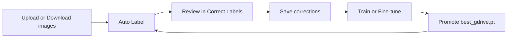
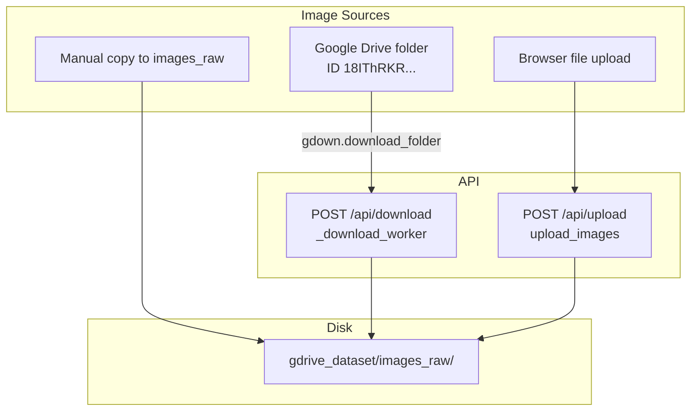
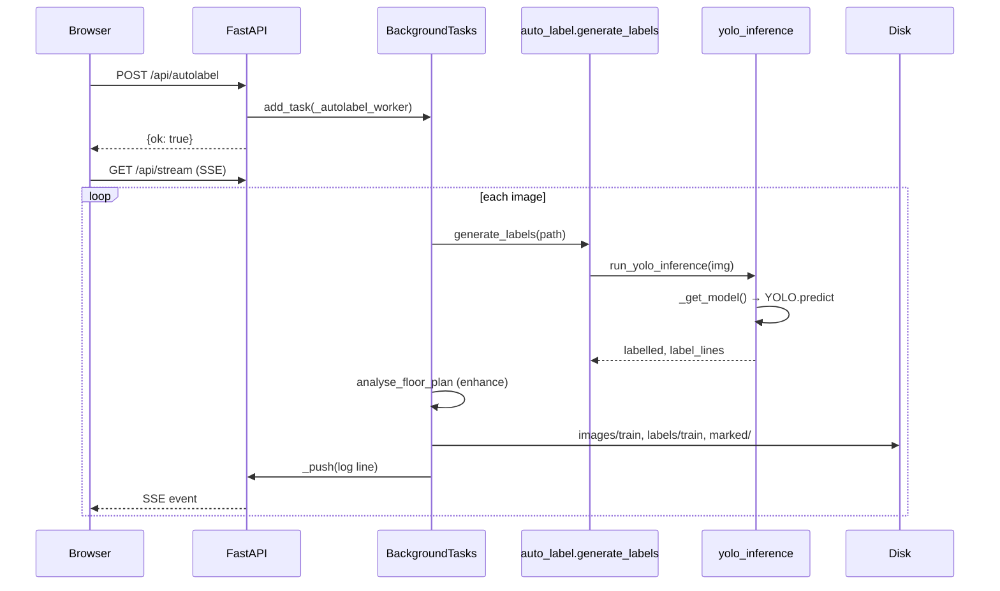
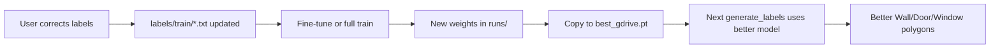
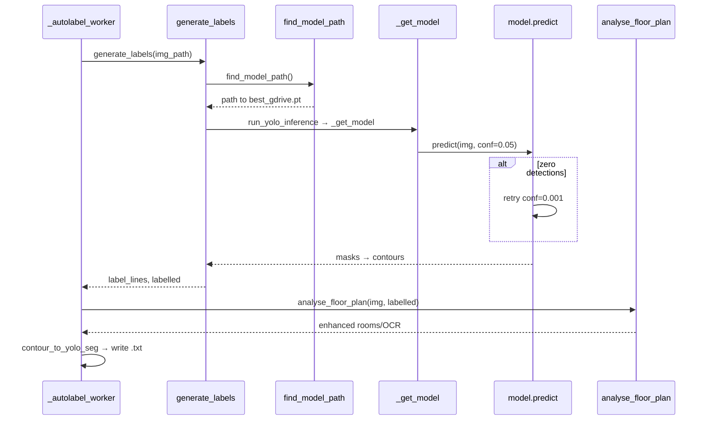
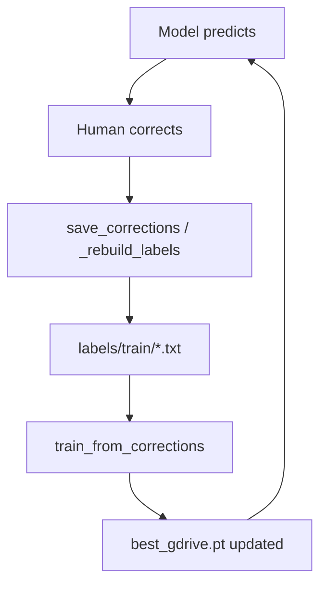
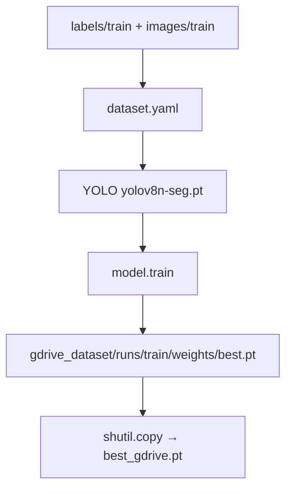
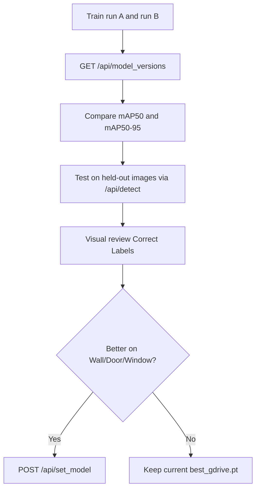
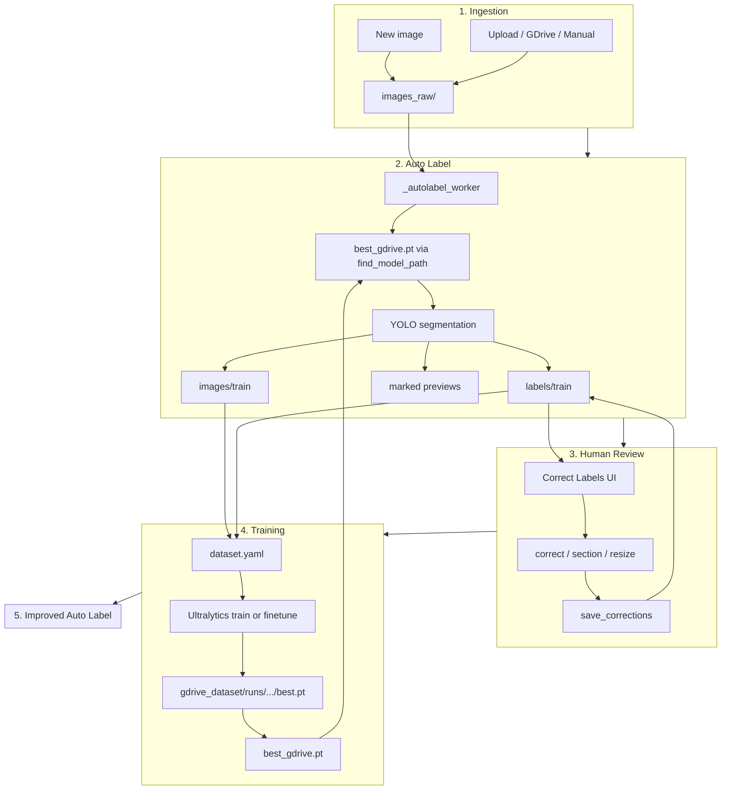
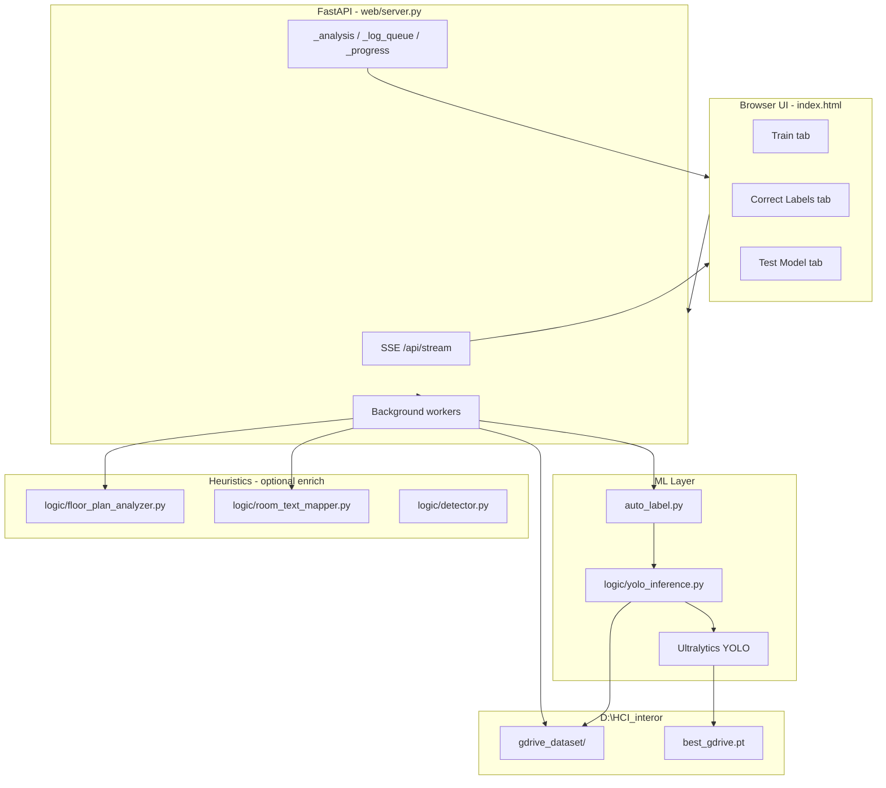

# Hci_1 — Project Workflow Deep Analysis

**Project root (app):** `D:\HCI_interor\Hci_1`  
**Runtime data root (PROJECT_ROOT):** `D:\HCI_interor` (parent of `Hci_1`)  
**Document type:** Read-only architectural analysis (generated from code inspection)  
**Date:** 2026-07-09

---

## Executive Summary

`Hci_1` is a **Floor Plan Model Trainer** web application. It ingests floor-plan images, runs **YOLO segmentation** to auto-label structural elements (primarily Wall, Door, Window), lets users correct labels in the browser, trains or fine-tunes an Ultralytics model on disk-stored YOLO labels, and promotes the best weights to **`D:\HCI_interor\best_gdrive.pt`** for future auto-labeling and detection.

The system is a **human-in-the-loop ML pipeline**: images → model predictions → human corrections → retraining → improved `best_gdrive.pt` → better auto-label.

---

## Section 1 — Project Goal

### Purpose of Hci_1

Hci_1 is a **local FastAPI + browser UI** for:

1. Collecting floor-plan images (upload or Google Drive download).
2. **Auto-labeling** them with a YOLO segmentation model (`best_gdrive.pt`).
3. Letting users **review and correct** polygon labels (Correct Labels tab).
4. **Training / fine-tuning** YOLO on the accumulated label corpus.
5. **Promoting** improved weights to the active model file.
6. Optional: IFC property editing, metadata JSON, OCR room-name mapping, test detection.

### Problem it solves

Manual polygon annotation of floor plans (walls, doors, windows, rooms) is slow. Hci_1 automates the first pass with ML, keeps humans in the loop for quality, and closes the loop by retraining on corrected data.

### Intended user workflow



1. Open `http://127.0.0.1:8000`
2. **Upload** images or **Download** from Google Drive folder
3. Click **Auto Label** → polygons written to disk
4. Open **Correct Labels** → remove/relabel/draw polygons
5. **Save corrections** → updates `labels/train/*.txt`
6. **Train** (full) or **Fine-tune from corrections** (incremental)
7. New model copied to `best_gdrive.pt`
8. Repeat Auto Label with improved model

---

## Section 2 — Folder Architecture

### Path resolution (critical)

From `web/server.py`:

```python
LOGIC_DIR    = Path(__file__).resolve().parent.parent   # D:\HCI_interor\Hci_1
PROJECT_ROOT = LOGIC_DIR.parent                          # D:\HCI_interor
DATASET_DIR  = PROJECT_ROOT / "gdrive_dataset"           # D:\HCI_interor\gdrive_dataset
```

| Path | Role |
|------|------|
| `D:\HCI_interor\Hci_1\` | Application code (canonical) |
| `D:\HCI_interor\gdrive_dataset\` | All training/upload data |
| `D:\HCI_interor\best_gdrive.pt` | Active YOLO weights for inference |
| `D:\HCI_interor\yolov8n-seg.pt` | Base pretrained weights for scratch training |

### Top-level folders

| Folder | Created by | When used | Persistent? |
|--------|------------|-----------|-------------|
| `web/` | Project | FastAPI server, `index.html` UI | Yes |
| `logic/` | Project | YOLO inference, OCR, floor-plan heuristics, metadata, IFC | Yes |
| `config/` | Project | `classes.py` — 17-class HCI taxonomy | Yes |
| `scripts/` | Project | `start_server.bat`, smoke tests | Yes |
| `auto_label.py` | Project | YOLO-based label generation | Yes |
| `gdrive_dataset/` | **Code on first use** (`mkdir` in workers) | All dataset I/O | Yes (user data) |
| `IMPROVED_MODEL_1.1/` | Separate training project | Fallback model path in `find_model_path()` | Yes |
| `hci-3d-model/` | Nested git copy | **Not canonical** — duplicate trees | Yes (archive) |

### `gdrive_dataset/` subfolders

| Subfolder | Created by | Purpose | Persistent? |
|-----------|------------|---------|---------------|
| `images_raw/` | Upload / GDrive download workers | Source images for auto-label input | Yes |
| `images/train/` | `_autolabel_worker` | Training images (copied from raw) | Yes |
| `labels/train/` | `_autolabel_worker`, corrections | YOLO-seg `.txt` label files | Yes |
| `marked/` | `_autolabel_worker` | Preview JPGs (`*_labelled.jpg`, pre/post OCR) | Yes |
| `metadata/` | `save_metadata()` | Per-image JSON sidecars | Yes |
| `dataset.yaml` | `_autolabel_worker` | Ultralytics dataset config (regenerated) | Yes |
| `runs/` | Ultralytics `model.train()` | Training outputs (`train/`, `finetune_*`, `merged_*`) | Yes |

### Models (not a folder — files at PROJECT_ROOT)

| File | Role |
|------|------|
| `best_gdrive.pt` | **Active** inference + fine-tune base |
| `yolov8n-seg.pt` | COCO-pretrained YOLOv8-seg starting point for scratch train |

### Nested duplicates (warning)

Under `Hci_1/hci-3d-model/` there are **nested copies** of `hci/`, `web/`, `IMPROVED_MODEL_*`, etc. The **canonical runtime** is:

- Server: `D:\HCI_interor\Hci_1\web\server.py`
- Data: `D:\HCI_interor\gdrive_dataset\`
- Model: `D:\HCI_interor\best_gdrive.pt`

Do not run servers from nested copies unless you intend to.

---

## Section 3 — Data Import Workflow

### Where does the Google Drive dataset come from?

**Hardcoded in `web/server.py`:**

```python
GDRIVE_FOLDER_ID = "18IThRKRGUHFXnSiMtJlhqHSphDIuphNk"
```

### Is `gdrive_dataset` created by code, downloaded, or local?

| Mechanism | Answer |
|-----------|--------|
| **Folder creation** | **Code** — `mkdir(parents=True)` in upload/download/autolabel workers |
| **Image content** | **Either** — (1) `gdown` download from GDrive, (2) user upload via UI, (3) manually copied files |
| **Not bundled** | The repo does **not** ship `gdrive_dataset`; it appears at runtime under `D:\HCI_interor\` |

### Import paths



### `_download_worker()` — exact behavior

**File:** `web/server.py`  
**Function:** `_download_worker()`

1. Ensures `DATASET_DIR / "images_raw"` exists
2. Calls `gdown.download_folder()` on the GDrive folder URL
3. **Flattens** subfolders — moves all image files into `images_raw/`
4. Logs count via SSE (`_push`)

**Requires:** `pip install gdown` (optional dependency).

### `_upload_images()` — exact behavior

**Route:** `POST /api/upload`  
Writes each uploaded file directly to `images_raw/`.

### What happens when a new image is added?

1. File lands in `images_raw/` only
2. **Not** auto-labeled until user clicks **Auto Label**
3. Auto Label reads from `images_raw/`, writes to `images/train/`, `labels/train/`, `marked/`
4. In-memory `_analysis` dict updated; persisted previews in `marked/`

---

## Section 4 — API Request Flow (Auto Label)

### Master request flow



### Step-by-step (execution order)

| Step | File | Function | Purpose | Input | Output |
|------|------|----------|---------|-------|--------|
| 1 | `web/index.html` | `autoLabel()` | User triggers | selected metadata choice | `POST /api/autolabel` |
| 2 | `web/server.py` | `autolabel()` | Queue worker | JSON body | `{ok: true}` |
| 3 | `web/server.py` | `_autolabel_worker()` | Batch processor | `images_raw/*` | disk artifacts |
| 4 | `auto_label.py` | `generate_labels()` | Per-image entry | image path | label_lines, img, labelled |
| 5 | `logic/yolo_inference.py` | `run_yolo_inference()` | YOLO seg | BGR image ndarray | polygons + YOLO lines |
| 6 | `logic/floor_plan_analyzer.py` | `analyse_floor_plan()` | OCR/watershed enhance | img, labelled | enriched dict |
| 7 | `auto_label.py` | `contour_to_yolo_seg()` | Polygon → YOLO line | contour, w, h, class id | `"3 x1 y1 ..."` string |
| 8 | `web/server.py` | `_autolabel_worker` | Write files | label_lines | `.txt`, `.jpg`, copies |
| 9 | `web/server.py` | `_push()` | SSE log | message | `_log_queue` |
| 10 | `web/server.py` | `stream()` | Browser poll | — | SSE JSON |

### Complete API route map (functional groups)

| Route | Method | Worker / handler | Purpose |
|-------|--------|------------------|---------|
| `/api/stream` | GET | `stream()` | SSE log + progress |
| `/api/status` | GET | `get_status()` | Raw/labelled lists, best model path |
| `/api/download` | POST | `_download_worker()` | GDrive → `images_raw` |
| `/api/upload` | POST | `upload_images()` | Multipart → `images_raw` |
| `/api/autolabel` | POST | `_autolabel_worker()` | YOLO label batch |
| `/api/image/{basename}` | GET | `get_image()` | Labelled preview b64 |
| `/api/correct` | POST | `correct_label()` | Remove/relabel polygon |
| `/api/save_corrections` | POST | `save_corrections()` | Persist label_lines |
| `/api/revert` | POST | `revert_corrections()` | Restore `.bak` |
| `/api/section` | POST | `add_section()` | Draw new bbox polygon |
| `/api/resize_label` | POST | `resize_label()` | Move/resize polygon |
| `/api/train` | POST | `_train_worker()` | Full train from yolov8n-seg |
| `/api/train_from_corrections` | POST | `_finetune_worker()` | Fine-tune from base model |
| `/api/merge_models` | POST | `_merge_worker()` | Weight-average two checkpoints |
| `/api/set_model` | POST | `set_model()` | Copy checkpoint → `best_gdrive.pt` |
| `/api/model_versions` | GET | `get_model_versions()` | Scan `runs/**/best.pt` |
| `/api/detect` | POST | `detect()` | Test image inference |
| `/api/metadata/*` | GET/POST | metadata helpers | JSON sidecars |
| `/api/ifc/*` | GET/POST/DELETE | IFC property CRUD | BIM metadata (separate from YOLO) |

---

## Section 5 — Auto Label Deep Analysis

### Which model file is loaded?

**Resolution order** (`logic/yolo_inference.py` → `find_model_path()`):

1. `D:\HCI_interor\best_gdrive.pt` (if exists) — **primary**
2. `D:\HCI_interor\IMPROVED_MODEL_1.1\runs\pilot_wall_door_v0_1\weights\best.pt`
3. Highest mAP50 `best.pt` under `gdrive_dataset/runs`, `runs`, `iterations`, etc.
4. First `best.pt` candidate found

Override: environment variable `HCI_MODEL_PATH`.

### `_get_model()` behavior

**File:** `logic/yolo_inference.py`

```python
def _get_model(model_path=None):
    path = model_path or find_model_path()
    if _model_cache["path"] == path and _model_cache["model"] is not None:
        return _model_cache["model"], path
    from ultralytics import YOLO
    model = YOLO(path)
    _model_cache["path"] = path
    _model_cache["model"] = model
    return model, path
```

- **Lazy import** of `ultralytics` (only when inference runs)
- **Module-level cache** — same process reuses loaded model
- Cache invalidates only if `model_path` changes

### Detection filtering

**Class filter** (`map_model_class_to_hci`):

- Only **`Wall`, `Door`, `Window`** pass (`PRIORITY_HCI_CLASSES`)
- Model class names mapped via aliases (`wall` → `Wall`, etc.)
- All other YOLO classes **discarded** at inference

**Geometry filter** (`_filter_contour`):

- Minimum area: `max(16, 0.00005 * H * W)`
- `approxPolyDP` simplification
- Requires ≥3 points

**Confidence retry:**

- First pass: `conf=0.05`
- If zero detections: retry at `conf=0.001` (pilot model fires ~0.002)

### Polygon → YOLO segmentation

**Function:** `contour_to_yolo_seg(cnt, img_w, img_h, cid)`

Format: `class_id x1 y1 x2 y2 ...` (normalized 0–1)

HCI class IDs (`config/classes.py`):

| Class | ID |
|-------|-----|
| Room | 0 |
| Window | 1 |
| Door | 2 |
| Wall | 3 |

Auto-label primarily emits **1, 2, 3** (Window, Door, Wall). Room may appear if model/heuristics detect it.

### Where labels are written

Per successful image in `_autolabel_worker`:

| Output | Path |
|--------|------|
| Training image | `gdrive_dataset/images/train/{basename}.{ext}` |
| YOLO labels | `gdrive_dataset/labels/train/{basename}.txt` |
| Marked preview | `gdrive_dataset/marked/{basename}_labelled.jpg` |
| Pre/post OCR | `gdrive_dataset/marked/{basename}_pre_label.jpg`, `_post_label.jpg` |
| Metadata | `gdrive_dataset/metadata/{basename}.json` |
| Dataset config | `gdrive_dataset/dataset.yaml` (rewritten each autolabel run) |

### Post-YOLO enhancement (not from YOLO)

After YOLO, `_autolabel_worker` calls:

- `analyse_floor_plan()` — may add rooms, stairs, furniture via heuristics/OCR
- `analyse_image()` — room text OCR mapping
- Rebuilds `label_lines` from **enriched** `labelled` dict

So final labels = **YOLO (Wall/Door/Window) + optional heuristic enrichments**.

### Why Auto Label improves after retraining



The model does **not** learn from corrections automatically — corrections must be **saved to disk** and included in a **training run** that updates `best_gdrive.pt`.

### Auto Label sequence diagram



---

## Section 6 — Manual Correction Workflow

### How users edit labels (UI → API)

**Frontend:** `web/index.html` — Correct Labels tab

| User action | API | Backend |
|-------------|-----|---------|
| Remove polygon | `POST /api/correct` action=remove | `correct_label()` |
| Change class | `POST /api/correct` action=relabel | `correct_label()` |
| Draw new region | `POST /api/section` | `add_section()` |
| Resize/move | `POST /api/resize_label` | `resize_label()` |
| Save to disk | `POST /api/save_corrections` | `save_corrections()` |
| Revert | `POST /api/revert` | `revert_corrections()` |

### In-memory vs disk

- **`_analysis[basename]`** — session state: `labelled` contours, `label_lines`, base64 previews
- **`_corrected_basenames`** — set of basenames edited this session (for fine-tune scope)
- **Disk:** `labels/train/{basename}.txt` — training ground truth

`_rebuild_labels()` converts contour dict → YOLO lines and writes `.txt`.

### ML feedback loop



**Key insight:** Corrections are **supervised training labels**. Fine-tuning on them shifts the model toward user-approved geometry.

---

## Section 7 — Training Workflow

### Full training (`POST /api/train`)

**Handler:** `_train_worker(epochs, batch, imgsz)`



| Parameter | Default | Notes |
|-----------|---------|-------|
| Base model | `yolov8n-seg.pt` | Scratch training |
| `epochs` | from UI (default 1) | User-configurable |
| `batch` | 4 | |
| `imgsz` | 640 | |
| `project` | `gdrive_dataset/runs` | |
| `name` | `train` | |
| `workers` | 0 | Windows compatibility |
| `device` | cuda / mps / cpu | Auto-detected |

**dataset.yaml** (written by autolabel):

```yaml
path: D:\HCI_interor\gdrive_dataset
train: images/train
val: images/train
test: images/train
nc: 17
names:
  0: Room
  1: Window
  ...
```

Note: train/val/test all point to same folder (legacy design).

### Fine-tuning (`POST /api/train_from_corrections`)

**Handler:** `_finetune_worker()`

| Mode | Base weights |
|------|--------------|
| `incremental` | `base_model` or `_find_best_model()` |
| `scratch` | `yolov8n-seg.pt` |

| Scope | Files used |
|-------|------------|
| `corrected` | Only `_corrected_basenames` this session |
| `all` | All `labels/train/*.txt` |
| explicit `train_files` | User-selected basenames |

Fine-tune hyperparameters (hardcoded):

- `optimizer=SGD`, `lr0=0.0005`, `freeze=10` (backbone layers)
- Output: `gdrive_dataset/runs/finetune_YYYYMMDD_HHMMSS/weights/best.pt`
- Promoted to `best_gdrive.pt`
- Registered in `_model_versions` via `_register_model()`

### Model promotion paths

| Trigger | Destination |
|---------|-------------|
| `_train_worker` success | `shutil.copy2(best.pt, PROJECT_ROOT/best_gdrive.pt)` |
| `_finetune_worker` success | same |
| `_merge_worker` success | same |
| `POST /api/set_model` | User-selected checkpoint → `best_gdrive.pt` |

---

## Section 8 — Improved Model Workflow

### How improved model data is imported

1. **Pilot model:** `IMPROVED_MODEL_1.1/runs/pilot_wall_door_v0_1/weights/best.pt` — fallback in `find_model_path()`
2. **User training:** UI train/fine-tune → `gdrive_dataset/runs/**/best.pt`
3. **Manual placement:** Copy any `.pt` to `D:\HCI_interor\best_gdrive.pt`
4. **External datasets (e.g. CubiCasa):** Not wired in code — would add images/labels to `gdrive_dataset/images/train` + `labels/train`, then train (documented separately)

### How labeled data is reused

- Every autolabel run **appends/overwrites** per-image train files
- Corrections update `labels/train/*.txt` in place
- Training reads **all** files in `images/train` + `labels/train` (unless subset fine-tune)

### Why more labeled data helps

YOLO segmentation learns pixel-mask boundaries from polygon labels. More diverse, corrected examples → better generalization on new floor plans.

### Fine-tuning vs scratch

| | Scratch (`/api/train`) | Fine-tune (`/api/train_from_corrections`) |
|--|------------------------|-------------------------------------------|
| Base | `yolov8n-seg.pt` (COCO) | `best_gdrive.pt` or chosen checkpoint |
| Data | All train folder | Optional subset (corrected only) |
| LR | Ultralytics defaults | `lr0=0.0005`, frozen backbone |
| Use when | No prior HCI model | Iterative improvement |

### How current `best_gdrive.pt` became active

Typical promotion chain:

1. Train or fine-tune completes
2. Ultralytics saves `best.pt` under `gdrive_dataset/runs/...`
3. `_train_worker` / `_finetune_worker` copies latest `best.pt` → `D:\HCI_interor\best_gdrive.pt`
4. Next `find_model_path()` returns that file

Pilot checkpoint (~6 MB, June 2026) was the working model before UI training runs.

---

## Section 9 — Model Comparison Workflow

### Listing versions

**`GET /api/model_versions`** scans:

- `gdrive_dataset/runs/**/best.pt`
- `PROJECT_ROOT/runs/**/best.pt`
- `iterations/**/best.pt`

Reads from each checkpoint:

- `metrics/mAP50(B)`, `metrics/mAP50-95(B)`
- `epochs` count from `train_results`
- `nc` (number of classes)

### Recommended evaluation process



| Metric | Source | Use |
|--------|--------|-----|
| mAP50 | Ultralytics training metrics | Primary segmentation quality |
| mAP50-95 | Same | Stricter IoU threshold |
| Visual | `/api/detect` or Correct Labels | HCI cares about Wall/Door/Window quality |
| Per-class | Manual review | mAP is global; pilot model may be weak on BHK plans |

### Old vs new comparison

1. Note `best_model` from `/api/status`
2. Run `/api/detect` with `model_path` form field pointing to old `runs/.../best.pt`
3. Repeat with candidate new checkpoint
4. Compare polygon counts and visual alignment
5. If new model wins → `POST /api/set_model {"path": "..."}`

**Caution:** Undertrained models (mAP50 ≈ 0, few epochs) trigger warnings in `/api/detect`.

---

## Section 10 — End-to-End Lifecycle (Master Diagram)



### Step-by-step execution order

| # | Stage | Key functions | Disk artifacts |
|---|-------|---------------|----------------|
| 1 | Image arrives | `upload_images`, `_download_worker` | `images_raw/foo.jpg` |
| 2 | User clicks Auto Label | `autolabel` → `_autolabel_worker` | — |
| 3 | Model gate | `find_model_path()` | reads `best_gdrive.pt` |
| 4 | Inference | `generate_labels` → `run_yolo_inference` | — |
| 5 | Enhance | `analyse_floor_plan`, `analyse_image` | pre/post jpg |
| 6 | Persist | write in worker | `images/train`, `labels/train`, `marked/` |
| 7 | User corrects | `correct_label`, `_rebuild_labels` | updated `.txt` |
| 8 | User saves | `save_corrections` | `.txt` committed |
| 9 | Train | `_train_worker` or `_finetune_worker` | `runs/.../best.pt` |
| 10 | Promote | `shutil.copy2` | `best_gdrive.pt` |
| 11 | Next autolabel | same as step 2–6 | improved polygons |

---

## Architecture Summary — How Components Interact



| Component | Responsibility |
|-----------|----------------|
| `web/index.html` | All user interactions, SSE log display |
| `web/server.py` | Routing, workers, state, file I/O orchestration |
| `auto_label.py` | Thin wrapper: image load → YOLO → error handling |
| `logic/yolo_inference.py` | Model resolve, predict, filter, polygon export |
| `config/classes.py` | 17-class taxonomy and ID mapping |
| `gdrive_dataset/` | Single source of training truth on disk |
| `best_gdrive.pt` | Single active inference checkpoint |

---

## Operational Notes (from prior forensic analysis)

### Python environment

Auto Label requires **PyTorch** in the server process. Use:

```text
C:\Users\DELL\anaconda3\envs\improved_model_train\python.exe
```

via `scripts/start_server.bat`. Base Anaconda or `web_file_v2\.venv` may fail on `c10.dll`.

### Server entry

```text
D:\HCI_interor\Hci_1\web\server.py
```

`if __name__ == "__main__"` → `uvicorn.run("server:app", host="0.0.0.0", port=8000)`

---

## Appendix — Key File Index

| File | Purpose |
|------|---------|
| `web/server.py` | Main FastAPI application (~1700 lines) |
| `web/index.html` | Single-page UI (~3200 lines) |
| `auto_label.py` | YOLO label generation entry point |
| `logic/yolo_inference.py` | Model path, inference, overlays |
| `logic/floor_plan_analyzer.py` | Heuristic room/OCR enhancement |
| `logic/room_text_mapper.py` | Text-to-room OCR mapping |
| `logic/detector.py` | Heuristic detector (fallback in /api/detect) |
| `logic/image_metadata.py` | JSON metadata read/write |
| `logic/ifc_properties.py` | IFC schema helpers |
| `config/classes.py` | Class name ↔ ID registry |
| `scripts/start_server.bat` | Launch with `improved_model_train` Python |
| `scripts/verify_autolabel_integration.py` | Smoke test without server |
| `scripts/verify_full_pipeline.py` | End-to-end test script |
| `RUN_FROM_SCRATCH.md` | Operator run guide |
| `PROJECT_ARCHITECTURE_AND_WORKFLOW.md` | Prior architecture doc |

---

*End of document. No project logic was modified during this analysis.*
