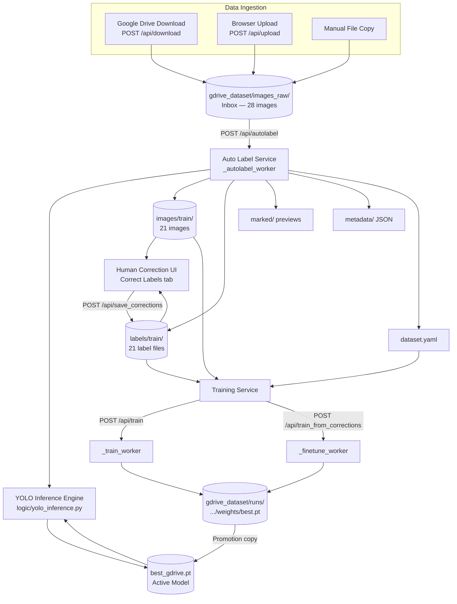
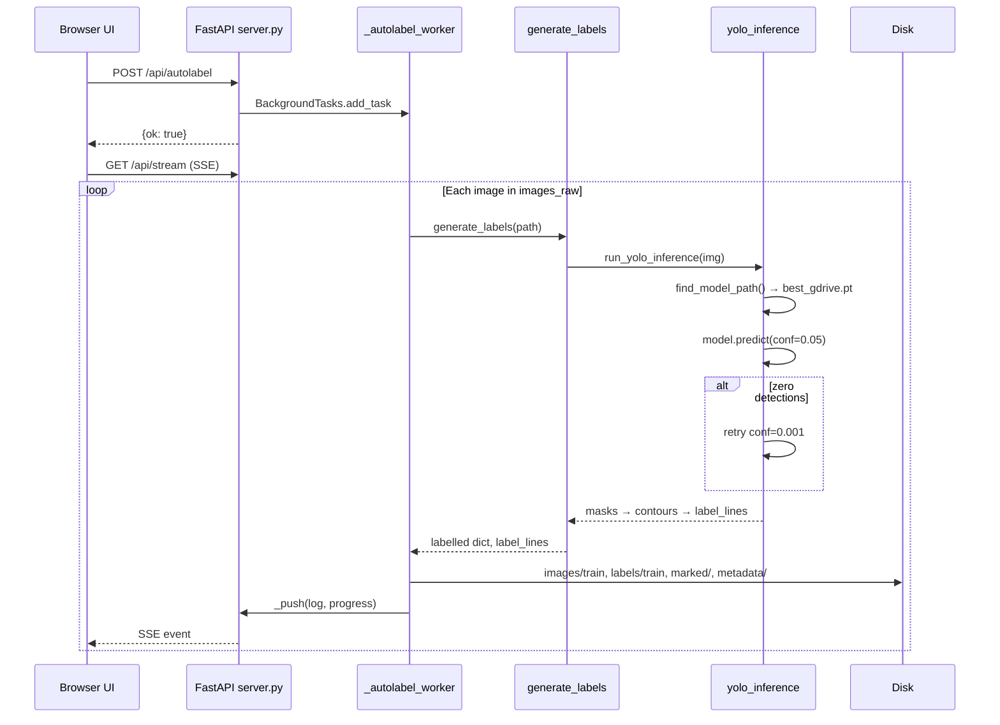
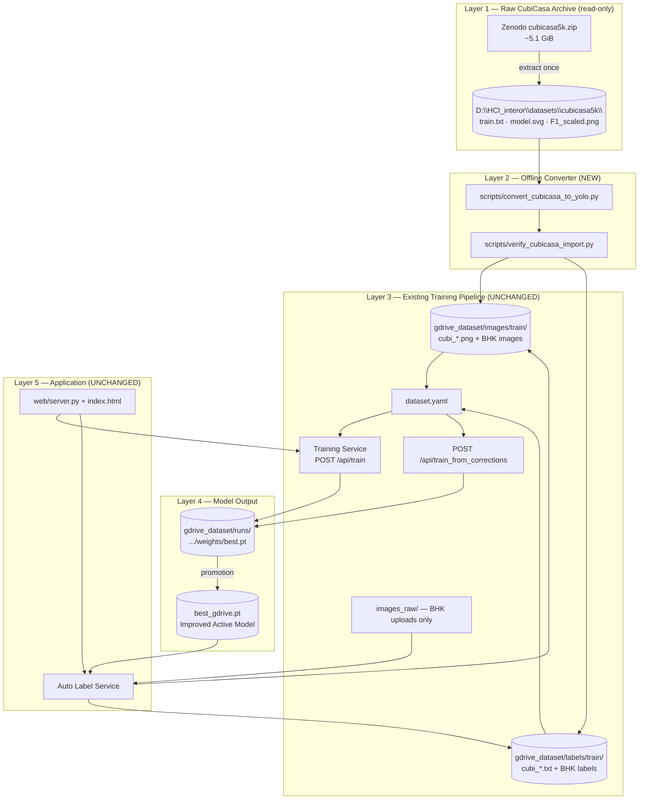
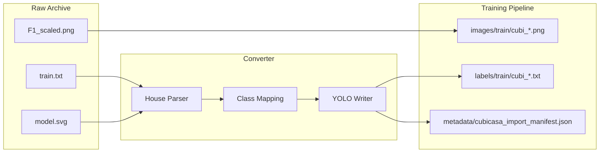
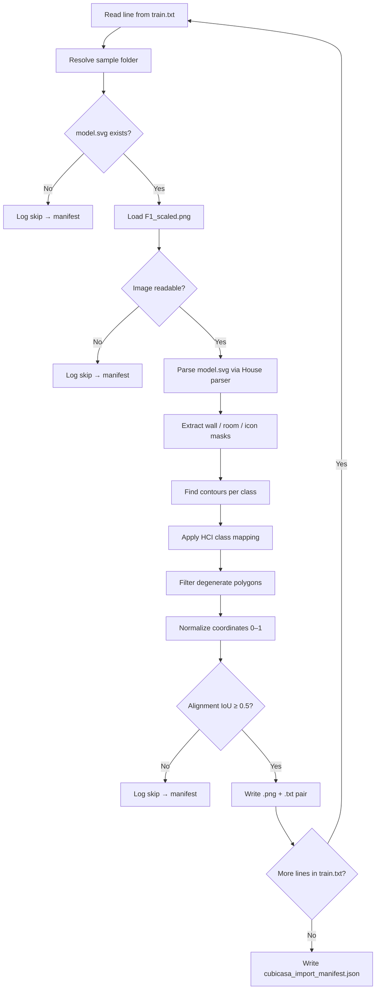
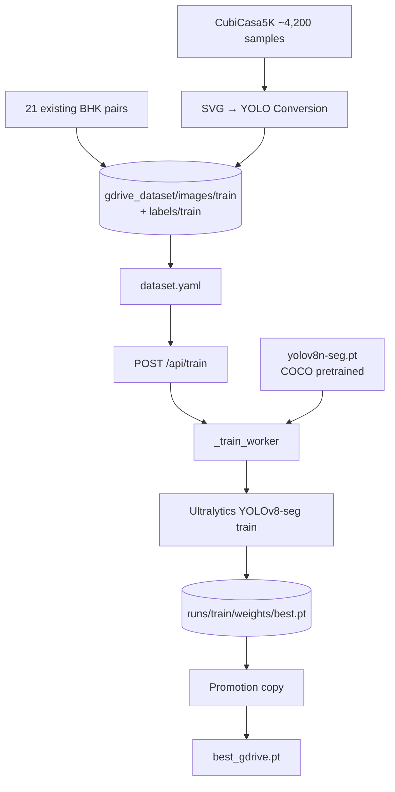
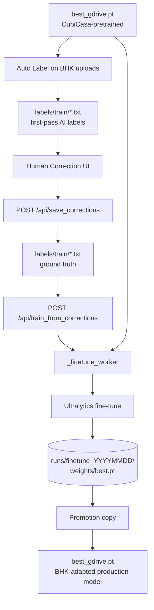
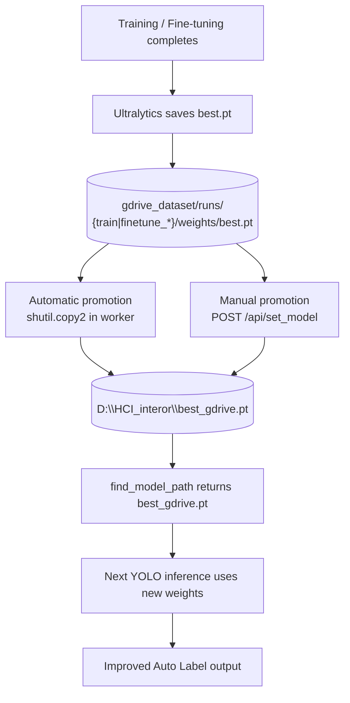
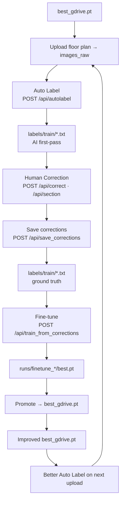
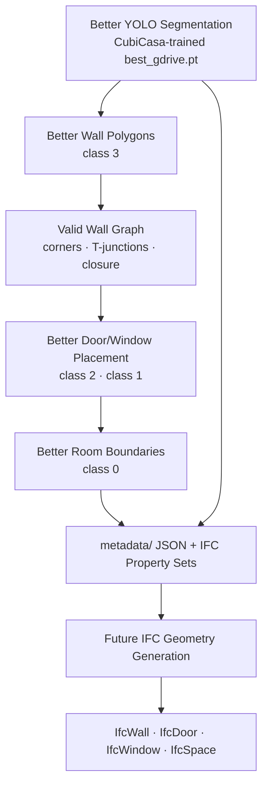

# High-Level Design (HLD)

## Training Module × CubiCasa5K Integration

---

| Field | Value |
|-------|-------|
| **Document Title** | Training Module × CubiCasa5K Integration — High-Level Design |
| **Document ID** | TM-CUBICASA-HLD-001 |
| **Version** | 1.0 |
| **Status** | Draft for Architecture Review |
| **Classification** | Internal — Management & Technical Leadership |
| **Application** | Training Module (Floor Plan Segmentation Training Platform) |
| **Application Root** | `D:\HCI_interor\Hci_1` |
| **Runtime Data Root** | `D:\HCI_interor` (PROJECT_ROOT) |
| **Date** | July 2026 |
| **Prepared For** | Senior Management, Technical Leadership, Solution Architecture |

---

## Document Control

| Version | Date | Author | Description |
|---------|------|--------|-------------|
| 1.0 | July 2026 | Architecture Team | Initial formal HLD for CubiCasa5K integration |

### Review and Approval

| Role | Name | Signature | Date |
|------|------|-----------|------|
| Solution Architect | | | |
| Technical Lead | | | |
| Engineering Manager | | | |
| Legal (License Review) | | | |

### Related Documents

| Document | Location |
|----------|----------|
| Project Workflow Deep Analysis | `D:\HCI_interor\Hci_1\PROJECT_WORKFLOW_DEEP_ANALYSIS.md` |
| CubiCasa Integration Roadmap | `D:\HCI_interor\Hci_1\CUBICASA_INTEGRATION_ROADMAP.md` |
| CubiCasa5K Official Dataset | [Zenodo 2613548](https://zenodo.org/records/2613548) |
| CubiCasa5K Repository | [GitHub CubiCasa/CubiCasa5k](https://github.com/CubiCasa/CubiCasa5k) |

### Scope

This HLD covers the integration of the external CubiCasa5K dataset into the Training Module training pipeline. It defines current architecture, proposed architecture, data flows, training strategy, model promotion, accuracy expectations, IFC/BIM dependencies, operational considerations, and risks. It does not constitute implementation code or configuration changes.

### Assumptions

- The Training Module web application (`web/server.py`, `index.html`) remains the primary operator interface.
- `PROJECT_ROOT` is `D:\HCI_interor`; training data resides in `gdrive_dataset/`.
- CubiCasa5K is downloaded from Zenodo (`cubicasa5k.zip`, ~5.1 GiB, MD5: `0ce0b203d1e3c125b51087b219bd23b9`).
- Integration Phase 1 requires only an offline converter; no web application architectural changes.
- License CC BY-NC-SA 4.0 requires separate legal approval for commercial deployment.

### Out of Scope

- Implementation of the SVG→YOLO converter (specified, not built in this document).
- IFC `.ifc` file writer and 3D extrusion pipeline.
- CubiCasa5K MMDetection or non-YOLO training frameworks.
- Modifications to existing application source code or training data.

---

## Table of Contents

1. [Executive Summary](#1-executive-summary)
2. [Current Architecture (Before Integration)](#2-current-architecture-before-integration)
3. [Current Limitations](#3-current-limitations)
4. [Proposed Architecture (After Integration)](#4-proposed-architecture-after-integration)
5. [Dataset Integration Architecture](#5-dataset-integration-architecture)
6. [SVG → YOLO Conversion Workflow](#6-svg--yolo-conversion-workflow)
7. [Training Architecture](#7-training-architecture)
8. [Fine-Tuning Architecture](#8-fine-tuning-architecture)
9. [Model Promotion Workflow](#9-model-promotion-workflow)
10. [Human-in-the-Loop Improvement Loop](#10-human-in-the-loop-improvement-loop)
11. [Accuracy Improvement Analysis](#11-accuracy-improvement-analysis)
12. [IFC/BIM Dependency Architecture](#12-ifcbim-dependency-architecture)
13. [File & Folder Architecture](#13-file--folder-architecture)
14. [Security & Data Handling Considerations](#14-security--data-handling-considerations)
15. [Scalability Considerations](#15-scalability-considerations)
16. [Operational Considerations](#16-operational-considerations)
17. [Risks & Mitigations](#17-risks--mitigations)
18. [End Goal](#18-end-goal)
19. [Final HLD Conclusion](#19-final-hld-conclusion)

---

## 1. Executive Summary

### 1.1 Purpose

The Training Module is a human-in-the-loop machine learning platform that ingests floor-plan images, auto-labels structural elements (walls, doors, windows), supports expert correction, retrains segmentation models, and promotes improved weights for future auto-labeling. The long-term product direction includes BIM/IFC geometry generation from accurate 2D segmentation polygons.

### 1.2 Current State

| Metric | Value |
|--------|-------|
| Labeled training pairs | **21** |
| Raw inbox images | **28** |
| Active model | `D:\HCI_interor\best_gdrive.pt` (~5.7 MB) |
| Training metric mAP50 | **≈ 0.0** |
| Estimated correction time | **30–60 minutes per plan** |

The Training Module architecture is functionally complete. The training corpus is insufficient for segmentation model convergence. Recent training runs (`train-2`, `train-3`, `finetune_20260708_190530`) report mAP50 = 0 across all epochs, confirming the model has not learned measurable detection quality.

### 1.3 Proposed Solution

Integrate **CubiCasa5K**, an industry-standard dataset of approximately **5,000 professionally annotated floor plans** with **~4,200 samples** in the official training split. Annotations are stored as SVG vector polygons (`model.svg`) paired with raster images (`F1_scaled.png`).

Integration approach:

1. Store raw CubiCasa5K in a read-only archive at `D:\HCI_interor\datasets\cubicasa5k\`.
2. Build an offline converter (`scripts/convert_cubicasa_to_yolo.py`) to transform SVG annotations into YOLO segmentation labels.
3. Import converted image-label pairs into existing `gdrive_dataset/images/train/` and `gdrive_dataset/labels/train/`.
4. Train using the existing Training Service (`POST /api/train`, `POST /api/train_from_corrections`).
5. Promote improved checkpoints to `best_gdrive.pt` using the existing promotion mechanism.

### 1.4 Expected Business Outcomes

| Outcome | Target |
|---------|--------|
| Training corpus expansion | 21 → ~4,221 pairs (~200×) |
| mAP50 improvement | > 0.30 after full import |
| Manual correction time | 30–60 min → 10–20 min per plan |
| Polygons requiring edit | 60–80% → 15–30% per plan |
| Training feedback loop | Measurable improvement per correction cycle |
| BIM/IFC foundation | Reliable 2D wall, door, window, room polygons |

### 1.5 Recommendation

Proceed with a **phased pilot** (100 samples, 1–2 weeks) subject to seven defined success gates before full ~4,200 sample import. Initiate legal review of CubiCasa5K license (CC BY-NC-SA 4.0) for commercial deployment.

---

## 2. Current Architecture (Before Integration)

### 2.1 Purpose

Document the existing Training Module architecture, components, data flows, and interfaces prior to CubiCasa5K integration.

### 2.2 Path Resolution

The Training Module resolves paths in `web/server.py`:

```python
LOGIC_DIR    = Path(__file__).resolve().parent.parent   # D:\HCI_interor\Hci_1
PROJECT_ROOT = LOGIC_DIR.parent                          # D:\HCI_interor
DATASET_DIR  = PROJECT_ROOT / "gdrive_dataset"           # D:\HCI_interor\gdrive_dataset
```

| Symbol | Path | Role |
|--------|------|------|
| Training Module code | `D:\HCI_interor\Hci_1\` | Application source |
| PROJECT_ROOT | `D:\HCI_interor\` | Data, models, external datasets |
| DATASET_DIR | `D:\HCI_interor\gdrive_dataset\` | Training pipeline I/O |

### 2.3 Current Architecture Diagram



### 2.4 Component Reference

| Component | File / Service | Input | Output | Business Role |
|-----------|----------------|-------|--------|---------------|
| **Ingestion Service** | `web/server.py` — `_download_worker()`, `upload_images()` | GDrive folder, browser files | Files in `images_raw/` | Collect floor plans from multiple sources |
| **Inbox Storage** | `gdrive_dataset/images_raw/` | Raw image files | Stored images | Staging area; not training-ready until Auto Label |
| **Auto Label Service** | `_autolabel_worker()` → `auto_label.generate_labels()` | `images_raw/*`, `best_gdrive.pt` | `images/train/`, `labels/train/`, `marked/`, `metadata/`, `dataset.yaml` | First-pass AI annotation |
| **YOLO Inference Engine** | `logic/yolo_inference.py` — `run_yolo_inference()` | BGR image, model weights | Wall/Door/Window polygon contours | Core segmentation inference |
| **Heuristic Enrichment** | `logic/floor_plan_analyzer.py`, `logic/room_text_mapper.py` | Image, partial labels | Enhanced room/OCR data | Supplement YOLO when room detection is weak |
| **Human Correction UI** | `web/index.html` — Correct Labels tab | User polygon edits | Updated `labels/train/*.txt` | Quality gate; creates supervised training data |
| **Training Service** | `_train_worker()`, `_finetune_worker()` | `dataset.yaml`, train folders, base weights | `runs/**/weights/best.pt` | Model retraining |
| **Model Promotion** | `shutil.copy2()` in server workers | `runs/.../best.pt` | Updated `best_gdrive.pt` | Activates trained model for inference |
| **Progress Streaming** | `GET /api/stream` (SSE) | Worker log events | Live UI updates | Operator visibility during long jobs |
| **Model Version Registry** | `GET /api/model_versions` | Checkpoint files on disk | mAP50, epochs, paths | Model governance and comparison |

### 2.5 Auto Label Execution Sequence



### 2.6 Inference Class Filter

At auto-label time, `logic/yolo_inference.py` filters detections to **Wall, Door, Window** only (`PRIORITY_HCI_CLASSES`). Room polygons may be added by heuristic modules (`analyse_floor_plan`, `analyse_image`) but are not primary YOLO inference output today.

### 2.7 Model Resolution Order

`find_model_path()` resolves the active inference model in this order:

1. `D:\HCI_interor\best_gdrive.pt`
2. `IMPROVED_MODEL_1.1\runs\pilot_wall_door_v0_1\weights\best.pt`
3. Highest mAP50 `best.pt` under `gdrive_dataset/runs/`, `runs/`, `iterations/`
4. Environment override: `HCI_MODEL_PATH`

---

## 3. Current Limitations

### 3.1 Purpose

Identify architectural and operational constraints that prevent the Training Module from delivering reliable auto-labeling and model improvement without external training data.

### 3.2 Limitation Summary

| Limitation | Evidence | Business Impact |
|------------|----------|-----------------|
| **Insufficient training data** | 21 labeled pairs | Model cannot generalize; mAP50 ≈ 0 |
| **Broken wall polygons** | Visual review of auto-label output | Structural geometry unreliable |
| **Missed doors and windows** | Low recall; confidence retry at 0.001 | Manual polygon drawing required |
| **High correction burden** | Est. 60–80% of polygons edited; 30–60 min/plan | High labor cost per floor plan |
| **Ineffective training loop** | mAP50 = 0 after train/fine-tune | No ROI on training investment |
| **Heuristic room dependency** | Rooms from `floor_plan_analyzer`, not YOLO | Inconsistent, non-learnable room detection |
| **Legacy dataset.yaml design** | train = val = test (same folder) | Validation metrics unreliable |
| **IFC/BIM geometry blocked** | Poor 2D polygons | Cannot support valid IfcWall, IfcDoor, IfcSpace |

### 3.3 Root Cause Analysis

```
┌────────────────────────────────────────────────────────────┐
│  PRIMARY BOTTLENECK: TRAINING DATA VOLUME                    │
│                                                            │
│  Segmentation models require hundreds to thousands of      │
│  diverse annotated examples for convergence.               │
│                                                            │
│  Training Module today:  21 labeled plans                │
│  CubiCasa5K train split:  ~4,200 labeled plans            │
│  Gap:                     ~200× insufficient               │
└────────────────────────────────────────────────────────────┘
```

The system architecture is sound. The training corpus is not.

---

## 4. Proposed Architecture (After Integration)

### 4.1 Purpose

Define the target architecture after CubiCasa5K integration, clearly separating new components from unchanged existing services.

### 4.2 Proposed Architecture Diagram



### 4.3 Change Summary

| Category | Changes | Unchanged |
|----------|---------|-----------|
| **Storage** | New `datasets/cubicasa5k/` raw archive; expanded `images/train/`, `labels/train/` | `gdrive_dataset` layout; `images_raw/` for BHK uploads |
| **Code** | New offline converter and QA scripts | `web/server.py`, `index.html`, all API routes |
| **Training** | Larger corpus (~4,221 pairs) | Training Service, promotion, `dataset.yaml` format |
| **Inference** | Improved `best_gdrive.pt` | Auto Label Service code path |
| **Operator workflow** | Better first-pass labels | Upload → correct → train → promote loop |

### 4.4 Business Impact

- **Low integration risk:** Data injection and one offline tool; no application rewrite.
- **Preserves existing investment:** All UI, APIs, and workflows remain valid.
- **Phased validation:** 100-sample pilot with defined gates before full import.

---

## 5. Dataset Integration Architecture

### 5.1 Purpose

Define how CubiCasa5K raw data is stored, indexed, and prepared for conversion into Training Module-compatible training data.

### 5.2 Raw Dataset Location

| Item | Value |
|------|-------|
| **Recommended path** | `D:\HCI_interor\datasets\cubicasa5k\` |
| **Source** | [Zenodo 2613548](https://zenodo.org/records/2613548) |
| **Archive file** | `cubicasa5k.zip` (~5,469,495,706 bytes) |
| **Checksum** | MD5: `0ce0b203d1e3c125b51087b219bd23b9` |
| **License** | CC BY-NC-SA 4.0 |

### 5.3 Rationale for External Storage

| Reason | Explanation |
|--------|-------------|
| Size | Multi-gigabyte archive inappropriate inside application repository |
| Separation of concerns | Third-party read-only archive vs. mutable application code |
| Convention | `PROJECT_ROOT` holds data siblings; application code in `Hci_1/` |
| License audit | Clear provenance for external dataset |
| Upgrade safety | Application updates do not affect raw archive |

### 5.4 Raw Folder Structure

```text
D:\HCI_interor\datasets\cubicasa5k\
├── train.txt                   # ~4,200 relative paths (one per line)
├── val.txt                     # ~400 paths
├── test.txt                    # ~400 paths (HOLD OUT — evaluation only)
├── high_quality_architectural\ # 3,732 samples
│   └── 41\
│       ├── model.svg           # Vector annotations (source of truth)
│       ├── F1_scaled.png       # Raster aligned to SVG (recommended)
│       └── F1_original.png     # Alternate raster
├── high_quality\               # 992 samples
└── colorful\                   # 276 samples
```

### 5.5 Dataset Split Usage

| Split | Samples | Training Module Usage |
|-------|---------|----------------------|
| `train.txt` | ~4,200 | Convert → import → train |
| `val.txt` | ~400 | Optional validation during training |
| `test.txt` | ~400 | **Never import for training**; evaluation only |

### 5.6 Dataset Integration Flow



### 5.7 Current Code Dependency

A search of the Training Module codebase finds **zero** references to `cubicasa`, `floortrans`, or `model.svg`. Integration requires a **new offline converter**; the running web server does not read the raw CubiCasa archive.

---

## 6. SVG → YOLO Conversion Workflow

### 6.1 Purpose

Define the technical process for transforming CubiCasa5K SVG vector annotations into YOLO segmentation label files compatible with the existing Training Module training pipeline.

### 6.2 Conversion Pipeline Diagram



### 6.3 Parser Selection

| Option | Description | Recommendation |
|--------|-------------|----------------|
| **A. floortrans.House** | Official CubiCasa parser; battle-tested | **Pilot phase** |
| **B. Custom SVG parser** | HCI-native; no legacy dependencies | Production evaluation |
| **C. Hybrid** | A for pilot; migrate to B | Long-term maintenance |

Official parser: `floortrans.loaders.house.House` from [CubiCasa/CubiCasa5k](https://github.com/CubiCasa/CubiCasa5k).

### 6.4 Polygon Extraction

| CubiCasa SVG Element | Extracted Geometry | HCI Class | Class ID |
|----------------------|-------------------|-----------|----------|
| `<g id="Wall">` polygons | Wall contours | Wall | 3 |
| `<g id="Space" class="...">` | Room contours | Room | 0 |
| Icon `id="Door"` | Door contours | Door | 2 |
| Icon `id="Window"` | Window contours | Window | 1 |

**Phase 1 room collapse:** All CubiCasa room types (Kitchen, Bedroom, Bath, LivingRoom, etc.) map to single HCI class `Room` (0). Sub-type distinctions preserved in optional metadata JSON for future `IfcSpace.LongName`.

### 6.5 YOLO Segmentation Format

One line per polygon instance:

```text
<class_id> <x1> <y1> <x2> <y2> <x3> <y3> ...
```

Coordinates normalized to [0, 1] relative to image width and height. Format matches `contour_to_yolo_seg()` in `logic/yolo_inference.py`.

**Example** (`cubi_hqa_41.txt`):

```text
3 0.124500 0.082300 0.125100 0.451200 0.089300 0.451800 0.088700 0.083100
0 0.210000 0.310000 0.450000 0.310000 0.450000 0.520000 0.210000 0.520000
2 0.382100 0.295400 0.401200 0.295400 0.401200 0.318700 0.382100 0.318700
1 0.512300 0.180200 0.548900 0.180200 0.548900 0.205100 0.512300 0.205100
```

### 6.6 Contour Processing

Aligned with `yolo_inference._filter_contour()`:

| Step | Parameter |
|------|-----------|
| Minimum area | `max(16, 0.00005 × H × W)` |
| Simplification | `cv2.approxPolyDP` |
| Rejection | Polygons with fewer than 3 points |

### 6.7 Output Naming Convention

| CubiCasa Category | Prefix | Example |
|-------------------|--------|---------|
| high_quality_architectural | `cubi_hqa_` | `cubi_hqa_41.png` / `cubi_hqa_41.txt` |
| high_quality | `cubi_hq_` | `cubi_hq_123.png` / `cubi_hq_123.txt` |
| colorful | `cubi_col_` | `cubi_col_55.png` / `cubi_col_55.txt` |

### 6.8 Validation Checks

| Check | Pass Criteria |
|-------|---------------|
| Pair count | `count(images) == count(labels)` |
| Non-empty labels | Each `.txt` has ≥ 1 polygon line |
| Coordinate range | All values in [0, 1] |
| Basename pairing | `cubi_hqa_41.png` ↔ `cubi_hqa_41.txt` |
| SVG/PNG alignment | IoU ≥ 0.5 (expected 2–5% rejection) |
| Visual QA (pilot) | ≥ 8/10 overlay checks pass |

---

## 7. Training Architecture

### 7.1 Purpose

Define the full (scratch) training architecture for CubiCasa-pretrained model creation using the expanded training corpus.

### 7.2 Training Pipeline Diagram



### 7.3 Full Training Parameters

| Parameter | Value | Rationale |
|-----------|-------|-----------|
| **API endpoint** | `POST /api/train` | Existing Training Service entry point |
| **Worker** | `_train_worker()` in `web/server.py` | Background training execution |
| **Base model** | `yolov8n-seg.pt` | COCO-pretrained YOLOv8 segmentation; provides general vision features as starting point |
| **Training data** | `dataset.yaml` → `images/train/` + `labels/train/` | Standard Ultralytics dataset layout |
| **Epochs** | 50–100 | Sufficient for ~4,200 samples to converge; current 21 samples fail at any epoch count |
| **Batch size** | 8–16 (GPU) / 4 (CPU) | GPU: balance memory and gradient stability; CPU: `workers=0` for Windows compatibility |
| **Image size** | 640 | Matches existing auto-label inference (`imgsz=640`); consistent train/inference resolution |
| **Optimizer** | Ultralytics defaults | Standard Adam/SGD schedule for scratch training |
| **Freeze** | None | All layers must learn floor-plan-specific features from scratch on domain data |
| **Device** | CUDA / MPS / CPU auto-detect | GPU strongly recommended for 4,000+ sample training |
| **Project directory** | `gdrive_dataset/runs` | Consistent with existing training output location |
| **Run name** | `train` | Default Ultralytics run naming |
| **Workers** | 0 | Windows compatibility (existing server configuration) |
| **Output** | `gdrive_dataset/runs/train/weights/best.pt` | Best checkpoint by validation metric |

### 7.4 dataset.yaml Configuration

Generated by Auto Label worker; regenerated on each autolabel run:

```yaml
path: D:\HCI_interor\gdrive_dataset
train: images/train
val: images/train
test: images/train
nc: 17
names:
  0: Room
  1: Window
  2: Door
  3: Wall
  # ... classes 4–16
```

**Known limitation:** train, val, and test point to the same folder. Recommended future improvement: separate validation folder for reliable mAP reporting.

### 7.5 Phased Training Scope

| Phase | Samples | Training Action |
|-------|---------|-----------------|
| Phase 1 (Pilot) | 100 CubiCasa | Fine-tune from `best_gdrive.pt` (10 epochs) |
| Phase 2 (Validation) | 500 CubiCasa + 21 BHK | Full or fine-tune; evaluate on hold-out |
| Phase 3 (Production) | ~4,200 CubiCasa + 21 BHK | Full train 50–100 epochs from `yolov8n-seg.pt` |

---

## 8. Fine-Tuning Architecture

### 8.1 Purpose

Define the incremental training architecture for adapting a CubiCasa-pretrained model to local Training Module floor plans (BHK marketing renders) using human-corrected labels.

### 8.2 Fine-Tuning Pipeline Diagram



### 8.3 Fine-Tuning Parameters

| Parameter | Value | Rationale |
|-----------|-------|-----------|
| **API endpoint** | `POST /api/train_from_corrections` | Existing fine-tune entry point |
| **Worker** | `_finetune_worker()` in `web/server.py` | Background fine-tune execution |
| **Base model** | `best_gdrive.pt` or user-selected checkpoint | Preserves CubiCasa geometric knowledge; avoids retraining from COCO |
| **Epochs** | 5–10 | Small correction batches require few epochs; prevents overfitting |
| **Batch size** | 2–4 | Appropriate for small BHK correction subsets |
| **Image size** | 640 | Consistent with full training and inference |
| **Optimizer** | SGD | Hardcoded in `_finetune_worker`; stable for fine-tuning |
| **Learning rate** | 0.0005 (`lr0`) | Low rate prevents catastrophic forgetting of CubiCasa-learned features |
| **LR final factor** | 0.01 (`lrf`) | Standard decay schedule |
| **Freeze** | 10 backbone layers | Retains low-level visual features; adapts detection head to BHK domain |
| **Momentum** | 0.937 | Standard SGD momentum |
| **Weight decay** | 0.0005 | Mild regularization |
| **Warmup epochs** | 1 | Stabilizes initial fine-tune steps |
| **Close mosaic** | 0 | Disabled for fine-tune runs |
| **Train scope** | `corrected` / `all` / explicit `train_files` | Flexible: corrected-only for incremental; all for full corpus refresh |
| **Subset handling** | Temporary `dataset.yaml` in temp dir | When training on corrected subset only |
| **Output** | `gdrive_dataset/runs/finetune_YYYYMMDD_HHMMSS/weights/best.pt` | Timestamped fine-tune run |

### 8.4 Domain Transfer Strategy

| Stage | Data Source | Purpose |
|-------|-------------|---------|
| **Pretrain** | CubiCasa ~4,200 + 21 BHK | Learn wall/door/window geometry across diverse plans |
| **Fine-tune** | BHK corrections (5–10 plans sufficient) | Adapt to Indian marketing render appearance |
| **Ongoing** | Each correction batch → fine-tune → promote | Continuous domain refinement |

**Domain gap:** CubiCasa plans are Finnish/European architectural CAD; Training Module BHK plans are Indian marketing renders. Pretrain teaches structure; fine-tune teaches local appearance.

---

## 9. Model Promotion Workflow

### 9.1 Purpose

Define how trained checkpoints become the active inference model used by Auto Label and fine-tuning.

### 9.2 Promotion Flow Diagram



### 9.3 Promotion Mechanisms

| Mechanism | Trigger | Code Path |
|-----------|---------|-----------|
| **Automatic** | `_train_worker()` success | `shutil.copy2(best.pt, PROJECT_ROOT / "best_gdrive.pt")` |
| **Automatic** | `_finetune_worker()` success | Same copy operation |
| **Automatic** | `_merge_worker()` success | Same copy operation |
| **Manual** | `POST /api/set_model {"path": "..."}` | User-selected checkpoint → `best_gdrive.pt` |

### 9.4 Model Comparison Before Promotion

| Step | API / Action | Purpose |
|------|--------------|---------|
| 1 | `GET /api/model_versions` | List all checkpoints with mAP50, mAP50-95, epochs |
| 2 | `GET /api/status` | Confirm current `best_model` path |
| 3 | `POST /api/detect` with `model_path` override | Visual A/B test on BHK hold-out plans |
| 4 | Correct Labels tab review | Per-class polygon quality assessment |
| 5 | `POST /api/set_model` | Promote winner if superior |

### 9.5 Model Cache Behavior

`logic/yolo_inference.py` maintains a module-level model cache (`_model_cache`). Cache invalidates when `model_path` changes. Server restart loads new `best_gdrive.pt` on first inference call.

---

## 10. Human-in-the-Loop Improvement Loop

### 10.1 Purpose

Define the closed feedback cycle through which human corrections improve future auto-labeling quality.

### 10.2 Improvement Loop Diagram



### 10.3 Loop Step Reference

| Step | Service | Input | Output | ML Effect |
|------|---------|-------|--------|-----------|
| Upload | Ingestion Service | Floor plan image | `images_raw/{file}` | New sample enters pipeline |
| Auto Label | `_autolabel_worker` | `best_gdrive.pt`, image | `labels/train/{name}.txt` | Model applies learned patterns |
| Correction | Human Correction UI | User edits | Updated contours in `_analysis` | Expert defines correct geometry |
| Save | `save_corrections` | Session state | Persisted `.txt` on disk | Ground truth for training |
| Fine-tune | `_finetune_worker` | Corrected labels, base model | New `best.pt` | Weights shift toward expert labels |
| Promote | `shutil.copy2` | `best.pt` | Updated `best_gdrive.pt` | Improved model active for inference |
| Better Auto Label | `_autolabel_worker` | New `best_gdrive.pt` | Denser, more accurate polygons | Reduced correction burden |

### 10.4 Session Tracking

`_corrected_basenames` (in-memory set in `web/server.py`) records images corrected in the current session. Used by `train_from_corrections` when `train_scope=corrected` to fine-tune only on recently corrected labels.

### 10.5 Why the Loop Fails Today

With 21 training samples and mAP50 ≈ 0, fine-tuning on corrections does not produce measurable model improvement. The loop requires a capable base model — which CubiCasa pretraining provides.

---

## 11. Accuracy Improvement Analysis

### 11.1 Purpose

Quantify expected improvements across key operational and technical metrics.

### 11.2 Comparison Table

| Metric | Current (Before) | Target (After Integration) | Improvement Factor |
|--------|------------------|---------------------------|-------------------|
| **Training pairs** | 21 | ~4,221 | ~200× |
| **mAP50** | ≈ 0.0 | > 0.30 | Measurable quality |
| **mAP50-95** | 0.0 | > 0.15 | Stricter IoU threshold |
| **Wall continuity** | Broken chains, gaps | Continuous wall lines | Structural reliability |
| **Door recall** | Low; conf retry 0.001 | Normal confidence 0.05 | Fewer manual drawings |
| **Window recall** | Frequently missed | Improved detection | Better opening data |
| **Correction time** | 30–60 min/plan | 10–20 min/plan | 50–70% reduction |
| **Polygons edited** | 60–80% per plan | 15–30% per plan | Major labor savings |
| **Auto-label skip rate** | High | Low | Higher automation rate |
| **Training ROI** | None (mAP50 = 0) | Measurable per cycle | Working ML flywheel |
| **BHK plans to improve model** | N/A | 5–10 corrected + fine-tune | Low ongoing cost |

### 11.3 Phased Accuracy Targets

| Phase | Samples | mAP50 Target | Primary Validation |
|-------|---------|--------------|-------------------|
| Phase 1 (Pilot) | 100 | > 0 (non-zero) | Visual on 5 BHK plans |
| Phase 2 (Validation) | 500 | > 0.30 | Hold-out test.txt (50 samples) |
| Phase 3 (Full) | ~4,200 | > 0.30–0.50 | BHK correction time study |

### 11.4 Operational Impact

| Operational Area | Current Cost | Projected Cost | Savings Mechanism |
|------------------|-------------|----------------|-------------------|
| Per-plan annotation | 30–60 min expert time | 10–20 min | Better first-pass auto-label |
| Model training cycles | No measurable return | Positive mAP delta per cycle | Corrections improve model |
| New plan onboarding | Near-manual polygon creation | Review and light correction | AI handles majority of polygons |
| Model governance | Subjective visual comparison | mAP50-based version ranking | Data-driven promotion decisions |
| BIM/IFC preparation | Unreliable geometry | Trustworthy 2D foundation | Professional training annotations |

---

## 12. IFC/BIM Dependency Architecture

### 12.1 Purpose

Define how segmentation quality connects to the long-term BIM/IFC export strategy and document built vs. future capabilities.

### 12.2 IFC/BIM Dependency Diagram



### 12.3 Class-to-IFC Entity Mapping

| Training Module Class | Class ID | IFC Entity | IFC Property Sets (Built) |
|-----------------------|----------|------------|---------------------------|
| Room | 0 | `IfcSpace` | Pset_SpaceCommon, Pset_SpaceThermal, Pset_SpaceLighting |
| Window | 1 | `IfcWindow` | Pset_WindowCommon |
| Door | 2 | `IfcDoor` | Pset_DoorCommon |
| Wall | 3 | `IfcWall` | Pset_WallCommon |
| Slab | 4 | `IfcSlab` | Pset_SlabCommon |
| Stair | 8 | `IfcStair` | Pset_StairCommon |
| Railing | 9 | `IfcRailing` | Pset_RailingCommon |
| Furniture | 11 | `IfcFurnishingElement` | Pset_Furniture |
| FlowTerminal | 15 | `IfcSanitaryTerminal` | Pset_FlowTerminal |

Schema defined in `logic/ifc_properties.py`.

### 12.4 Built vs. Future Capabilities

| Capability | Status | Component |
|------------|--------|-----------|
| 2D YOLO polygon labels | **Built** | `labels/train/*.txt` |
| Human correction UI | **Built** | Correct Labels tab |
| IFC property schema | **Built** | `logic/ifc_properties.py` |
| Per-element property CRUD | **Built** | `/api/ifc/schema`, `/api/ifc/props/{basename}` |
| Export JSON for IFC builder | **Partial** | `/api/ifc/export/{basename}` |
| OCR room-name mapping | **Built** | `logic/room_text_mapper.py` |
| Image metadata JSON | **Built** | `logic/image_metadata.py` |
| Pixel → meter scale calibration | **Future** | Not implemented |
| 2D polygon → 3D extrusion | **Future** | Not implemented |
| `.ifc` file writer (IfcOpenShell) | **Future** | Not implemented |
| End-to-end BIM export pipeline | **Future** | Depends on all above |

### 12.5 Segmentation as BIM Foundation

```
Principle:  Inaccurate 2D segmentation → Invalid BIM geometry
            Accurate 2D segmentation    → Valid BIM foundation
```

| BIM Element | Segmentation Dependency |
|-------------|----------------------|
| IfcWall | Requires continuous, correctly placed wall polygons |
| IfcDoor | Requires door polygon positioned within wall segment |
| IfcWindow | Requires window polygon on wall face |
| IfcSpace | Requires closed room boundary for area calculation |

CubiCasa integration improves the bottom of this chain. IFC export implementation is a separate future phase.

---

## 13. File & Folder Architecture

### 13.1 Purpose

Document all disk locations, file types, naming conventions, and component dependencies.

### 13.2 Complete Directory Tree

```text
D:\HCI_interor\
│
├── best_gdrive.pt                         # ACTIVE MODEL (inference + fine-tune base)
├── yolov8n-seg.pt                         # COCO pretrained (scratch training only)
│
├── datasets\                              # NEW — proposed
│   └── cubicasa5k\                        # RAW CubiCasa archive (read-only)
│       ├── train.txt
│       ├── val.txt
│       ├── test.txt
│       └── {category}\{id}\
│           ├── model.svg
│           ├── F1_scaled.png
│           └── F1_original.png
│
├── gdrive_dataset\                        # TRAINING PIPELINE ROOT (DATASET_DIR)
│   ├── images_raw\           (28 files)   # Inbox — uploads / GDrive
│   ├── images\train\         (21 → ~4,221) # Training images
│   ├── labels\train\         (21 → ~4,221) # YOLO segmentation labels
│   ├── marked\               (63 files)   # UI preview images
│   ├── metadata\             (21 files)   # JSON sidecars + import manifest
│   ├── dataset.yaml                       # Ultralytics dataset config
│   └── runs\                              # Training outputs
│       ├── train\weights\best.pt
│       └── finetune_*\weights\best.pt
│
└── Hci_1\                                 # TRAINING MODULE APPLICATION
    ├── web\
    │   ├── server.py                      # FastAPI backend (all API routes)
    │   └── index.html                     # Browser UI
    ├── auto_label.py                      # Auto Label entry point
    ├── config\
    │   └── classes.py                     # 17-class taxonomy
    ├── logic\
    │   ├── yolo_inference.py              # Model resolve, inference, YOLO format
    │   ├── floor_plan_analyzer.py         # Heuristic room enrichment
    │   ├── room_text_mapper.py            # OCR text-to-room mapping
    │   ├── image_metadata.py              # JSON metadata read/write
    │   └── ifc_properties.py              # IFC schema
    └── scripts\
        ├── start_server.bat               # Launch with improved_model_train env
        ├── convert_cubicasa_to_yolo.py    # NEW — proposed converter
        └── verify_cubicasa_import.py      # NEW — proposed QA tool
```

### 13.3 Current Files

| File Pattern | Location | Created By | Consumed By |
|--------------|----------|------------|-------------|
| `*.jpg`, `*.png` (raw) | `images_raw/` | Upload, GDrive download | Auto Label |
| `*.jpg`, `*.png` (train) | `images/train/` | Auto Label | Ultralytics training |
| `*.txt` (labels) | `labels/train/` | Auto Label, corrections | Ultralytics training |
| `*_labelled.jpg` | `marked/` | Auto Label | UI preview |
| `*.json` | `metadata/` | Auto Label, IFC routes | Metadata / IFC props |
| `dataset.yaml` | `gdrive_dataset/` | Auto Label | Training Service |
| `best.pt` | `runs/**/weights/` | Ultralytics training | Promotion |
| `best_gdrive.pt` | `PROJECT_ROOT/` | Promotion | Inference, fine-tune base |

### 13.4 New Files After Integration

| File Pattern | Location | Created By | Purpose |
|--------------|----------|------------|---------|
| `cubi_hqa_*.png` | `images/train/` | CubiCasa converter | Training image |
| `cubi_hqa_*.txt` | `labels/train/` | CubiCasa converter | YOLO label |
| `cubi_hq_*.png/.txt` | `images/train/`, `labels/train/` | Converter | high_quality category |
| `cubi_col_*.png/.txt` | `images/train/`, `labels/train/` | Converter | colorful category |
| `cubicasa_import_manifest.json` | `metadata/` | Converter | Import audit trail |

### 13.5 Key Application Files

| File | Role |
|------|------|
| `web/server.py` | FastAPI backend; all API routes and background workers |
| `web/index.html` | Single-page UI; all operator interactions |
| `auto_label.py` | Auto Label entry; calls `yolo_inference.run_yolo_inference()` |
| `logic/yolo_inference.py` | `find_model_path()`, `_get_model()`, `run_yolo_inference()`, `contour_to_yolo_seg()` |
| `config/classes.py` | 17-class taxonomy: `CLASS_IDS`, `ID_TO_CLASS` |
| `logic/ifc_properties.py` | IFC schema: `IFC_SCHEMA`, `MATERIALS`, property set validators |

---

## 14. Security & Data Handling Considerations

### 14.1 Purpose

Define data handling, access, and compliance considerations for CubiCasa5K integration.

### 14.2 Data Classification

| Data Asset | Classification | Storage | Access |
|------------|---------------|---------|--------|
| CubiCasa5K raw archive | Third-party open dataset | `datasets/cubicasa5k/` (local disk) | Read-only; converter only |
| BHK floor plans | Customer/project data | `gdrive_dataset/` | Training Module application |
| Model weights | Intellectual property | `best_gdrive.pt`, `runs/` | Application process |
| IFC property data | Project metadata | `metadata/` | Application API |

### 14.3 License Compliance

| Requirement | CC BY-NC-SA 4.0 Obligation | Action |
|-------------|---------------------------|--------|
| **Attribution (BY)** | Credit CubiCasa5K authors | Include in documentation and model cards |
| **Non-Commercial (NC)** | No commercial use without separate license | Legal review before commercial deployment |
| **Share-Alike (SA)** | Derivative datasets/models may require same license | Assess impact on model distribution |

### 14.4 Data Handling Principles

- Raw CubiCasa archive is **read-only**; the running web server does not access it.
- Converter runs as an **offline batch job** with no network exposure.
- BHK customer data and CubiCasa data coexist in `images/train/` but are distinguishable by filename prefix (`cubi_*` vs. BHK names).
- No customer data is transmitted to external services during conversion or training (local processing only).
- Import manifest provides audit trail for data provenance.

---

## 15. Scalability Considerations

### 15.1 Purpose

Define how the integrated architecture scales with increasing data volume, user load, and model complexity.

### 15.2 Data Volume Scaling

| Dimension | Current | After Integration | Scaling Path |
|-----------|---------|-------------------|--------------|
| Training pairs | 21 | ~4,221 | Add more external datasets using same converter pattern |
| Raw archive disk | 0 | ~5–10 GB | Additional datasets as siblings under `datasets/` |
| Converted data disk | ~100 MB | ~2–4 GB | Linear with sample count |
| Training time | Minutes (no convergence) | Hours (GPU, 50–100 epochs) | GPU upgrade; distributed training (future) |

### 15.3 Application Scaling

| Component | Current Design | Scaling Consideration |
|-----------|---------------|----------------------|
| Auto Label | Single-process background worker | Parallel workers for large batches (future) |
| Training | Single `_training_lock` | Queue-based training job management (future) |
| Model cache | Single `_model_cache` in process | Sufficient for single-server deployment |
| SSE log stream | In-memory `_log_queue` | Sufficient for single-operator use |

### 15.4 Model Scaling

| Approach | Description | When |
|----------|-------------|------|
| YOLOv8n-seg (nano) | Current; fast, low memory | Pilot and production initial |
| YOLOv8s/m-seg | Larger backbone; higher accuracy | If mAP50 plateaus on nano |
| Multi-dataset training | Additional datasets beyond CubiCasa | Future data diversification |
| Per-class fine-tune | Fine-tune on specific class corrections | Targeted improvement |

---

## 16. Operational Considerations

### 16.1 Purpose

Define runtime, environment, and operational requirements for integrated system operation.

### 16.2 Python Environment

| Requirement | Detail |
|-------------|--------|
| **Recommended environment** | `improved_model_train` (Anaconda) |
| **Launch script** | `scripts/start_server.bat` |
| **PyTorch dependency** | Required for Auto Label and training |
| **Known issue** | Wrong Python interpreter causes `c10.dll` failure; use `start_server.bat` |

### 16.3 Server Entry Point

```text
D:\HCI_interor\Hci_1\web\server.py
uvicorn.run("server:app", host="0.0.0.0", port=8000)
```

### 16.4 Operational Procedures

| Procedure | Steps |
|-----------|-------|
| **Start server** | Run `scripts/start_server.bat` or `improved_model_train` python → `server.py` |
| **Upload plans** | UI upload or `POST /api/upload` → `images_raw/` |
| **Auto Label** | UI trigger → `POST /api/autolabel` → monitor `GET /api/stream` |
| **Correct labels** | Correct Labels tab → save → `labels/train/*.txt` updated |
| **Train** | Training tab → `POST /api/train` or `POST /api/train_from_corrections` |
| **Promote model** | Automatic after train; or `POST /api/set_model` |
| **Convert CubiCasa** | Offline: run `convert_cubicasa_to_yolo.py` → verify → train |
| **Backup** | Copy `best_gdrive.pt`, `gdrive_dataset/labels/train/`, `dataset.yaml` before major operations |

### 16.5 Phased Implementation Timeline

| Phase | Duration | Scope | Gate |
|-------|----------|-------|------|
| Phase 0 | Week 1 | Download, extract, build converter | Checksum verified |
| Phase 1 | Weeks 1–2 | 100-sample pilot | 7 success gates |
| Phase 2 | Weeks 3–4 | 500-sample validation | mAP50 > 0.30 |
| Phase 3 | Weeks 5–8 | Full ~4,200 import + production train | BHK correction time study |
| Ongoing | Continuous | BHK correction → fine-tune → promote | Per-cycle mAP delta |

---

## 17. Risks & Mitigations

### 17.1 Purpose

Identify integration risks and define mitigation strategies.

### 17.2 Risk Register

| Risk | Severity | Likelihood | Mitigation |
|------|----------|------------|------------|
| **SVG/PNG alignment mismatch** | High | Medium | Use `F1_scaled.png` only; IoU check per sample; skip failures (expect 2–5%); log to manifest |
| **Wrong class mapping** | High | Medium | Explicit mapping table in `config/cubicasa_class_map.py`; unit tests; visual QA 10/category |
| **Domain gap (EU vs Indian BHK)** | High | High | CubiCasa pretrain for geometry; retain 21 BHK; fine-tune on BHK corrections; evaluate on BHK hold-out |
| **License NC clause** | Critical | Certain | Legal review before commercial use; attribution in docs; R&D use approved separately |
| **Converter bugs** | Medium | Medium | 100-sample pilot with QA gates; import manifest audit; no full import until gates pass |
| **Dataset imbalance (walls >> doors)** | Medium | High | Accept natural distribution; optional wall instance cap per image |
| **Training time / GPU availability** | Medium | Medium | Phased training; GPU environment; batch size tuning |
| **dataset.yaml overwrite on autolabel** | Low | Certain | Backup `dataset.yaml` before autolabel; converter does not trigger autolabel |
| **Disk space** | Low | Low | ~10 GB total (raw + converted); monitor `D:\` capacity |
| **Catastrophic forgetting on fine-tune** | Medium | Medium | Low LR (0.0005); freeze 10 backbone layers; retain BHK in training set |

### 17.3 Pilot Success Gates (Go/No-Go)

| # | Gate | Pass Criteria |
|---|------|---------------|
| 1 | Valid pairs | 100 images = 100 non-empty label files |
| 2 | Alignment | < 5% samples rejected |
| 3 | Visual QA | ≥ 8/10 overlay checks pass |
| 4 | BHK improvement | ≥ 2/5 BHK test plans visibly better |
| 5 | mAP50 > 0 | Non-zero after pilot fine-tune |
| 6 | No regression | 21 BHK pairs intact; no naming collisions |
| 7 | License sign-off | Management approval documented |

All seven gates must pass before Phase 2 (500 samples) and Phase 3 (full import).

---

## 18. End Goal

### 18.1 Purpose

State the measurable outcomes this integration is designed to achieve.

### 18.2 Target State

The Training Module × CubiCasa5K integration transforms the platform from a **data-starved prototype** into a **scalable floor-plan segmentation engine** with a credible path to BIM/IFC export.

### 18.3 Success Criteria

| Goal | Current | Target |
|------|---------|--------|
| Auto Label first-pass quality | Weak; frequent skips | Dense Wall/Door/Window polygons |
| Manual correction effort | 30–60 min/plan | 10–20 min/plan |
| Model metric mAP50 | ≈ 0 | > 0.30 |
| Training feedback loop | Non-functional | Measurable improvement per cycle |
| Model governance | Subjective comparison | mAP50-based version ranking |
| BIM/IFC geometry foundation | Unreliable | Valid 2D wall, door, window, room polygons |
| Platform throughput | Limited by manual annotation | 50–70% annotation labor reduction |
| Operator confidence | Low (training shows no gain) | High (visible Auto Label improvement) |

### 18.4 Six-Month Vision

1. Operator uploads a new BHK floor plan.
2. Auto Label produces usable wall, door, and window polygons on first pass.
3. Expert performs light correction (10–20 minutes).
4. Fine-tune on corrections produces measurable mAP50 gain.
5. IFC properties attach to trustworthy geometry.
6. Management governs model versions using objective metrics.

---

## 19. Final HLD Conclusion

### 19.1 Summary

The Training Module is a well-architected human-in-the-loop floor-plan training platform. Its components — data ingestion, auto-labeling, human correction, training, model promotion, and IFC property preparation — form a complete and logically structured pipeline.

**The primary bottleneck is training data volume, not system design.**

| Fact | Conclusion |
|------|------------|
| 21 labeled training pairs | Insufficient for segmentation model convergence |
| mAP50 ≈ 0 | Model has not learned measurable detection quality |
| 30–60 min correction time per plan | High operational cost driven by poor auto-label |
| IFC properties built but geometry poor | BIM export blocked on segmentation quality |

### 19.2 Proposed Solution

CubiCasa5K provides approximately **4,200 professionally annotated floor plans** with SVG polygon labels ideally suited for YOLO segmentation training. Integration requires:

1. A read-only raw archive at `D:\HCI_interor\datasets\cubicasa5k\`
2. One new offline converter script
3. Import of converted pairs into existing `gdrive_dataset` training folders
4. Training via existing Training Service and promotion to `best_gdrive.pt`

**No web application architectural changes are required in Phase 1.**

### 19.3 Recommended Execution Path

```
Phase 0:  Prerequisites (download, extract, build converter)     — Week 1
Phase 1:  100-sample pilot with 7 success gates                  — Weeks 1–2
Phase 2:  500-sample validation (mAP50 > 0.30)                   — Weeks 3–4
Phase 3:  Full ~4,200 import + production training               — Weeks 5–8
Ongoing:  BHK correction → fine-tune → promote loop               — Continuous
```

### 19.4 Decision Requested

| Action | Owner |
|--------|-------|
| Approve Phase 1 pilot (100 samples, 1–2 weeks) | Management |
| Allocate engineering resource for converter development | Engineering Manager |
| Initiate legal review of CC BY-NC-SA 4.0 license | Legal / Management |
| Define BHK hold-out test set for evaluation | Product / Engineering |

### 19.5 Expected Outcome

A scalable floor-plan segmentation platform that:

- Delivers reliable Auto Label on new floor-plan uploads
- Reduces annotation labor by 50–70%
- Provides measurable model quality metrics for governance
- Establishes the geometric foundation for future BIM/IFC generation
- Activates the human-in-the-loop training flywheel that the current architecture supports but cannot sustain without adequate training data

---

*End of Document*

*Document: TM-CUBICASA-HLD-001 v1.0 | Training Module × CubiCasa5K Integration | July 2026*

*This HLD was prepared from analysis of the Training Module codebase and integration planning documents. No source code or training data was modified during its creation.*
