# End-to-End Architecture & Post-Integration Flow Analysis

> **Update (HCI_2.1):** Live app is `HCI_2.1`. In addition to the Drive/UI IFC path analyzed below, an additive Node doorway exists:  
> `POST /api/generate-ifc-webhook` → isolated `gdrive_dataset/webhook_uploads/{job_id}/` → `generate_labels()` → `generate_full_ifc()` → callback.  
> Drive/UI flows remain unchanged. See `DEPLOY.md` / `RUN_GUIDE.md`.

**Document Title:** Training Module — Before/After CubiCasa Integration & IFC Generation Architecture  
**Version:** 2.0  
**Date:** July 2026  
**Application:** Training Module (`D:\HCI_interor\Hci_1`)  
**Runtime Root:** `D:\HCI_interor` (PROJECT_ROOT)  
**Classification:** Internal — Technical Architecture Review  

---

## Document Control

| Item | Value |
|------|-------|
| Output path | `D:\HCI_interor\Hci_1\END_TO_END_IFC_ARCHITECTURE_ANALYSIS.md` |
| Scope | Current flow, post-CubiCasa flow, training, IFC future architecture |
| Out of scope | Source code or dataset modification |

### Path Constants

```python
# web/server.py
LOGIC_DIR    = D:\HCI_interor\Hci_1
PROJECT_ROOT = D:\HCI_interor
DATASET_DIR  = D:\HCI_interor\gdrive_dataset
```

| Asset | Path |
|-------|------|
| Active model | `D:\HCI_interor\best_gdrive.pt` |
| Training inbox | `D:\HCI_interor\gdrive_dataset\images_raw\` |
| Training images | `D:\HCI_interor\gdrive_dataset\images\train\` |
| Training labels | `D:\HCI_interor\gdrive_dataset\labels\train\` |
| Training config | `D:\HCI_interor\gdrive_dataset\dataset.yaml` |
| Training runs | `D:\HCI_interor\gdrive_dataset\runs\` |
| CubiCasa raw (proposed) | `D:\HCI_interor\datasets\cubicasa5k\` |

---

## Table of Contents

1. [Executive Summary](#1-executive-summary)
2. [Current End-to-End Flow (Before Integration)](#2-current-end-to-end-flow-before-integration)
3. [Why the Current System Fails](#3-why-the-current-system-fails)
4. [CubiCasa Integration Flow (After Integration)](#4-cubicasa-integration-flow-after-integration)
5. [Before vs After Comparison](#5-before-vs-after-comparison)
6. [Training Architecture (After Integration)](#6-training-architecture-after-integration)
7. [Model Improvement Loop (After Integration)](#7-model-improvement-loop-after-integration)
8. [IFC/BIM Generation Flow (Future Architecture)](#8-ifcbim-generation-flow-future-architecture)
9. [How building.ifc Will Be Created](#9-how-buildingifc-will-be-created)
10. [What Exists Today vs What Must Be Built](#10-what-exists-today-vs-what-must-be-built)

---

## 1. Executive Summary

### 1.1 Full Future Vision

The Training Module is designed to transform raster floor-plan images into valid BIM models. The complete target lifecycle is:

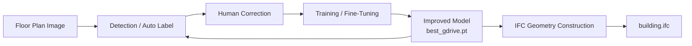

**Expanded chain:**

```
Uploaded image (images_raw/)
  → YOLO Detection (Auto Label via best_gdrive.pt)
  → Human Correction (labels/train/*.txt ground truth)
  → Training / Fine-Tuning (Ultralytics YOLOv8-seg)
  → Improved Model (promoted best_gdrive.pt)
  → IFC Geometry (2D topology → 3D extrusion)     [FUTURE]
  → building.ifc (IfcWall, IfcDoor, IfcWindow, IfcSpace)   [FUTURE]
```

### 1.2 Two-Phase Architecture

| Phase | State | Core Problem / Solution |
|-------|-------|-------------------------|
| **Before CubiCasa** | 21 training pairs, mAP50 ≈ 0 | Data-starved model; broken ML flywheel |
| **After CubiCasa** | ~4,221 training pairs | Capable base model; effective fine-tuning; IFC path viable |

### 1.3 Strategic Insight

The application architecture is **mature**. The training data corpus is **not**. CubiCasa5K integration adds ~4,200 professionally annotated samples via an offline converter — without redesigning the web application.

---

## 2. Current End-to-End Flow (Before Integration)

### 2.1 Master Flow Diagram

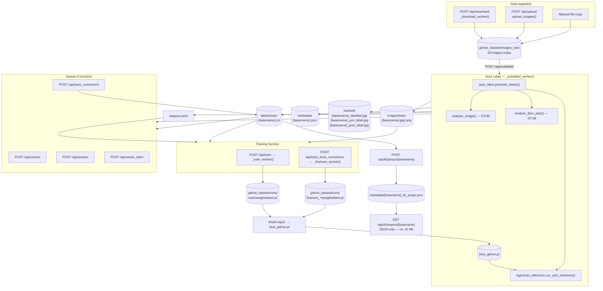

### 2.2 How an Uploaded Floor Plan Moves Through the System Today

| Step | What Happens | API / Function |
|------|--------------|----------------|
| 1 | User uploads image or downloads from GDrive | `POST /api/upload` or `POST /api/download` |
| 2 | File lands in inbox | Written to `images_raw/{filename}` |
| 3 | User clicks Auto Label | `POST /api/autolabel` → `_autolabel_worker()` (background) |
| 4 | Worker reads image | `cv2.imread()` in `auto_label.generate_labels()` |
| 5 | YOLO inference | `run_yolo_inference()` loads `best_gdrive.pt` |
| 6 | Polygons written | `images/train/`, `labels/train/`, `marked/`, `metadata/` |
| 7 | User corrects in UI | `POST /api/correct`, `/api/section`, `/api/resize_label` |
| 8 | User saves | `POST /api/save_corrections` → updates `labels/train/{basename}.txt` |
| 9 | User trains | `POST /api/train` or `POST /api/train_from_corrections` |
| 10 | Best checkpoint promoted | `shutil.copy2` → `D:\HCI_interor\best_gdrive.pt` |
| 11 | Next Auto Label uses new weights | `find_model_path()` returns updated `best_gdrive.pt` |
| 12 | User attaches IFC properties (optional) | `POST /api/ifc/props/{basename}` |

### 2.3 API Routes — Complete Reference

| Route | Method | Handler | When Called |
|-------|--------|---------|-------------|
| `/api/upload` | POST | `upload_images()` | User uploads floor plan files |
| `/api/download` | POST | `download_gdrive()` → `_download_worker()` | User downloads GDrive folder |
| `/api/autolabel` | POST | `autolabel()` → `_autolabel_worker()` | User triggers batch labeling |
| `/api/stream` | GET | `stream()` | UI monitors SSE progress during workers |
| `/api/status` | GET | `get_status()` | UI polls raw/labelled lists and best model |
| `/api/image/{basename}` | GET | `get_image()` | UI loads labelled preview |
| `/api/correct` | POST | `correct_label()` | Remove or relabel polygon |
| `/api/section` | POST | `add_section()` | Draw new bbox polygon |
| `/api/resize_label` | POST | `resize_label()` | Move/resize polygon |
| `/api/save_corrections` | POST | `save_corrections()` | Persist labels to disk |
| `/api/revert` | POST | `revert_corrections()` | Restore from `.bak` |
| `/api/label_details/{basename}` | GET | `get_label_details()` | Per-polygon geometry for editor |
| `/api/train` | POST | `train()` → `_train_worker()` | Full training from scratch |
| `/api/train_from_corrections` | POST | `train_from_corrections()` → `_finetune_worker()` | Incremental fine-tune |
| `/api/detect` | POST | `detect()` | Ad-hoc test inference |
| `/api/model_versions` | GET | `get_model_versions()` | List all checkpoints |
| `/api/set_model` | POST | `set_model()` | Manual model promotion |
| `/api/corrected_files` | GET | `get_corrected_files()` | List session-corrected basenames |
| `/api/ifc/schema` | GET | `get_ifc_schema()` | IFC property schema |
| `/api/ifc/props/{basename}` | GET/POST | `get_ifc_props()` / `save_ifc_props()` | IFC property CRUD |
| `/api/ifc/export/{basename}` | GET | `export_ifc_props()` | Export property JSON (not `.ifc`) |
| `/api/metadata/{basename}` | GET | `get_metadata()` | Load metadata JSON |

### 2.4 Files Created Per Auto Label Run (Per Image)

| File | Path | Created By |
|------|------|------------|
| Training image copy | `gdrive_dataset/images/train/{basename}.{ext}` | `_autolabel_worker` |
| YOLO label file | `gdrive_dataset/labels/train/{basename}.txt` | `_autolabel_worker` |
| Marked preview | `gdrive_dataset/marked/{basename}_labelled.jpg` | `draw_labelled_image()` |
| Pre-label OCR view | `gdrive_dataset/marked/{basename}_pre_label.jpg` | `analyse_image()` stub |
| Post-label OCR view | `gdrive_dataset/marked/{basename}_post_label.jpg` | `analyse_image()` stub |
| Metadata JSON | `gdrive_dataset/metadata/{basename}.json` | `save_metadata()` — stub content |
| Dataset config | `gdrive_dataset/dataset.yaml` | Rewritten each autolabel batch |

### 2.5 Folders Updated

| Folder | Role | Updated When |
|--------|------|--------------|
| `images_raw/` | Inbox for new uploads | Upload, download, manual copy |
| `images/train/` | Training image corpus | Auto Label, CubiCasa import (future) |
| `labels/train/` | YOLO ground truth | Auto Label, corrections, CubiCasa import (future) |
| `marked/` | UI preview images | Auto Label |
| `metadata/` | JSON sidecars + IFC props | Auto Label, IFC property routes |
| `runs/` | Ultralytics training outputs | Train, fine-tune |
| PROJECT_ROOT | Active model | Promotion after train/fine-tune |

### 2.6 Role of `best_gdrive.pt`

`D:\HCI_interor\best_gdrive.pt` is the **single active model** for the entire system:

| Consumer | Function | Usage |
|----------|----------|-------|
| Auto Label | `find_model_path()` → `_get_model()` | YOLO inference on `images_raw/` |
| Fine-tune base | `_finetune_worker()` default base | Starting weights for correction training |
| Test detect | `POST /api/detect` | Default model if `model_path` not specified |
| Model cache | `_model_cache` in `yolo_inference.py` | Loaded once per server process |

**Resolution priority** (`find_model_path()`):

1. `best_gdrive.pt` (if exists)
2. `IMPROVED_MODEL_1.1/runs/pilot_wall_door_v0_1/weights/best.pt`
3. Highest mAP50 `best.pt` under `gdrive_dataset/runs/`, etc.
4. `HCI_MODEL_PATH` environment override

**Promotion:** After train or fine-tune, `shutil.copy2(runs/.../best.pt, best_gdrive.pt)`.

### 2.7 How Auto Label Works Today

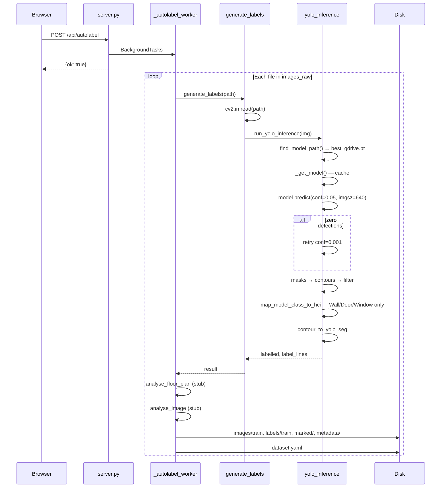

**YOLO label format** (one line per polygon):

```text
<class_id> <x1> <y1> <x2> <y2> <x3> <y3> ...
```

Coordinates normalized to [0, 1]. Example Wall line: `3 0.124500 0.082300 0.125100 0.451200 ...`

### 2.8 How Training Works Today

**Full training** — `POST /api/train` → `_train_worker()`:

- Base: `yolov8n-seg.pt` (COCO pretrained)
- Reads: `dataset.yaml` + `images/train/` + `labels/train/`
- Ultralytics `model.train()` → `gdrive_dataset/runs/train/weights/best.pt`
- Promotes to `best_gdrive.pt`

**Fine-tuning** — `POST /api/train_from_corrections` → `_finetune_worker()`:

- Base: `best_gdrive.pt`
- Parameters: `lr0=0.0005`, `freeze=10`, SGD, epochs 5–10 default
- Scope: all labels, corrected-only (`_corrected_basenames`), or explicit file list
- Output: `runs/finetune_YYYYMMDD/weights/best.pt` → promoted to `best_gdrive.pt`

---

## 3. Why the Current System Fails

### 3.1 Root Cause: Training Data Volume

| Metric | Current Value | Required for Segmentation |
|--------|---------------|---------------------------|
| Labeled training pairs | **21** | Hundreds to thousands |
| mAP50 | **≈ 0.0** | > 0.30 for production use |
| Data multiplier vs CubiCasa | **1×** | ~200× gap |

### 3.2 Why mAP50 ≈ 0

1. **Only 21 images** in `images/train/` with paired `labels/train/*.txt`
2. **17-class taxonomy** but very few instances per class
3. **`dataset.yaml` sets train = val = test** (same folder) — no held-out validation signal
4. Recent runs (`train-2`, `train-3`, `finetune_20260708_190530`) all report `metrics/mAP50(B) = 0.0` every epoch
5. Model cannot learn generalizable wall/door/window boundaries from 21 similar BHK marketing renders

### 3.3 Broken Wall Chains

- Undertrained model produces **fragmented wall masks** with gaps at corners and junctions
- `run_yolo_inference()` applies `_filter_contour()` which drops small polygons — weak model produces many sub-threshold fragments
- No post-processing to connect collinear wall segments
- Result: discontinuous wall polygons unsuitable for room closure or future `IfcWall` topology

### 3.4 Door and Window Misses

| Factor | Effect |
|--------|--------|
| Low model confidence | Primary pass at `conf=0.05` finds nothing; retry at `conf=0.001` |
| Class filter | Only Wall/Door/Window pass `PRIORITY_HCI_CLASSES` — correct but model rarely fires |
| Marketing render style | BHK PNGs differ from training distribution (21 similar plans) |
| Small opening size | Doors/windows are small relative to image — hard to detect with weak model |
| User workaround | Manual drawing via `POST /api/section` |

### 3.5 Heuristic Room Detection

| Component | Status | Effect |
|-----------|--------|--------|
| `logic/floor_plan_analyzer.py` | **Stub** — returns input unchanged | No room enrichment |
| `logic/room_text_mapper.py` | **Stub** — empty OCR mappings | No room name assignment |
| `logic/detector.py` | **Stub** — returns empty dict | Heuristic fallback in `/api/detect` is empty |
| YOLO inference filter | Wall/Door/Window only at inference | Rooms not emitted by YOLO |

Rooms are **not reliably detected** today. Any Room polygons in labels come from model training class head if present, not from a working detection pipeline.

### 3.6 Ineffective Fine-Tuning

Fine-tuning **cannot overcome** a base model with mAP50 ≈ 0:

```
Corrected labels (high quality ground truth)
  → _finetune_worker(lr=0.0005, freeze=10)
  → Weight update on incapable base
  → mAP50 remains ≈ 0
  → No visible Auto Label improvement
```

**Why:**

- 21 samples provide insufficient gradient signal even for fine-tuning
- Frozen backbone (`freeze=10`) on an untrained base preserves bad features
- `_corrected_basenames` may contain only 1–3 images per session — too few for adaptation
- Promotion to `best_gdrive.pt` replaces weights but quality does not improve measurably

**The human-in-the-loop flywheel is architecturally correct but data-starved.**

---

## 4. CubiCasa Integration Flow (After Integration)

### 4.1 Integration Architecture Diagram

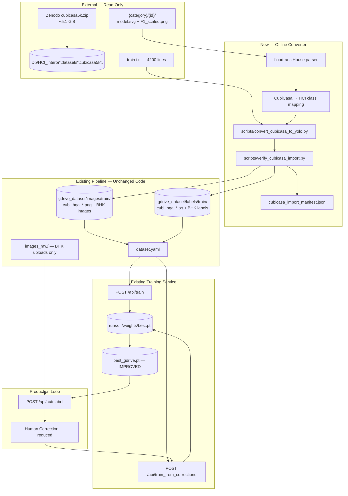

### 4.2 How CubiCasa Data Enters the Pipeline

| Step | Action | Path |
|------|--------|------|
| 1 | Download `cubicasa5k.zip` from Zenodo | Local disk |
| 2 | Extract to read-only archive | `D:\HCI_interor\datasets\cubicasa5k\` |
| 3 | Offline converter reads `train.txt` | One sample path per line |
| 4 | Per sample: parse `model.svg`, copy `F1_scaled.png` | Converter internal |
| 5 | Write YOLO label `.txt` | `gdrive_dataset/labels/train/cubi_hqa_{id}.txt` |
| 6 | Write training image | `gdrive_dataset/images/train/cubi_hqa_{id}.png` |
| 7 | Log results | `gdrive_dataset/metadata/cubicasa_import_manifest.json` |

**CubiCasa data does NOT pass through:**

- `images_raw/` (BHK inbox only)
- Auto Label worker
- Any web API route

### 4.3 How SVG Annotations Are Converted

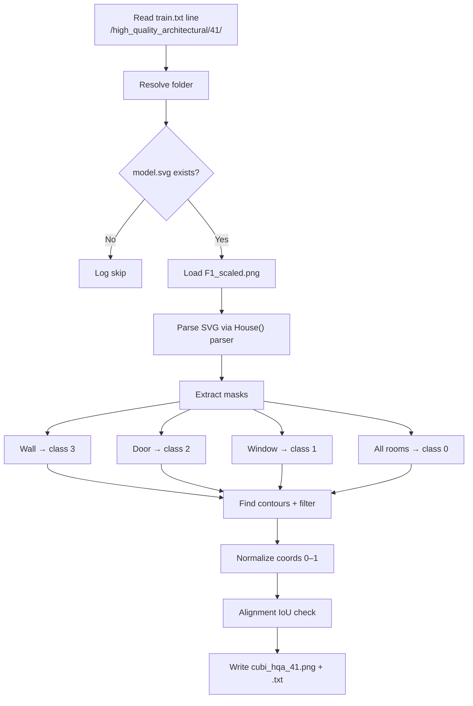

| CubiCasa Source | Training Module Class | ID |
|-----------------|----------------------|-----|
| Wall polygons | Wall | 3 |
| Door icons | Door | 2 |
| Window icons | Window | 1 |
| All room types (Kitchen, Bedroom, …) | Room | 0 |

**Why `F1_scaled.png`:** Raster image aligned to `model.svg` coordinate system. Using `F1_original.png` without validation risks misaligned labels (known issue in ~2–5% of samples).

### 4.4 How Training Changes After Integration

| Aspect | Before | After |
|--------|--------|-------|
| Training pairs | 21 | ~4,221 (4,200 CubiCasa + 21 BHK) |
| Full train viability | Meaningless (mAP50=0) | 50–100 epochs on GPU recommended |
| Fine-tune viability | No measurable gain | Corrections shift capable base model |
| mAP50 | ≈ 0 | Target > 0.30 |
| `dataset.yaml` | Same format | Same format — more files in train folders |
| Training code | Unchanged | Unchanged |

### 4.5 How Auto Label Improves

| Improvement | Mechanism |
|-------------|-----------|
| More wall detections | Model learned wall continuity from 4,000+ diverse plans |
| Doors found at conf=0.05 | Sufficient door instances in training data |
| Windows on BHK renders | Transfer learning from CubiCasa + BHK fine-tune |
| Fewer SKIP messages | `label_lines` non-empty on first pass |
| Denser `labels/train/*.txt` | More polygons per image without manual drawing |

### 4.6 How Manual Correction Reduces

| Metric | Before | After (target) |
|--------|--------|----------------|
| Correction time | 30–60 min/plan | 10–20 min/plan |
| Polygons edited | 60–80% | 15–30% |
| Manual door/window drawing | Frequent | Rare |
| Full wall chain redraws | Frequent | Occasional touch-up |

### 4.7 How Model Lifecycle Changes

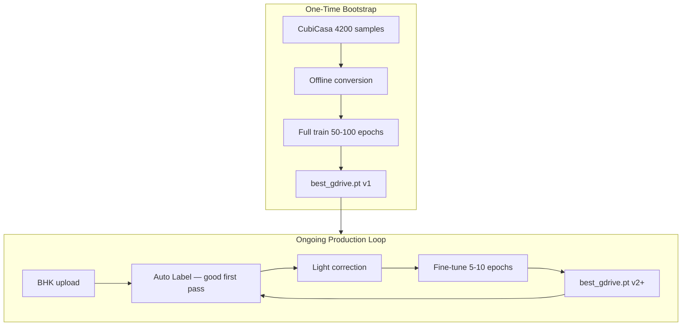

**Key change:** Model lifecycle becomes **versioned and improving** rather than static pilot checkpoint with mAP50 ≈ 0.

### 4.8 How IFC Generation Becomes Feasible

IFC generation requires **accurate 2D polygons** as input. Today:

```
Poor polygons → broken topology → invalid IfcWall/IfcSpace → no viable building.ifc
```

After CubiCasa:

```
Reliable wall/door/window/room polygons
  → valid wall graph (future topology builder)
  → scale calibration (future)
  → 3D extrusion (future)
  → IfcOpenShell writer (future)
  → building.ifc
```

CubiCasa does not implement IFC export — it **enables** it by fixing the geometric foundation.

---

## 5. Before vs After Comparison

| Feature | Before Integration | After Integration |
|---------|-------------------|-------------------|
| **Training pairs** | 21 | ~4,221 |
| **mAP50** | ≈ 0 | > 0.30 (target) |
| **Wall detection** | Broken chains, gaps | Continuous wall lines |
| **Door recall** | Low; conf retry 0.001 | Improved; normal conf 0.05 |
| **Window recall** | Low; frequently missed | Improved opening detection |
| **Room detection** | Stub heuristics only | Room class in training data (Phase 1+) |
| **Correction time** | 30–60 min/plan | 10–20 min/plan |
| **Polygons edited** | 60–80% | 15–30% |
| **Auto-label skip rate** | High (zero detections common) | Low |
| **Fine-tune effectiveness** | None (mAP50 stays 0) | Measurable per correction batch |
| **Training ROI** | No improvement per cycle | Positive mAP delta |
| **Model comparison** | All runs mAP50=0 | Data-driven via `/api/model_versions` |
| **IFC property attachment** | Properties on bad geometry | Properties on trustworthy geometry |
| **IFC file generation** | Not feasible | Feasible after topology/3D phases |
| **Web application changes** | N/A | None required (Phase 1) |
| **CubiCasa converter** | Does not exist | Offline batch script |

---

## 6. Training Architecture (After Integration)

### 6.1 Full Training Diagram

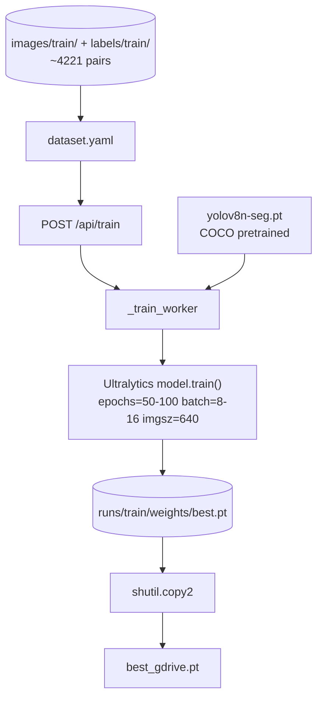

### 6.2 Full Training Parameters

| Parameter | Value | Why Chosen |
|-----------|-------|------------|
| **Base model** | `yolov8n-seg.pt` | COCO-pretrained YOLOv8 nano segmentation; general vision features; fast training |
| **Epochs** | 50–100 | 4,000+ samples need sufficient epochs for loss convergence; 21 samples fail at any epoch count |
| **Batch size** | 8–16 (GPU) / 4 (CPU) | GPU: stable gradients with large corpus; larger batch improves BN statistics |
| **Image size** | 640 | Matches inference `imgsz=640` in `run_yolo_inference()` — consistent train/deploy resolution |
| **Freeze** | None | All layers must learn floor-plan-specific features from scratch on domain data |
| **Optimizer** | Ultralytics defaults | Standard schedule proven for YOLOv8 training |
| **Device** | CUDA recommended | CPU training on 4,000+ images is impractically slow |
| **Output** | `runs/train/weights/best.pt` | Best checkpoint by validation metric |
| **Promotion** | `shutil.copy2` → `best_gdrive.pt` | Makes training result active for Auto Label |

### 6.3 Fine-Tuning Diagram

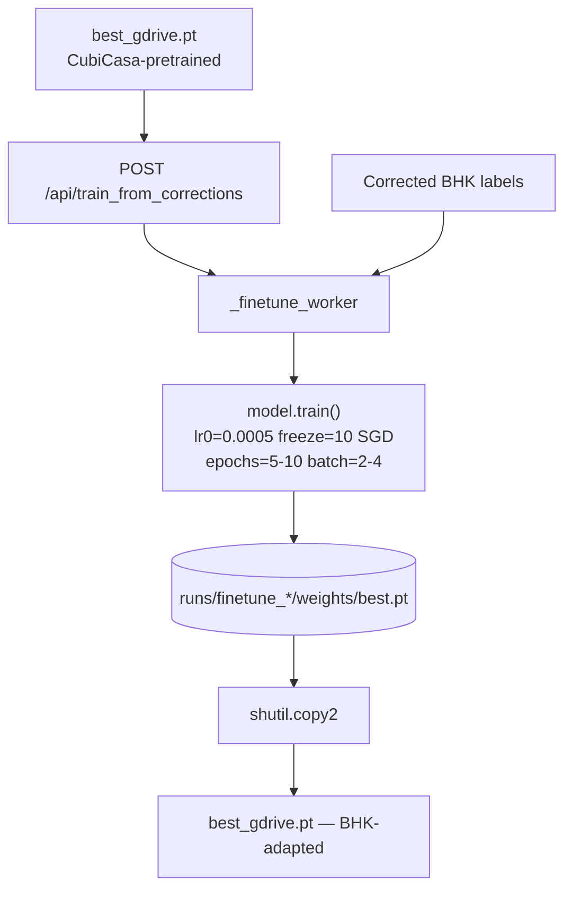

### 6.4 Fine-Tuning Parameters

| Parameter | Value | Why Chosen |
|-----------|-------|------------|
| **Base model** | `best_gdrive.pt` | Preserves CubiCasa-learned geometric features |
| **Epochs** | 5–10 | Small BHK correction sets (5–10 plans) need few epochs; avoids overfitting |
| **Batch size** | 2–4 | Appropriate for small fine-tune subsets |
| **Learning rate** | `lr0=0.0005` | Low rate prevents **catastrophic forgetting** of CubiCasa features while adapting to BHK style |
| **Freeze** | 10 backbone layers | Retains low-level visual features (edges, textures); trains detection head for domain shift |
| **Optimizer** | SGD | Hardcoded in `_finetune_worker`; stable for fine-tuning |
| **Scope** | `corrected` / `all` / explicit list | Flexible: session corrections only, or full corpus refresh |
| **Subset handling** | Temp `dataset.yaml` in temp dir | When `train_files` list provided — copies only selected pairs |

### 6.5 Recommended Training Sequence

```
Phase 1: Fine-tune on 100 CubiCasa samples (pilot validation)
Phase 2: Train on 500 CubiCasa + 21 BHK (validation scale)
Phase 3: Full train on ~4,200 CubiCasa + 21 BHK (production bootstrap)
Ongoing: Fine-tune on BHK corrections after each correction batch
```

---

## 7. Model Improvement Loop (After Integration)

### 7.1 Improvement Loop Diagram

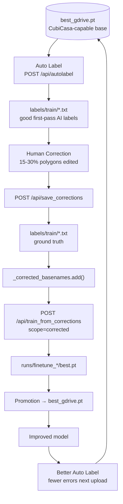

### 7.2 Why the Loop Becomes Effective Only After CubiCasa Pretraining

| Stage | Before CubiCasa | After CubiCasa |
|-------|-----------------|----------------|
| **Base model quality** | mAP50 ≈ 0; pilot checkpoint | mAP50 > 0.30; learned wall/door/window features |
| **Auto Label output** | Sparse, many skips | Dense first-pass polygons |
| **Correction value** | Redrawing most polygons | Refining good polygons |
| **Fine-tune gradient** | No meaningful signal from 21 samples | Strong signal from capable base + BHK corrections |
| **Weight update effect** | Invisible to operator | Visible improvement next Auto Label |
| **Flywheel** | Broken — train does not help | Self-reinforcing — each cycle improves model |

**Analogy:** Fine-tuning corrects a student who already understands geometry (CubiCasa pretrain), not one who has never seen a floor plan (current state).

### 7.3 Role of `_corrected_basenames`

```python
# web/server.py
_corrected_basenames: set = set()
```

- Updated when user corrects or saves labels
- Read by `train_from_corrections` when `train_scope == "corrected"`
- Passed to `_finetune_worker(..., train_files=selected)` as basename filter
- **Session-scoped** — cleared on server restart
- After CubiCasa: even 3–5 corrected BHK plans produce measurable fine-tune gain

---

## 8. IFC/BIM Generation Flow (Future Architecture)

### 8.1 Future IFC Pipeline Diagram

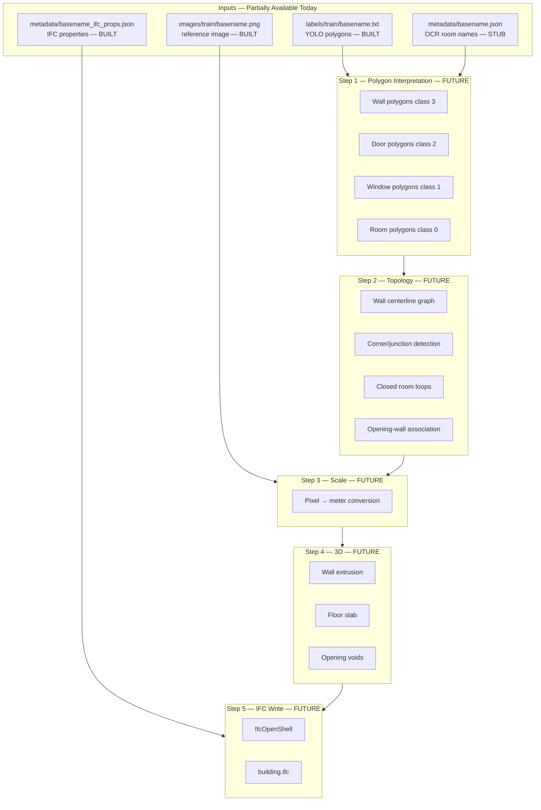

### 8.2 Dependency Chain

```
Better segmentation (CubiCasa-trained best_gdrive.pt)
  → Better 2D polygons
  → Valid wall topology
  → Calibrated metric geometry
  → 3D building elements
  → building.ifc
```

### 8.3 Class-to-IFC Entity Mapping (Built in `ifc_properties.py`)

| Training Module Class | IFC Entity |
|-----------------------|------------|
| Wall (3) | `IfcWall` |
| Door (2) | `IfcDoor` |
| Window (1) | `IfcWindow` |
| Room (0) | `IfcSpace` |
| Furniture (11) | `IfcFurnishingElement` |
| FlowTerminal (15) | `IfcSanitaryTerminal` |

---

## 9. How building.ifc Will Be Created

### 9.1 Future Process — Step by Step

This section describes the **planned** IFC generation pipeline. None of these steps (except property attachment) are implemented today.

#### Step 1 — Detect Wall Polygons

**Input:** `labels/train/{basename}.txt` lines with `class_id = 3`

```text
3 0.124500 0.082300 0.125100 0.451200 0.089300 0.451800 ...
```

**Process (future `logic/ifc_geometry.py`):**

1. Denormalize coordinates: `x_px = x_norm × image_width`
2. Build list of wall polygon instances
3. Optional: skeletonize area masks to wall centerlines for true `IfcWall` axis representation

**Output:** List of wall polygon vertex arrays in pixel space.

#### Step 2 — Detect Door and Window Openings

**Input:** Lines with `class_id = 2` (Door) and `class_id = 1` (Window)

**Process:**

1. Denormalize door/window polygons
2. Compute bounding box and centroid per opening
3. **Associate each opening with nearest wall segment** (snap to wall edge)
4. Record position along wall axis (distance from wall start)

**Output:** Opening instances with `(wall_id, position, width, height)` references.

#### Step 3 — Build Wall Topology

**Future module:** `logic/topology_builder.py`

| Operation | Description |
|-----------|-------------|
| Wall intersection detection | Find where wall polygons meet |
| Corner classification | L-junction, T-junction, X-junction |
| Centerline graph | Nodes at corners; edges along wall segments |
| Closed loop detection | Trace room boundaries from connected walls |
| Adjacency graph | Rooms connected through doors |

**Output:** Wall graph data structure + room loop polygons.

#### Step 4 — Convert Pixels to Meters

**Future module:** `logic/scale_calibration.py`

| Method | Description |
|--------|-------------|
| User reference dimension | Operator enters known distance between two clicked points |
| Plan scale notation | Parse "1:100" from OCR (requires OCR implementation) |
| Default estimation | Assume standard door width 0.9 m to infer scale |

```python
meters_per_pixel = reference_length_m / reference_length_px
x_m = x_px * meters_per_pixel
y_m = y_px * meters_per_pixel
```

**Output:** All coordinates in meters.

#### Step 5 — Extrude Walls into 3D

**Future module:** `logic/geometry_3d.py`

| Element | Construction |
|---------|-------------|
| Walls | Extrude wall centerline/path from Z=0 to Z=wall_height |
| Wall height | From `Pset_WallCommon` or storey default (2.7 m) |
| Wall thickness | From `Pset_WallCommon.Thickness` (default 230 mm) |
| Floor slab | Extrude building footprint at Z=0 |
| Opening voids | Boolean subtract door/window volumes from wall solids |

**Output:** 3D solid geometry per building element.

#### Step 6 — Create IfcWall Objects

**Using IfcOpenShell (future `logic/ifc_writer.py`):**

```python
# Pseudocode
wall = ifc_file.create_entity("IfcWall",
    GlobalId=guid,
    Name=f"Wall-{i}",
    ObjectPlacement=placement)
# Attach 3D representation (extruded solid)
# Attach Psets from _ifc_props.json Wall_{i} entry
```

#### Step 7 — Insert IfcDoor and IfcWindow

For each opening:

1. Create `IfcOpeningElement` void in parent wall
2. Create `IfcDoor` or `IfcWindow` fitting
3. Set `IfcRelFillsElement` relationship (opening → door/window)
4. Set `IfcRelVoidsElement` (wall → opening)
5. Attach `Pset_DoorCommon` / `Pset_WindowCommon` from `_ifc_props.json`

#### Step 8 — Generate IfcSpace from Room Boundaries

For each room polygon (class 0):

1. Create `IfcSpace` with 3D bounded volume (extrude room polygon to ceiling height)
2. Set `IfcSpace.LongName` from OCR metadata (e.g., "Bedroom (SL_25_15_10)")
3. Attach `Pset_SpaceCommon` (GrossFloorArea, OccupancyType, finishes)
4. Create `IfcRelSpaceBoundary` linking space to bounding walls

#### Step 9 — Attach IFC Property Sets

**Input:** `metadata/{basename}_ifc_props.json` (already built today)

For each element key (`Door_1`, `Room_2`, etc.):

1. Match to geometry instance by `(cls_name, idx)`
2. Create `IfcPropertySet` entities from `psets` dict
3. Link via `IfcRelDefinesByProperties`

#### Step 10 — Write Final building.ifc

```python
# Future API route: POST /api/ifc/generate/{basename}
ifc_file = ifcopenshell.file()
# Create IfcProject → IfcBuilding → IfcBuildingStorey
# Add all walls, doors, windows, spaces
# Write file
output_path = DATASET_DIR / "output" / f"{basename}.ifc"
ifc_file.write(str(output_path))
```

**Proposed output path:** `D:\HCI_interor\gdrive_dataset\output\{basename}.ifc`

### 9.2 Complete Future Flow — Upload to building.ifc

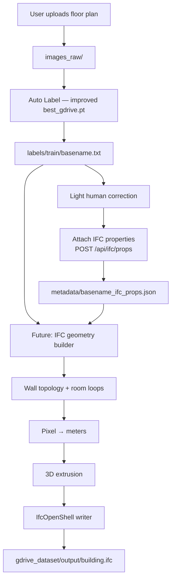

---

## 10. What Exists Today vs What Must Be Built

### 10.1 Capability Matrix

| Capability | Status | Location | Notes |
|------------|--------|----------|-------|
| YOLO polygon labels | **Built** | `labels/train/*.txt` | Normalized seg format |
| Image upload / GDrive download | **Built** | `/api/upload`, `/api/download` | → `images_raw/` |
| Auto Label worker | **Built** | `_autolabel_worker()`, `auto_label.py` | Background + SSE |
| YOLO inference engine | **Built** | `logic/yolo_inference.py` | Wall/Door/Window filter |
| Model resolution & cache | **Built** | `find_model_path()`, `_get_model()` | |
| Human correction UI | **Built** | Correct Labels tab, `/api/correct` etc. | |
| Correction persistence | **Built** | `/api/save_corrections`, `_rebuild_labels()` | |
| Session correction tracking | **Built** | `_corrected_basenames` | In-memory |
| Full training | **Built** | `_train_worker()`, `/api/train` | |
| Fine-tuning | **Built** | `_finetune_worker()`, `/api/train_from_corrections` | |
| Model promotion | **Built** | `shutil.copy2` → `best_gdrive.pt` | |
| Model version listing | **Built** | `/api/model_versions` | |
| Test detection | **Built** | `/api/detect` | |
| Marked image previews | **Built** | `marked/*_labelled.jpg` | |
| dataset.yaml generation | **Built** | `_autolabel_worker()` | 17 classes |
| 17-class taxonomy | **Built** | `config/classes.py` | |
| IFC property schema | **Built** | `logic/ifc_properties.py` | Full Pset definitions |
| IFC property CRUD | **Built** | `/api/ifc/props/*` | Per element cls+idx |
| IFC schema API | **Built** | `/api/ifc/schema` | |
| IFC export JSON | **Partial** | `/api/ifc/export/{basename}` | Properties only; no geometry |
| Metadata file I/O | **Built** | `logic/image_metadata.py` | load/save/list |
| Rich metadata content | **Stub** | `build_metadata_from_ocr()` | Placeholder JSON |
| Floor plan analyzer | **Stub** | `logic/floor_plan_analyzer.py` | Passthrough |
| OCR room text mapper | **Stub** | `logic/room_text_mapper.py` | Empty mappings |
| Heuristic detector | **Stub** | `logic/detector.py` | Empty dict |
| CubiCasa offline converter | **Missing** | `scripts/convert_cubicasa_to_yolo.py` | Specified, not built |
| CubiCasa QA tool | **Missing** | `scripts/verify_cubicasa_import.py` | Specified, not built |
| Separate val/test splits | **Missing** | `dataset.yaml` | train=val=test |
| Wall graph generation | **Missing** | Future `logic/topology_builder.py` | |
| Scale calibration | **Missing** | Future `logic/scale_calibration.py` | |
| 3D extrusion | **Missing** | Future `logic/geometry_3d.py` | |
| IfcOpenShell writer | **Missing** | Future `logic/ifc_writer.py` | |
| `building.ifc` output | **Missing** | Future `/api/ifc/generate/{basename}` | |
| Gemini metadata | **Stub** | `/api/metadata/save_gemini` | Route exists; builder stub |

### 10.2 Architecture Maturity Summary

```
┌─────────────────────────────────────────────────────────────────┐
│  CURRENT HLD (BUILT)                                            │
│  Upload → images_raw → Auto Label → labels/train → Correction   │
│  → Training → runs/best.pt → best_gdrive.pt → Improved Auto Label│
│  + IFC property schema + CRUD (no geometry export)                │
├─────────────────────────────────────────────────────────────────┤
│  POST-CUBICASA HLD (PLANNED — minimal app changes)              │
│  CubiCasa archive → offline converter → labels/train (4200+)      │
│  → Full train → capable best_gdrive.pt → effective fine-tune loop │
├─────────────────────────────────────────────────────────────────┤
│  FUTURE IFC HLD (NOT BUILT)                                     │
│  labels/train + ifc_props.json → topology → scale → 3D          │
│  → IfcOpenShell → gdrive_dataset/output/building.ifc            │
└─────────────────────────────────────────────────────────────────┘
```

### 10.3 Critical Path to building.ifc

| Order | Milestone | Depends On |
|-------|-----------|------------|
| 1 | CubiCasa integration + pilot | Offline converter |
| 2 | Production train (mAP50 > 0.30) | Step 1 |
| 3 | Reliable Auto Label on BHK | Step 2 |
| 4 | OCR + rich metadata | Stub replacement |
| 5 | Topology builder | Step 3 (good polygons) |
| 6 | Scale calibration UI | Step 5 |
| 7 | 3D extrusion module | Step 6 |
| 8 | IfcOpenShell writer | Steps 5–7 + IFC props (built) |
| 9 | `building.ifc` per upload | All above |

---

## Appendix — Direct Answers to Key Questions

### BEFORE Integration

| Question | Answer |
|----------|--------|
| How does an uploaded floor plan move through the system? | `images_raw/` → Auto Label → `images/train` + `labels/train` → correction → training → `best_gdrive.pt` |
| Which APIs are called? | `/api/upload` or `/api/download` → `/api/autolabel` → `/api/correct` + `/api/save_corrections` → `/api/train` or `/api/train_from_corrections` |
| Which files are created? | `images/train/{basename}.*`, `labels/train/{basename}.txt`, `marked/*`, `metadata/{basename}.json`, `dataset.yaml`, `runs/**/best.pt`, `best_gdrive.pt` |
| How does Auto Label work? | `generate_labels()` → `run_yolo_inference()` with `best_gdrive.pt`; masks → contours → YOLO `.txt` lines |
| How does training work? | `_train_worker` from `yolov8n-seg.pt` or `_finetune_worker` from `best_gdrive.pt`; Ultralytics train; promote best.pt |
| Why is mAP50 ≈ 0? | Only 21 training pairs; insufficient data for segmentation convergence |
| Why are walls/doors/windows missed? | Undertrained model; low confidence; BHK render domain unlike training set |
| Why does fine-tuning not improve significantly? | Base model incapable; 21 samples insufficient; frozen backbone preserves bad features |

### AFTER Integration

| Question | Answer |
|----------|--------|
| How will CubiCasa data enter the pipeline? | Offline converter writes directly to `images/train/` + `labels/train/`; bypasses `images_raw/` and Auto Label |
| How will SVG annotations be converted? | `floortrans House` parser on `model.svg` + `F1_scaled.png` → YOLO seg `.txt` via class mapping |
| How will training change? | ~4,221 pairs; full train 50–100 epochs viable; mAP50 > 0.30 expected |
| How will Auto Label improve? | Capable `best_gdrive.pt`; dense Wall/Door/Window polygons; fewer skips |
| How will manual correction reduce? | 60–80% → 15–30% polygons edited; 30–60 min → 10–20 min per plan |
| How will the model lifecycle change? | Versioned improving flywheel: pretrain → BHK fine-tune → promote → repeat |
| How will IFC generation become feasible? | Accurate 2D polygons enable topology → scale → 3D → IfcOpenShell → `building.ifc` |

---

*End of Document — Version 2.0*

*No source code or training data was modified during this analysis.*
