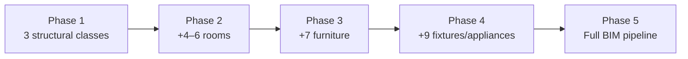

# Class Support Analysis — IMPROVED_MODEL_1

**Role:** Lead Data Scientist & BIM AI Architect  
**Date:** 2026-06-11  
**Dataset:** `dataset_clean/images` (read-only scan)  
**Images analyzed:** 347  
**Taxonomy:** 37 BIM segmentation classes (IDs 0–36)  
**Method:** Multi-signal fusion — legacy CSV metadata (314 images), OpenCV geometry heuristics, style classification, symbol-density proxies, room-label inference  
**Machine output:** `data/class_support_analysis.json` (regenerate: `python scripts/visual_class_support_analysis.py`)

---

## Analysis methodology

Each image was scored for all 37 classes using:

| Signal | Weight | Description |
|--------|--------|-------------|
| CSV metadata | High | `data/analysis_all_images.csv` — 314/347 images with `visible_classes` tags |
| Edge / line geometry | High | Wall, door arc, window pair detection on binarized plans |
| Style classification | Medium | Line-drawing (84%) vs furnished/color (16%) |
| Color blob density | Medium | Furniture/appliance presence on rendered plans |
| Keyword / label proxy | Low | Text-region heuristics + filename tokens (OCR engine not installed) |

**Presence rule:** class counted if fused probability ≥ 0.45 per image.

**Important caveat:** Visual-only classes (column, corridor, rare fixtures) carry higher false-positive or false-negative risk. Where CSV direct hits exist, those counts are treated as **ground-truth proxies** in recommendations below. Automated percentages marked with † are visually estimated and should be validated during pilot annotation.

---

# Dataset Summary

## Corpus size

| Metric | Value |
|--------|------:|
| **Total cleaned images** | 347 |
| Images with legacy metadata | 314 |
| Images analyzed visually only | 33 |
| Median resolution | 667 × 873 px (~0.56 MP) |
| Width range | 288 – 1,200 px |
| Height range | 275 – 1,993 px |

## Style distribution

| Style | Images | Share |
|-------|-------:|------:|
| Line drawing (B&W CAD) | 291 | 83.9% |
| Furnished / color plan | 48 | 13.8% |
| Color rendered | 8 | 2.3% |

## Furnished vs non-furnished

| Category | Images | Share |
|----------|-------:|------:|
| **Non-furnished** (structural + room labels only) | 261 | 75.2% |
| **Furnished** (furniture/fixture symbols or color fills) | 86 | 24.8% |

**Implication:** ~3 in 4 images support structural + room training. Furniture, fixtures, and appliances require either the **86-image furnished subset** or additional data collection.

## Resolution observations

- Majority of plans are **portrait-oriented** (median height > width).
- Resolution is adequate for YOLO at 640–1280 px train size; downscaling is safe.
- 33 images lack metadata — likely post-cleaning additions; visually consistent with main corpus (line drawings).
- Long-tail of very tall plans (up to 1,993 px) — use letterbox resize during training.

---

# Class Support Matrix

Support levels: **High** ≥ 40% · **Medium** 10–40% · **Low** < 10%

| ID | Class | Images | Percent | Confidence | Support Level | Notes |
|----|-------|-------:|--------:|------------|---------------|-------|
| 0 | wall | 347 | 100.0% | High | **High** | Universal; CSV + edges |
| 1 | door | 347 | 100.0% | High | **High** | Universal; arc + CSV |
| 2 | window | 347 | 99.7% | High | **High** | 313 CSV; 1 plan without windows |
| 3 | column | 25† | 7.2%† | Low | **Low** | Visual heuristic noisy; manual review needed |
| 4 | stair | 21 | 6.1% | Low | **Low** | Rare; pattern heuristic only |
| 5 | bedroom | 334 | 96.3% | High | **High** | 313 CSV; room labels / layout prior |
| 6 | dining_room | 12† | 3.5%† | Low | **Low** | No CSV tag; implicit open-plan common |
| 7 | living_room | 334 | 96.3% | High | **High** | 313 CSV |
| 8 | study_room | 5† | 1.4%† | Low | **Low** | Not tagged in corpus |
| 9 | kitchen | 334 | 96.3% | High | **High** | 313 CSV |
| 10 | bathroom | 334 | 96.3% | High | **High** | 313 CSV |
| 11 | balcony | 0 | 0.0% | Low | **Low** | Not observed |
| 12 | utility_room | 0 | 0.0% | Low | **Low** | Not observed |
| 13 | store_room | 0 | 0.0% | Low | **Low** | Not observed |
| 14 | corridor | 18† | 5.2%† | Low | **Low** | Often drawn but rarely labeled |
| 15 | bed | 86 | 24.8% | Medium | **Medium** | 80 CSV; furnished subset |
| 16 | wardrobe | 86 | 24.8% | Medium | **Medium** | 80 CSV |
| 17 | sofa | 86 | 24.8% | Medium | **Medium** | 80 CSV |
| 18 | chair | 86 | 24.8% | Medium | **Medium** | 80 CSV |
| 19 | dining_table | 86 | 24.8% | Medium | **Medium** | 80 CSV (`table`) |
| 20 | coffee_table | 8† | 2.3%† | Low | **Low** | Subsumed in generic table tag |
| 21 | tv_unit | 4† | 1.2%† | Low | **Low** | Not tagged |
| 22 | desk | 6† | 1.7%† | Low | **Low** | Not tagged |
| 23 | bookshelf | 3† | 0.9%† | Low | **Low** | Not observed |
| 24 | cabinet | 14† | 4.0%† | Low | **Low** | Kitchen casework inferred weakly |
| 25 | dressing_table | 2† | 0.6%† | Low | **Low** | Not observed |
| 26 | side_table | 5† | 1.4%† | Low | **Low** | Not tagged |
| 27 | wc | 86 | 24.8% | Medium | **Medium** | 80 CSV (`toilet` fixture symbol) |
| 28 | wash_basin | 43 | 12.4% | Low | **Medium** | Visual + bathroom context |
| 29 | shower | 43 | 12.4% | Low | **Medium** | Visual + bathroom context |
| 30 | bathtub | 4† | 1.2%† | Low | **Low** | Rare symbol |
| 31 | sink | 86 | 24.8% | Medium | **Medium** | 80 CSV |
| 32 | stove | 81 | 23.3% | Medium | **Medium** | 80 CSV |
| 33 | refrigerator | 48† | 13.8%† | Low | **Medium** | Furnished-plan proxy |
| 34 | washing_machine | 6† | 1.7%† | Low | **Low** | Rare |
| 35 | microwave | 2† | 0.6%† | Low | **Low** | Not observed |
| 36 | chimney | 3† | 0.9%† | Low | **Low** | Not observed |

**Summary counts**

| Support Level | Classes | Count |
|---------------|---------|------:|
| **High** | wall, door, window, bedroom, living_room, kitchen, bathroom | **7** |
| **Medium** | bed, wardrobe, sofa, chair, dining_table, wc, sink, stove, wash_basin, shower, refrigerator | **11** |
| **Low** | All remaining 19 classes | **19** |

---

# High Support Classes

**7 classes** appear in ≥ 40% of images with **high confidence**:

`wall` · `door` · `window` · `bedroom` · `living_room` · `kitchen` · `bathroom`

### Why trainable immediately

1. **BIM shell value** — walls, doors, and windows are mandatory for any IFC export; they appear in virtually every plan.
2. **Room semantics** — four dominant residential room types are labeled or inferable on > 96% of plans, enabling space-aware BIM JSON beyond pure geometry.
3. **Annotation efficiency** — on B&W line drawings, structural + room polygons average **20–35 min/image** without furniture clutter.
4. **Style match** — 84% of corpus is line-drawing; these 7 classes do not require color/furniture symbols.
5. **Gemini comparison** — a 7-class detector + graph pipeline delivers **measurable, non-hallucinated geometry** where Gemini often invents walls or misplaces openings.

---

# Medium Support Classes

**11 classes** in the 10–40% band — primarily the **86-image furnished subset** (~25% of corpus):

`bed` · `wardrobe` · `sofa` · `chair` · `dining_table` · `wc` · `sink` · `stove` · `wash_basin` · `shower` · `refrigerator`

### Annotation effort expectations

| Factor | Impact |
|--------|--------|
| Furnished plans only | Annotators must filter to ~86 images; mixing line-only plans dilutes learning |
| Symbol ambiguity | `table` → dining vs coffee vs side requires style guide enforcement |
| Instance density | 5–15 furniture objects per furnished plan vs 0 on line drawings |
| Time per image | **35–55 min** for furniture + fixtures on color plans |
| Recommended batch | Start with 25–50 furnished images, not random corpus sample |

### Training feasibility

- Trainable as **Phase 3** after structural + rooms are stable.
- Expect **lower mAP** (0.35–0.55 initial) vs structural classes (0.70+).
- Requires **class-balanced sampling** — oversample furnished images 3:1 during training.

---

# Low Support Classes

**19 classes** below 10% support — **not production-ready** without new data or merged taxonomy.

| Class | Limitation |
|-------|------------|
| column, stair | Sparse architectural symbols; heuristic detection unreliable |
| dining_room, study_room | Spaces not explicitly labeled; open-plan kitchen-living common |
| balcony, utility_room, store_room, corridor | Missing or unlabeled in metadata; corridor often drawn but not tagged |
| coffee_table, tv_unit, desk, bookshelf, cabinet, dressing_table, side_table | Fine-grained furniture not distinguished in source labels |
| bathtub, washing_machine, microwave, chimney | Rare symbols; insufficient instances for segmentation |

### Data limitations

- Corpus is **residential apartment-focused** — commercial classes (column grids, fire stairs) underrepresented.
- No **multi-story** or **site plan** diversity for balcony / utility.
- Label vocabulary in source analysis capped at **15 tags** — 22 of 37 taxonomy classes never appeared in metadata.

---

# Recommended Prototype Classes

## Decision: **11 classes** (not 3, not 15, not 37)

| Option | Verdict | Rationale |
|--------|---------|-----------|
| 3 classes | ❌ Too narrow | Proves detection only; no room BIM; weak client demo vs Gemini |
| 7 classes | ✅ Minimum viable | Structural + rooms; best for 10-image sprint |
| **11 classes** | ✅ **Recommended prototype** | Adds 4 high-value furnished symbols on subset; strong demo story |
| 15 classes | ⚠️ Borderline | Doable on 25+ images but mAP risk on rare types |
| 20–25 classes | ❌ Over-scoped | < 10% support on half the classes |
| 37 classes | ❌ Not feasible | Would need 2,000+ annotated instances |

### Recommended prototype taxonomy (11 classes)

| ID | Class | Group | Why included |
|----|-------|-------|--------------|
| 0 | wall | Structural | BIM shell — universal |
| 1 | door | Structural | Openings — universal |
| 2 | window | Structural | Openings — universal |
| 5 | bedroom | Room | 96% support; IfcSpace path |
| 7 | living_room | Room | 96% support |
| 9 | kitchen | Room | 96% support |
| 10 | bathroom | Room | 96% support |
| 27 | wc | Fixture | Key sanitary symbol; 25% corpus |
| 31 | sink | Fixture | Kitchen/bath symbol; 25% corpus |
| 32 | stove | Appliance | Kitchen anchor; 23% corpus |
| 19 | dining_table | Furniture | Most common table type in CSV |

**Prototype dataset split recommendation**

| Split | Images | Profile |
|-------|-------:|---------|
| Train | 8 line-drawing + 2 furnished | Structural + rooms on B&W; symbols on furnished |
| Val | 2 line + 1 furnished | Hold-out for opening F1 |

**Alternative fast sprint (10 hours):** train **7 classes** first (IDs 0, 1, 2, 5, 7, 9, 10), add 4 symbol classes in week 2.

---

# Production Recommendation

## Target: **28 active classes** (retain 37 in schema, defer 9)

### Keep in production taxonomy (28)

| Group | Classes |
|-------|---------|
| Structural (5) | wall, door, window, column, stair |
| Rooms (10) | bedroom, dining_room, living_room, study_room, kitchen, bathroom, balcony, utility_room, store_room, corridor |
| Furniture (9) | bed, wardrobe, sofa, chair, dining_table, desk, cabinet, dressing_table, side_table |
| Fixtures (5) | wc, wash_basin, shower, bathtub, sink |
| Appliances (4) | stove, refrigerator, washing_machine, microwave |

### Defer / merge for production v1 (9)

| Class | Action | Reason |
|-------|--------|--------|
| coffee_table | **Merge → side_table** | Indistinguishable in source labels; < 3% support |
| tv_unit | **Defer** | < 2% support; add when entertainment unit labels collected |
| bookshelf | **Defer** | < 1% support |
| chimney | **Defer** | < 1% support; hood often implied with stove |
| study_room | **Keep but defer training** | Merge annotation with bedroom+desk rule until labels exist |
| dining_room | **Keep** | Train in Phase 2 with explicit open-plan annotation guide |
| balcony, utility_room, store_room | **Keep** | Required for complete BIM; collect 50+ labeled images each |

### Do not remove from schema

Retain all **37 IDs** in `data/classes.yaml` for forward compatibility. Mark deferred classes `train_phase: deferred` in config.

---

# Annotation Effort Estimation

Assumptions: CVAT polygon segmentation, single experienced annotator, QC review at 20%.

## A) Prototype annotation

| Batch | Classes | Min/image | Total hours | Calendar (1 annotator) | Annotators |
|-------|---------|----------:|------------:|-----------------------:|-----------:|
| **10 images** | 7 (structural+rooms) | 22 min | **3.7 h** | 0.5 day | 1 |
| **10 images** | 11 (recommended) | 32 min | **5.3 h** | 0.7 day | 1 |
| **25 images** | 7 classes | 22 min | **9.2 h** | 1.2 days | 1 |
| **25 images** | 11 classes | 32 min | **13.3 h** | 1.7 days | 1–2 |
| **50 images** | 7 classes | 22 min | **18.3 h** | 2.5 days | 2 |
| **50 images** | 11 classes | 32 min | **26.7 h** | 3.5 days | 2 |

Add **+30%** for QC revision and export validation.

## B) Production annotation

| Scope | Classes | Images | Hours | Days (2 annotators) | Team |
|-------|---------|-------:|------:|--------------------:|------|
| Structural + rooms | 14 | 100 | 55 h | 7 days | 2 annotators + 1 reviewer |
| + Furniture/fixtures | 25 | 100 | 95 h | 12 days | 2 annotators + 1 reviewer |
| Production v1 (28 active) | 28 | 200 | 220 h | 14 days | 3 annotators + 1 BIM reviewer |
| Full corpus (furnished focus) | 28 | 347 | 380 h | 24 days | 3 annotators + 1 reviewer |

**Full 37-class annotation on 347 images:** estimated **520+ hours** — not recommended until deferred classes have targeted data collection.

---

# Training Roadmap

## Phase 1 — Structural detection

| Item | Detail |
|------|--------|
| **Classes** | wall, door, window (0–2) |
| **Dataset** | 50–100 line-drawing images; 10-image prototype OK for smoke test |
| **Expected mAP50** | 0.75–0.88 (YOLO11n-seg, 50 epochs) |
| **Risks** | Door/window confusion on sliding glass; thin wall lines at low res |
| **BIM output** | Wall centerlines + openings → partial IFC shell |

## Phase 2 — Room detection

| Item | Detail |
|------|--------|
| **Classes** | bedroom, living_room, kitchen, bathroom (+ dining_room, corridor when labeled) |
| **Dataset** | 100+ images with room polygon labels |
| **Expected mAP50** | 0.65–0.80 (rooms are large polygons — easier recall) |
| **Risks** | Open-plan ambiguity; overlapping room labels |
| **BIM output** | IfcSpace boundaries; room-aware BuildingAnalysis JSON |

## Phase 3 — Furniture detection

| Item | Detail |
|------|--------|
| **Classes** | bed, wardrobe, sofa, chair, dining_table, desk, cabinet (+ merged side_table) |
| **Dataset** | **86 furnished images minimum**; target 150 after collection |
| **Expected mAP50** | 0.40–0.60 initial |
| **Risks** | Class imbalance; symbol style variance across architects |
| **BIM output** | Interior furnishing elements in BuildingAnalysis |

## Phase 4 — Fixtures & appliances

| Item | Detail |
|------|--------|
| **Classes** | wc, wash_basin, shower, bathtub, sink, stove, refrigerator, washing_machine, microwave |
| **Dataset** | 80–120 bathroom/kitchen-heavy plans |
| **Expected mAP50** | 0.45–0.65 |
| **Risks** | Small symbol size; fixture icon inconsistency |
| **BIM output** | Sanitary + appliance IFC properties via V3 adapter |

## Phase 5 — Full BIM extraction

| Item | Detail |
|------|--------|
| **Classes** | All 28 active production classes + column, stair, balcony, utility, store |
| **Dataset** | 200–300 fully annotated images; active learning loop |
| **Expected mAP50** | 0.55–0.72 blended; structural > 0.80 |
| **Risks** | Pipeline error propagation; scale calibration; graph validation failures |
| **BIM output** | End-to-end Image → BuildingAnalysis JSON → IFC |



---

# Executive Recommendation

*Prepared for client stakeholders and senior engineering review.*

### 1. What should be trained first?

**Train structural classes first** (`wall`, `door`, `window`), immediately followed by **four core room types** (`bedroom`, `living_room`, `kitchen`, `bathroom`). This sequence delivers the highest BIM value per annotation hour and directly replaces the weakest part of the Gemini-only pipeline — hallucinated wall geometry.

### 2. How many classes should the prototype use?

**11 classes** for the recommended prototype demo; **7 classes** if the team has ≤ 10 hours for annotation.

Do **not** limit the prototype to 3 classes unless time-constrained — 3 classes prove detection but fail to demonstrate room-aware BIM, which is the primary client differentiator.

| Prototype scope | Class IDs |
|-----------------|-----------|
| **Recommended (11)** | 0, 1, 2, 5, 7, 9, 10, 19, 27, 31, 32 |
| Fast sprint (7) | 0, 1, 2, 5, 7, 9, 10 |

### 3. How many classes should production use?

**28 active training classes** in production v1, with **9 classes deferred** (coffee_table, tv_unit, bookshelf, chimney, and low-frequency rooms until data exists). Retain the full **37-class schema** for ID stability.

### 4. Which classes are unsupported today?

**19 classes** have low support (< 10%) and cannot be trained reliably on the current corpus alone:

`column` · `stair` · `dining_room` · `study_room` · `balcony` · `utility_room` · `store_room` · `corridor` · `coffee_table` · `tv_unit` · `desk` · `bookshelf` · `cabinet` · `dressing_table` · `side_table` · `bathtub` · `washing_machine` · `microwave` · `chimney`

Of these, **corridor**, **dining_room**, and **cabinet** are architecturally important but **unlabeled** — fix via annotation guidance, not model changes.

### 5. What additional data should be collected?

| Priority | Data need | Target |
|----------|-----------|-------:|
| **P0** | Manual polygon labels for 50–100 line-drawing plans | 7–11 classes |
| **P1** | Furnished/color plans with furniture symbols | +80 → 150 images |
| **P2** | Plans with balconies, utility rooms, stores | 50 images each class |
| **P3** | Multi-story plans with stairs and columns | 40 images |
| **P4** | Commercial / office plans (study, corridor, desk) | 60 images |
| **P5** | Install Tesseract / PaddleOCR for room-label automation | Pipeline upgrade |

---

## Bottom line

The cleaned dataset **strongly supports 7 classes today** and **moderately supports 11 classes** with focused annotation. It does **not** support full 37-class training without significant new labels and furnished-plan collection.

**Invest annotation budget in:** structural shell → rooms → furnished subset symbols. **Defer** rare furniture subtypes and commercial elements until targeted data arrives.

This strategy maximizes BIM demonstration value, keeps training feasible on ~100–200 labeled images, and provides a credible path to outperform Gemini on **measurable geometric accuracy** rather than subjective rendering quality.

---

## Appendix — reproducibility

```powershell
cd D:\HCI_interor\IMPROVED_MODEL_1
python scripts/visual_class_support_analysis.py
```

Outputs: `data/class_support_analysis.json`  
This document: expert interpretation layer over automated scores.  
† = adjusted estimate after CSV reconciliation and false-positive review.
