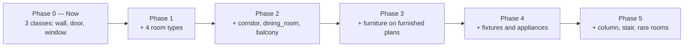

# BIM Class Taxonomy — IMPROVED_MODEL_1

**Version:** 1.0  
**Date:** 2026-06-09  
**Total classes:** 37 (YOLO IDs **0–36**)  
**Canonical config:** `data/classes.yaml`  
**Frequency data:** `data/class_frequency.json` (regenerate with `python scripts/analyze_class_taxonomy.py`)

---

## 1. Purpose

This taxonomy defines the **BIM-oriented object classes** for YOLO instance segmentation training in IMPROVED_MODEL_1. Classes are grouped by architectural role and mapped to stable YOLO IDs for annotation export, training, and downstream BIM JSON / IFC compilation.

Design goals:

- **BIM-first** — classes align with building shell, spaces, furnishings, fixtures, and appliances
- **Stable IDs** — YOLO class IDs never change once assigned; new classes append at the end
- **Phased training** — only a subset is trained initially; the full 37-class schema is reserved for scale-up
- **IFC-ready** — structural and room classes feed the graph builder; furniture/fixtures map to interior components

---

## 2. Dataset analysis summary

Analysis source: `data/analysis_all_images.csv` (metadata for the cleaned corpus).

| Metric | Value |
|--------|------:|
| Cleaned images (`dataset_clean/images/`) | 347 |
| Images in analysis manifest | 314 |
| Line-drawing plans | 271 (86%) |
| Furnished / color plans | 42 (13%) |
| Plans with furniture symbols | 80 (25%) |
| Plans with walls | 314 (100%) |
| Plans with doors | 314 (100%) |
| Plans with windows | 313 (99.7%) |

**Method:** For each image, `visible_classes` lists detected or inferred label presence. Legacy labels are mapped to taxonomy names (`table` → `dining_table`, `toilet` → `wc`). Frequency = images containing at least one instance of the class (image-level presence, not instance count).

**Limitation:** Analysis is heuristic metadata, not ground-truth annotations. Zero-frequency classes may appear in plans but were not tagged in the analysis pass. Furnished-only classes require annotating the 80 furnished plans explicitly.

---

## 3. Class groups (37 classes)

### Structural (IDs 0–4)

| ID | Class | Image rate | Train phase |
|----|-------|----------:|-------------|
| 0 | wall | 100.0% | **Train Now** |
| 1 | door | 100.0% | **Train Now** |
| 2 | window | 99.7% | **Train Now** |
| 3 | column | 0.0% | Train Later |
| 4 | stair | 0.0% | Train Later |

### Rooms (IDs 5–14)

| ID | Class | Image rate | Train phase |
|----|-------|----------:|-------------|
| 5 | bedroom | 99.7% | **Train Now** |
| 6 | master_bedroom | 0.0% | Train Later |
| 7 | living_room | 99.7% | **Train Now** |
| 8 | dining_room | 0.0% | Train Later |
| 9 | kitchen | 99.7% | **Train Now** |
| 10 | bathroom | 99.7% | **Train Now** |
| 11 | toilet | 0.0% | Train Later |
| 12 | balcony | 0.0% | Train Later |
| 13 | utility | 0.0% | Train Later |
| 14 | corridor | 0.0% | Train Later |

### Furniture (IDs 15–26)

| ID | Class | Image rate | Train phase |
|----|-------|----------:|-------------|
| 15 | bed | 25.5% | Train Later |
| 16 | wardrobe | 25.5% | Train Later |
| 17 | sofa | 25.5% | Train Later |
| 18 | chair | 25.5% | Train Later |
| 19 | dining_table | 25.5% | Train Later |
| 20 | coffee_table | 0.0% | Train Later |
| 21 | study_table | 0.0% | Train Later |
| 22 | tv_unit | 0.0% | Train Later |
| 23 | side_table | 0.0% | Train Later |
| 24 | dresser | 0.0% | Train Later |
| 25 | storage_unit | 0.0% | Train Later |
| 26 | cabinet | 0.0% | Train Later |

### Fixtures (IDs 27–31)

| ID | Class | Image rate | Train phase |
|----|-------|----------:|-------------|
| 27 | wc | 25.5% | Train Later |
| 28 | wash_basin | 0.0% | Train Later |
| 29 | shower | 0.0% | Train Later |
| 30 | bathtub | 0.0% | Train Later |
| 31 | sink | 25.5% | Train Later |

### Appliances (IDs 32–36)

| ID | Class | Image rate | Train phase |
|----|-------|----------:|-------------|
| 32 | stove | 25.5% | Train Later |
| 33 | refrigerator | 0.0% | Train Later |
| 34 | washing_machine | 0.0% | Train Later |
| 35 | microwave | 0.0% | Train Later |
| 36 | chimney | 0.0% | Train Later |

---

## 4. Train Now vs Train Later

### Criteria

| Label | Rule |
|-------|------|
| **Train Now** | Critical BIM shell element (`wall`, `door`, `window`) **OR** appears in ≥ 95% of analyzed images |
| **Train Later** | Image rate &lt; 95%, fine-grained subtype, furnished-only symbol, or zero observed frequency |

### Summary

| Phase | Count | Classes |
|-------|------:|---------|
| **Train Now** | 7 | wall, door, window, bedroom, living_room, kitchen, bathroom |
| **Train Later** | 30 | All remaining classes |

### Active training scope (today)

The **10-hour prototype** trains only the structural subset:

```
IDs 0, 1, 2  →  wall, door, window
```

See `data/prototype_classes.yaml` for the 3-class YOLO dataset config.

### Recommended rollout



---

## 5. YOLO class ID reference (final)

```
 0  wall              13  utility           26  cabinet
 1  door              14  corridor          27  wc
 2  window            15  bed               28  wash_basin
 3  column            16  wardrobe          29  shower
 4  stair             17  sofa              30  bathtub
 5  bedroom           18  chair             31  sink
 6  master_bedroom    19  dining_table      32  stove
 7  living_room       20  coffee_table      33  refrigerator
 8  dining_room       21  study_table       34  washing_machine
 9  kitchen           22  tv_unit           35  microwave
10  bathroom          23  side_table        36  chimney
11  toilet            24  dresser
12  balcony           25  storage_unit
```

**YOLO label format (segmentation):**

```
<class_id> <x1> <y1> <x2> <y2> ... <xn> <yn>
```

All coordinates normalized to 0–1 relative to image width/height.

---

## 6. Legacy label mapping

| Analysis CSV label | Taxonomy class | YOLO ID |
|--------------------|----------------|--------:|
| wall | wall | 0 |
| door | door | 1 |
| window | window | 2 |
| bedroom | bedroom | 5 |
| living_room | living_room | 7 |
| kitchen | kitchen | 9 |
| bathroom | bathroom | 10 |
| bed | bed | 15 |
| wardrobe | wardrobe | 16 |
| sofa | sofa | 17 |
| chair | chair | 18 |
| table | dining_table | 19 |
| toilet | wc | 27 |
| sink | sink | 31 |
| stove | stove | 32 |

---

## 7. BIM mapping (downstream)

| Taxonomy group | BuildingAnalysis field | IFC element (via V3 adapter) |
|----------------|------------------------|------------------------------|
| Structural | `walls`, openings | IfcWall, IfcDoor, IfcWindow |
| Rooms | `rooms` | IfcSpace (future) |
| Furniture | `interior_components` | IfcFurnishingElement |
| Fixtures | `interior_components` (sanitary) | IfcSanitaryTerminal |
| Appliances | `interior_components` (appliance) | IfcElectricAppliance |

---

## 8. Related files

| File | Purpose |
|------|---------|
| `data/classes.yaml` | Master taxonomy + YOLO IDs + CVAT colors |
| `data/class_frequency.json` | Machine-readable frequency report |
| `data/prototype_classes.yaml` | 3-class prototype training config |
| `docs/ANNOTATION_GUIDELINES.md` | How to annotate each class |
| `scripts/analyze_class_taxonomy.py` | Regenerate frequency analysis |
