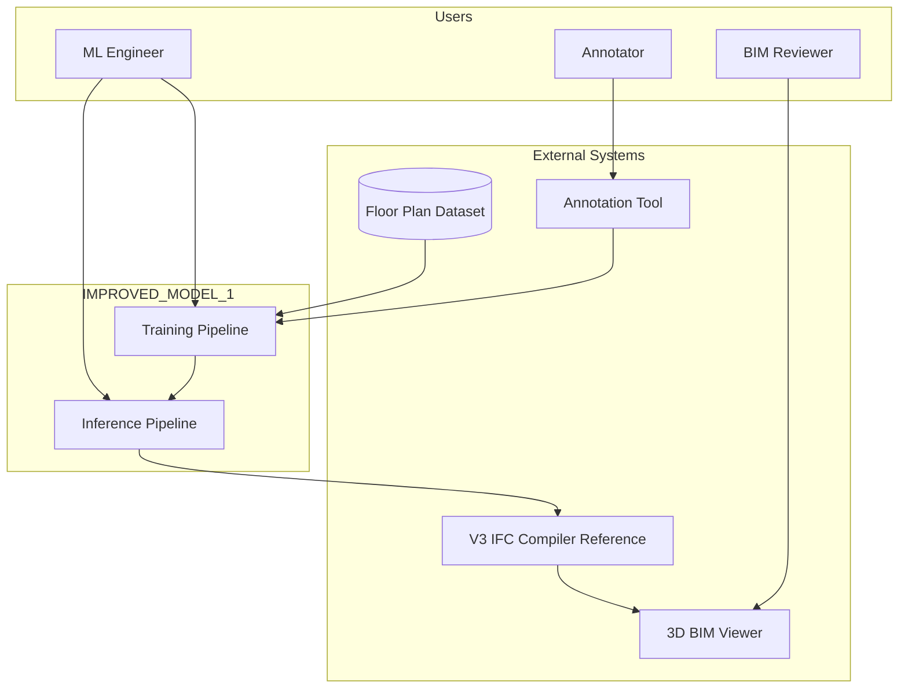
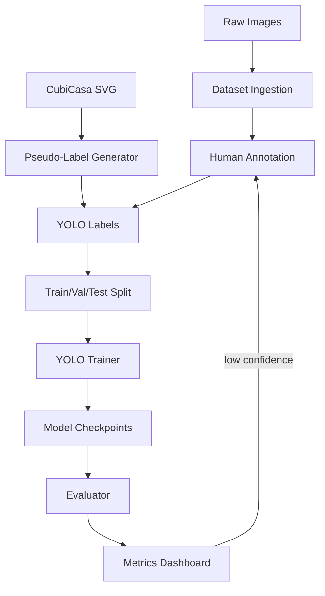
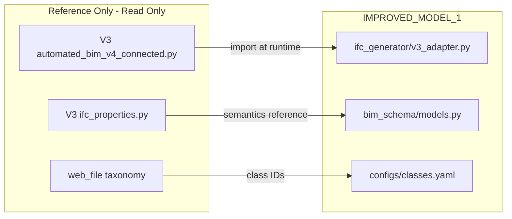

# High-Level Design (HLD)

**Project:** IMPROVED_MODEL_1 — Floor Plan → BIM AI Training Pipeline  
**Version:** 1.0  
**Date:** 2026-06-09

---

## 1. Purpose

Design a **trainable, vision-first** pipeline that converts floor plan images into valid IFC4 BIM models with reduced hallucination and improved geometric accuracy compared to the existing Gemini-only approach.

This system is architected for:
- Initial YOLO-based detection
- Graph-based spatial reasoning
- Future fine-tuning and active learning
- Future multimodal training (image + text + graph)
- Future interior design generation (downstream of valid BIM shell)

---

## 2. Design Principles

| Principle | Rationale |
|-----------|-----------|
| **Separation of perception and compilation** | Vision models change frequently; IFC compiler is stable (V3 reference) |
| **Schema as contract** | `BuildingAnalysis` JSON is the single interchange format between layers |
| **Dual representation** | Pixel masks for training; metre centerlines for BIM |
| **Deterministic geometry** | Graph operations are rule-based, auditable, and testable |
| **Fail visibly** | Topology validation blocks bad BIM rather than silently passing |
| **No modification of legacy code** | Reference V3 via adapter; all new code in `IMPROVED_MODEL_1` |
| **Incremental delivery** | Each layer produces inspectable artifacts before the next is built |

---

## 3. System Context



---

## 4. Target Pipeline Architecture

```
┌─────────────────────────────────────────────────────────────────────────────┐
│                         IMPROVED_MODEL_1 PIPELINE                           │
├─────────────────────────────────────────────────────────────────────────────┤
│                                                                             │
│  ┌──────────────┐                                                           │
│  │ Floor Plan   │                                                           │
│  │ Image / SVG  │                                                           │
│  └──────┬───────┘                                                           │
│         ▼                                                                   │
│  ┌──────────────────────────────────────────────────────────┐               │
│  │ LAYER 1: IMAGE PREPROCESSING                             │               │
│  │  • Format normalize (raster/SVG)                         │               │
│  │  • Deskew, denoise, contrast                             │               │
│  │  • DPI / resolution standardization                      │               │
│  │  • Optional caption/title block removal                  │               │
│  └──────┬───────────────────────────────────────────────────┘               │
│         ▼                                                                   │
│  ┌──────────────────────────────────────────────────────────┐               │
│  │ LAYER 2: DETECTION (YOLO + auxiliary heads)              │               │
│  │  • Wall masks / wall lines                               │               │
│  │  • Door / window symbols                                 │               │
│  │  • Room regions                                          │               │
│  │  • Furniture / fixture symbols                           │               │
│  │  • OCR branch: dimension text, room labels               │               │
│  └──────┬───────────────────────────────────────────────────┘               │
│         ▼                                                                   │
│  ┌──────────────────────────────────────────────────────────┐               │
│  │ LAYER 3: BUILDING GRAPH                                │               │
│  │  • Corner nodes, wall edges, opening attachments       │               │
│  │  • Room faces (cycles), adjacency                        │               │
│  │  • Scale calibration (pixel → metre)                     │               │
│  └──────┬───────────────────────────────────────────────────┘               │
│         ▼                                                                   │
│  ┌──────────────────────────────────────────────────────────┐               │
│  │ LAYER 4: TOPOLOGY VALIDATION                           │               │
│  │  • Wall connectivity, T-junction rules                   │               │
│  │  • Opening-on-wall constraints                         │               │
│  │  • Closed room polygons, min area                        │               │
│  │  • Confidence gating + repair suggestions              │               │
│  └──────┬───────────────────────────────────────────────────┘               │
│         ▼                                                                   │
│  ┌──────────────────────────────────────────────────────────┐               │
│  │ LAYER 5: BIM SCHEMA (BuildingAnalysis JSON)              │               │
│  │  • V3-compatible walls, openings, interiors, rooms     │               │
│  │  • Provenance: detection confidences, scale source       │               │
│  └──────┬───────────────────────────────────────────────────┘               │
│         ▼                                                                   │
│  ┌──────────────────────────────────────────────────────────┐               │
│  │ LAYER 6: IFC GENERATION (IfcOpenShell)                   │               │
│  │  • Adapter to V3 build_detailed_ifc()                    │               │
│  │  • Extended: IfcSpace from rooms                         │               │
│  └──────┬───────────────────────────────────────────────────┘               │
│         ▼                                                                   │
│  ┌──────────────┐                                                           │
│  │ 3D BIM       │                                                           │
│  │ Viewer       │                                                           │
│  └──────────────┘                                                           │
│                                                                             │
└─────────────────────────────────────────────────────────────────────────────┘
```

---

## 5. Logical Component Diagram

```mermaid
flowchart LR
    subgraph preprocessing [preprocessing/]
        P1[ImageLoader]
        P2[SVGParser]
        P3[EnhancePipeline]
    end

    subgraph detection [detection/]
        D1[YOLODetector]
        D2[OCRModule]
        D3[PostProcessor]
    end

    subgraph graph [graph_builder/]
        G1[WallGraphBuilder]
        G2[OpeningAssigner]
        G3[RoomExtractor]
        G4[ScaleCalibrator]
    end

    subgraph topology [topology/]
        T1[Validator]
        T2[RepairEngine]
    end

    subgraph bim [bim_schema/]
        B1[BuildingAnalysisAdapter]
        B2[IFCTypeMaps]
    end

    subgraph ifc [ifc_generator/]
        I1[V3CompilerAdapter]
        I2[SpaceCompiler]
    end

    subgraph training [training/]
        TR1[DatasetManager]
        TR2[Trainer]
        TR3[Evaluator]
    end

    subgraph viewer [viewer/]
        V1[IFCViewer]
        V2[OverlayViewer]
    end

    preprocessing --> detection
    detection --> graph
    graph --> topology
    topology --> bim
    bim --> ifc
    ifc --> viewer
    training --> detection
    TR1 --> training
```

---

## 6. Data Flow — Inference Path

| Stage | Input | Output | Persisted Artifact |
|-------|-------|--------|-------------------|
| Preprocess | Raw image/SVG | Normalized tensor + metadata | `artifacts/{id}/preprocessed.png` |
| Detect | Normalized image | `DetectionResult` | `artifacts/{id}/detections.json` |
| Graph | Detections + scale hints | `BuildingGraph` | `artifacts/{id}/graph.json` |
| Topology | BuildingGraph | `ValidatedGraph` or errors | `artifacts/{id}/validation.json` |
| BIM JSON | ValidatedGraph | `BuildingAnalysis` | `artifacts/{id}/building.json` |
| IFC | BuildingAnalysis | IFC4 file | `artifacts/{id}/model.ifc` |
| Viewer | IFC + overlays | WebGL render | — |

Every stage writes an inspectable artifact. Pipeline can resume from any checkpoint.

---

## 7. Data Flow — Training Path



**Future multimodal path:** Graph JSON + room labels + dimension OCR text become additional supervision signals fused in a later training phase (not Phase 1 implementation).

**Future interior path:** Valid `BuildingAnalysis` shell + room polygons become conditioning input for interior layout models.

---

## 8. Layer Responsibilities

### 8.1 Image Preprocessing

**Responsibility:** Produce a consistent, model-ready raster representation.

- Handle JPG, PNG, WebP, TIFF, SVG
- Normalize to target long-edge (e.g., 1280px) preserving aspect ratio
- Optional binarization for line-heavy plans
- Extract embedded scale from SVG (CubiCasa) or prepare for OCR

**Does not:** Detect elements or infer geometry.

### 8.2 Detection Layer

**Responsibility:** Produce pixel-space instance predictions with confidence scores.

**Phase 1 models:**
- YOLOv8-seg (or YOLO11-seg): multi-class instance segmentation
- Classes aligned with `web_file` taxonomy (prioritized: Wall, Door, Window, Room, Furniture)

**Phase 2 additions:**
- Dedicated wall line head (HAWP / L-CNN style) or skeletonization post-process
- PaddleOCR / EasyOCR for dimension strings and room names

**Output:** `DetectionResult` — list of instances with class, mask/bbox, confidence.

### 8.3 Building Graph Layer

**Responsibility:** Convert detections into a metric spatial graph.

**Graph model:**
- **Nodes:** corners, opening centers, room centroids
- **Edges:** wall segments (with thickness, height)
- **Faces:** room polygons
- **Attachments:** opening → wall edge mapping

**Key algorithms:**
- Wall mask skeletonization → polyline segments
- Douglas-Peucker simplification + corner snap (tolerance in pixels, then metres)
- Collinear segment merge
- Opening projection onto nearest wall edge
- Scale: OCR dimension pair OR standard door width (0.9 m) OR SVG metadata

### 8.4 Topology Validation Layer

**Responsibility:** Enforce architectural constraints before BIM JSON emission.

**Rules (examples):**
- Every opening must attach to exactly one wall edge
- Wall endpoints must snap within ε metres
- Room polygons must be simple (non-self-intersecting) and closed
- Minimum room area threshold
- Exterior wall loop must enclose interior rooms
- Confidence-weighted flagging for human review

**On failure:** Return structured errors + optional `RepairEngine` suggestions (snap, merge, drop low-conf).

### 8.5 BIM Schema Layer

**Responsibility:** Emit V3-compatible `BuildingAnalysis` JSON.

- Map graph entities to `WallData`, `OpeningComponent`, `InteriorComponent`
- Add extended `RoomData` for future `IfcSpace`
- Attach `ScaleMetadata`, `schema_version`, per-element confidence
- Apply `ifc_properties.py` type maps for operation types and furniture enums

### 8.6 IFC Generation Layer

**Responsibility:** Compile validated JSON to IFC4 via IfcOpenShell.

- **Phase 1:** Adapter calling V3 `build_detailed_ifc()` (read-only reference import)
- **Phase 2:** Extend with `IfcSpace` compilation from `RoomData`
- **Phase 3:** Boolean wall cuts for openings (if not in V3 reference)

### 8.7 3D BIM Viewer

**Responsibility:** Visual validation of pipeline output.

- Load generated IFC in browser (IFC.js / web-ifc)
- Overlay 2D detections on source image for debug
- Side-by-side: vision output vs Gemini baseline (optional)

---

## 9. Integration with Legacy Systems



**Rule:** No file in legacy directories is modified. Adapters import or copy interfaces into `IMPROVED_MODEL_1`.

---

## 10. Non-Functional Requirements

| NFR | Target |
|-----|--------|
| **Reproducibility** | Pinned deps, config-driven runs, versioned datasets |
| **Modularity** | Each layer independently testable with fixture artifacts |
| **Extensibility** | Plugin detection backends; swappable graph builders |
| **Performance** | Single plan inference < 30s on CPU (Phase 1); < 5s on GPU |
| **Observability** | Per-stage timing, confidence histograms, validation error logs |
| **Scalability** | Batch inference CLI; training multi-GPU ready (Phase 3) |

---

## 11. Security and Compliance

- API keys (if any Gemini baseline runs) via environment variables only
- No credentials in repo or configs
- Dataset images may contain address metadata — local storage by default

---

## 12. Future Architecture Extensions

### 12.1 Multimodal Training (Future)

```
Image ──┐
        ├──▶ Fusion Encoder ──▶ Graph Refiner ──▶ BuildingAnalysis
Text  ──┘   (room labels,      (GNN or Transformer
(OCR)       dimension OCR)      on wall graph)
```

### 12.2 Interior Generation (Future)

```
BuildingAnalysis (shell)
        │
        ▼
Room polygons + style prompt
        │
        ▼
Interior layout model ──▶ furnishes interiors[] ──▶ recompile IFC
```

### 12.3 Active Learning Loop (Future)

```
Production inference → low-confidence flag → annotation queue → fine-tune → deploy
```

---

## 13. Success Criteria

| Milestone | Criterion |
|-----------|-----------|
| M1 | Preprocess + detect on `model_2.svg` with visible overlays |
| M2 | Graph JSON with >90% wall corners snapped on CubiCasa sample |
| M3 | Valid `BuildingAnalysis` JSON passing topology validator |
| M4 | IFC compiles via V3 adapter; opens in viewer |
| M5 | YOLO trained on ≥50 labeled plans; wall IoU > 0.5 on val set |
| M6 | Vision pipeline wall endpoint error < Gemini baseline on held-out set |

---

*End of High-Level Design*
