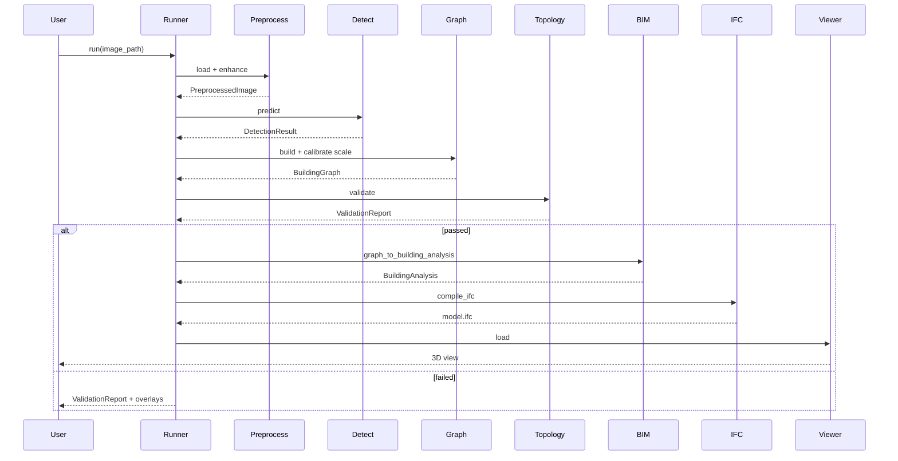

# Low-Level Design (LLD)

**Project:** IMPROVED_MODEL_1  
**Version:** 1.0  
**Date:** 2026-06-09

---

## 1. Overview

This document specifies module-level interfaces, data structures, algorithms, and interaction contracts for each pipeline layer. **No implementation code** — design specifications only.

---

## 2. Core Data Types

### 2.1 `PreprocessedImage`

```yaml
image_id: str              # UUID or content hash
source_path: str
source_format: str         # jpg | png | svg | ...
width: int                 # pixels after preprocess
height: int
dpi: float | null
tensor_path: str           # saved normalized array or PNG
metadata:
  deskew_angle: float
  binarized: bool
  svg_viewbox: [float, float] | null
  cubicasa: bool
```

### 2.2 `DetectionInstance`

```yaml
instance_id: str
class_name: str            # Wall | Door | Window | Room | Furniture | ...
class_id: int              # maps to configs/classes.yaml
confidence: float          # 0.0 - 1.0
bbox: [x1, y1, x2, y2]    # pixel coords
mask:                      # optional for seg classes
  format: polygon | rle
  coordinates: [[x,y], ...]
centroid: [x, y]
source_model: str          # yolov8n-seg-v1
```

### 2.3 `DetectionResult`

```yaml
image_id: str
instances: List[DetectionInstance]
ocr_results:               # optional parallel branch
  dimension_lines: [{text, value_m, bbox}]
  room_labels: [{text, bbox}]
inference_time_ms: float
model_version: str
```

### 2.4 `BuildingGraph`

```yaml
schema_version: "1.0"
image_id: str
scale:
  metres_per_pixel: float
  source: ocr | door_prior | svg_metadata | manual
  confidence: float

nodes:
  - id: str
    type: corner | opening_center | room_centroid
    position_px: [x, y]
    position_m: [x, y]

edges:
  - id: str
    type: wall
    start_node: str
    end_node: str
    thickness_m: float
    height_m: float
    is_exterior: bool
    confidence: float
    source_instances: [instance_id]

openings:
  - id: str
    type: door | window
    host_edge: str           # wall edge id
    position_on_edge: float  # 0.0-1.0 parametric
    width_m: float
    height_m: float
    confidence: float
    operation_type: str | null

rooms:
  - id: str
    label: str | null
    polygon_m: [[x,y], ...]
    polygon_px: [[x,y], ...]
    area_m2: float
    confidence: float

interiors:
  - id: str
    category: furnishing | sanitary | appliance
    type: str | null
    center_m: [x, y]
    dimensions_m: [w, d, h]
    rotation_deg: float
    confidence: float
```

### 2.5 `ValidationReport`

```yaml
image_id: str
passed: bool
errors:
  - code: str                # OPENING_ORPHAN | ROOM_NOT_CLOSED | ...
    severity: error | warning
    message: str
    entity_id: str | null
    suggested_repair: str | null
warnings: [...]
metrics:
  wall_count: int
  opening_count: int
  room_count: int
  snap_residual_max_m: float
  mean_confidence: float
```

### 2.6 `BuildingAnalysis` (Extended V3 Contract)

Extends V3 Pydantic models with:

```yaml
schema_version: "1.1"
building_name: str
scale: ScaleMetadata
walls: List[WallData]
openings: List[OpeningComponent]
interiors: List[InteriorComponent]
rooms: List[RoomData]          # NEW
provenance:
  pipeline_version: str
  detection_model: str
  graph_builder_version: str
  validation_passed: bool
  element_confidences: {id: float}
```

---

## 3. Module Specifications

### 3.1 `preprocessing/`

#### `image_loader.py`
| Function | Input | Output |
|----------|-------|--------|
| `load(path) → PreprocessedImage` | File path | Decoded raster + metadata |
| `detect_format(path) → str` | Path | MIME/format enum |

**Behavior:**
- SVG: rasterize via `cairosvg` at configurable DPI (default 150)
- EXIF orientation correction for phone photos
- Reject images < 256px on short edge (configurable)

#### `enhance.py`
| Function | Input | Output |
|----------|-------|--------|
| `deskew(img) → (img, angle)` | ndarray | Corrected image |
| `normalize_resolution(img, long_edge) → img` | ndarray, int | Resized |
| `binarize(img, method) → img` | ndarray | Binary image for line plans |

**Config keys** (`configs/preprocess.yaml`):
```yaml
long_edge: 1280
deskew_enabled: true
binarize_enabled: false
svg_dpi: 150
```

#### `svg_parser.py` (CubiCasa bootstrap)
| Function | Input | Output |
|----------|-------|--------|
| `parse_cubicasa(svg_path) → CubiCasaModel` | SVG path | Structured elements |
| `to_pseudo_labels(model) → DetectionResult` | CubiCasaModel | Synthetic detections |
| `to_building_graph(model) → BuildingGraph` | CubiCasaModel | Direct graph (bypass YOLO) |

**CubiCasa element mapping:**
| SVG class | Detection class | Graph entity |
|-----------|-----------------|--------------|
| `Space` | Room | room face |
| `Wall` | Wall | wall edge |
| `Door` | Door | opening |
| `Window` | Window | opening |
| `FixedFurniture` | Furniture | interior |
| `Column` | Column | node obstacle |
| `Railing` | Railing | edge annotation |

---

### 3.2 `detection/`

#### `yolo_detector.py`
| Class | Method | Description |
|-------|--------|-------------|
| `YOLODetector` | `__init__(config)` | Load weights from `configs/detection.yaml` |
| | `predict(image) → DetectionResult` | Run inference |
| | `predict_batch(images) → List` | Batch mode |

**Model strategy — Phase 1:**
- Single YOLOv8-seg model, `nc=17` (full taxonomy)
- **Priority classes for MVP metrics:** Wall(0), Door(2), Window(1), Room(3)

**Model strategy — Phase 2:**
- Option A: Single model with class-weighted loss
- Option B: Specialist models (wall-seg + symbol-det) merged in post-processor

#### `postprocess.py`
| Function | Description |
|----------|-------------|
| `nms_by_class(instances)` | Per-class NMS |
| `filter_by_confidence(instances, thresholds)` | Class-specific thresholds from config |
| `mask_to_polygon(mask)` | Contour extraction |
| `wall_mask_to_centerlines(mask)` | Skeletonize + vectorize |

**Wall centerline algorithm (design):**
1. Binary wall mask from YOLO seg
2. Zhang-Suen or `cv2.ximgproc.thinning` skeleton
3. Hough or graph tracing → line segments
4. Merge segments within angle ε and gap δ
5. Output as `DetectionInstance` with `geometry_type: polyline`

#### `ocr_module.py`
| Function | Description |
|----------|-------------|
| `extract_dimensions(img) → List[DimensionLine]` | Parse "2.00 m x 2.53 m" patterns |
| `extract_room_labels(img) → List[RoomLabel]` | Text near room centers |

**OCR engine:** PaddleOCR (primary) with regex post-parse for metric/imperial.

---

### 3.3 `graph_builder/`

#### `wall_graph.py`
| Class | Method |
|-------|--------|
| `WallGraphBuilder` | `build(detections, scale) → BuildingGraph` |
| | `_snap_corners(segments, ε_px)` |
| | `_merge_collinear(segments)` |
| | `_classify_exterior(loop)` |

**Corner snap tolerance:** Start at 5px, calibrate from validation residual on CubiCasa.

#### `opening_assigner.py`
| Function | Description |
|----------|-------------|
| `assign_openings(openings, wall_edges) → List[Opening]` | For each door/window detection, project centroid to nearest wall edge within max_distance_px |
| `estimate_opening_size(detection, scale) → (w, h)` | Bbox extent in metres; default door 0.9×2.1m |

**Assignment rule:**
```
for each opening O:
  E* = argmin_{E in wall_edges} distance(O.centroid, E.segment)
  if distance < max_dist:
    attach O to E*
  else:
    flag OPENING_ORPHAN in validation
```

#### `room_extractor.py`
| Function | Description |
|----------|-------------|
| `extract_rooms(room_masks, wall_graph) → List[Room]` | Mask polygon → graph face |
| `label_rooms(rooms, ocr_labels) → rooms` | Spatial join OCR text to nearest room centroid |

**Alternative:** If wall graph forms planar subdivision, extract faces via half-edge traversal.

#### `scale_calibrator.py`
| Class | Method |
|-------|--------|
| `ScaleCalibrator` | `estimate(detections, ocr, svg_meta) → Scale` |

**Priority chain:**
1. SVG `DimensionMeasureLabel` text (CubiCasa) — confidence 0.95
2. OCR dimension line with known metre value — confidence 0.85
3. Median door detection width → 0.9m prior — confidence 0.6
4. Fallback: reject or require manual scale input — confidence 0.0

---

### 3.4 `topology/`

#### `validator.py`
| Rule ID | Check | Severity |
|---------|-------|----------|
| `WALL_MIN_LENGTH` | Edge length ≥ 0.1m | error |
| `WALL_SNAP_RESIDUAL` | Corner snap residual ≤ 0.05m | warning |
| `OPENING_ON_WALL` | Every opening has host_edge | error |
| `OPENING_WIDTH` | 0.6m ≤ width ≤ 3.0m | warning |
| `ROOM_CLOSED` | Polygon closed, area ≥ 2 m² | error |
| `ROOM_SIMPLE` | No self-intersection (Shapely) | error |
| `CONFIDENCE_GATE` | Mean conf ≥ threshold | warning |
| `EXTERIOR_LOOP` | Single outer boundary | warning |

| Function | Input | Output |
|----------|-------|--------|
| `validate(graph) → ValidationReport` | BuildingGraph | Pass/fail + errors |

#### `repair.py`
| Function | Description |
|----------|-------------|
| `auto_repair(graph, report) → BuildingGraph` | Apply safe fixes: snap, merge, drop lowest-conf orphan |
| `suggest_manual_fixes(report) → List[Action]` | For annotation UI |

**Repair policy:** Auto-repair only warnings; errors require human review or re-inference.

---

### 3.5 `bim_schema/`

#### `models.py`
- Pydantic models: copy V3 `BuildingAnalysis` + extensions
- `RoomData`, `ScaleMetadata`, `ProvenanceMetadata`

#### `adapter.py`
| Function | Description |
|----------|-------------|
| `graph_to_building_analysis(graph) → BuildingAnalysis` | Main conversion |
| `assign_wall_ids(edges) → walls` | Sequential `wall_001`, ... |
| `map_opening_type(symbol_class) → str` | door/window/arch |

**Wall mapping:**
```
for each edge E in graph.edges:
  WallData(
    wall_id = E.id,
    start_pt = node[E.start].position_m,
    end_pt = node[E.end].position_m,
    thickness = E.thickness_m,
    height = config.default_wall_height_m,
    unit = "m"
  )
```

#### `type_maps.py`
- Port semantics from V3 `COMPONENT_TYPE_MAP`, `OPENING_TYPE_MAP`
- Do not import from legacy at runtime in Phase 1 design — **copy interface** into `bim_schema/`

---

### 3.6 `ifc_generator/`

#### `v3_adapter.py`
| Function | Description |
|----------|-------------|
| `compile_ifc(building: BuildingAnalysis, output_path)` | Import V3 `build_detailed_ifc` via sys.path to `latest_interior_v1` |
| `compile_with_spaces(building, output_path)` | V3 + custom `IfcSpace` loop |

**Import strategy (read-only):**
```python
# Pseudocode — design only
V3_ROOT = Path("D:/HCI_interor/latest_interior_v1/latest_interior_v1")
sys.path.insert(0, str(V3_ROOT))
from automated_bim_v4_connected import build_detailed_ifc, BuildingAnalysis
```

#### `space_compiler.py` (Phase 2)
- Iterate `building.rooms`
- Create `IfcSpace` with `Pset_SpaceCommon` from `ifc_properties.py` semantics
- `IfcRelSpaceBoundary` (optional, Phase 3)

---

### 3.7 `training/`

#### `dataset_manager.py`
| Function | Description |
|----------|-------------|
| `ingest_gdrive(folder_id, dest)` | Download + flatten to `dataset/raw/` |
| `create_splits(ratios, seed) → SplitManifest` | Stratified by plan type if metadata available |
| `export_yolo(dataset) → dataset.yaml` | Generate Ultralytics config |
| `import_pseudo_labels(svg_dir) → labels` | CubiCasa bootstrap |

**Split ratios (default):** train 70%, val 20%, test 10%

#### `trainer.py`
| Class | Method |
|-------|--------|
| `YOLOTrainer` | `train(config) → RunResult` |
| | `finetune(checkpoint, config) → RunResult` |

Wraps Ultralytics API with project logging to `experiments/`.

#### `evaluator.py`
| Metric | Description |
|--------|-------------|
| `mask_iou_per_class` | Segmentation quality |
| `opening_recall` | Door/window detection recall |
| `wall_endpoint_error_m` | Graph vs GT distance (CubiCasa) |
| `topology_pass_rate` | % graphs passing validator |
| `ifc_compile_success_rate` | End-to-end |

---

### 3.8 `viewer/`

#### `ifc_viewer.py`
- **Engine:** IFC.js (`web-ifc`) in static HTML or Streamlit embed
- Load `model.ifc`, orbit controls, element picking
- Display Pset properties on click

#### `overlay_viewer.py`
- 2D canvas: source image + detection masks + graph edges
- Color per class (reuse `web_file` CLASS_COLORS mapping)

---

## 4. Pipeline Orchestration

### 4.1 `pipeline/runner.py`

```yaml
PipelineRunner:
  config: configs/pipeline.yaml
  
  methods:
    run(image_path) → PipelineResult
    run_from_stage(image_path, stage) → PipelineResult
    run_batch(image_dir) → List[PipelineResult]
```

**Stage enum:** `preprocess | detect | graph | validate | bim | ifc | viewer`

### 4.2 `configs/pipeline.yaml` (structure)

```yaml
pipeline_version: "1.0"
stages:
  preprocess: {enabled: true, config: configs/preprocess.yaml}
  detect:     {enabled: true, config: configs/detection.yaml}
  graph:      {enabled: true, config: configs/graph.yaml}
  validate:   {enabled: true, config: configs/topology.yaml}
  bim:        {enabled: true}
  ifc:        {enabled: true, v3_adapter: true}
  viewer:     {enabled: false}
artifacts_dir: experiments/runs/{run_id}
fail_on_validation_error: true
```

---

## 5. Class Taxonomy Mapping

### 5.1 Detection → Graph

| Class ID | Name | Graph role |
|----------|------|------------|
| 0 | Wall | wall edges (via centerline extraction) |
| 1 | Window | opening attachment |
| 2 | Door | opening attachment |
| 3 | Room | room face polygon |
| 11 | Furniture | interior element |
| 15 | FlowTerminal | interior (sanitary) |

### 5.2 Detection → BuildingAnalysis

| Detection | BuildingAnalysis field |
|-----------|------------------------|
| Wall edge | `walls[]` |
| Door/Window | `openings[]` |
| Furniture/FlowTerminal | `interiors[]` |
| Room polygon | `rooms[]` (extended) |

---

## 6. Error Handling Contract

| Layer | On failure |
|-------|------------|
| Preprocess | Raise `PreprocessError`; no partial output |
| Detect | Return empty `DetectionResult` + warning; downstream may abort |
| Graph | Raise `GraphBuildError` with partial graph in artifact |
| Validate | Return `ValidationReport` with `passed=false`; block IFC if configured |
| BIM | Raise `SchemaError` on Pydantic validation failure |
| IFC | Raise `IFCCompileError` with IfcOpenShell traceback |
| Training | Log to MLflow; save failed run metadata |

---

## 7. Testing Strategy (Design)

| Level | Scope | Fixtures |
|-------|-------|----------|
| Unit | Each module function | Synthetic 64×64 masks |
| Integration | Stage chains | `model_2.svg` parsed output |
| Regression | Full pipeline | Golden `building.json` + IFC hash |
| Baseline | Vision vs Gemini | Same image, compare wall count/length |

**Golden files location:** `tests/fixtures/`

---

## 8. Sequence Diagram — Full Inference



---

*End of Low-Level Design*
