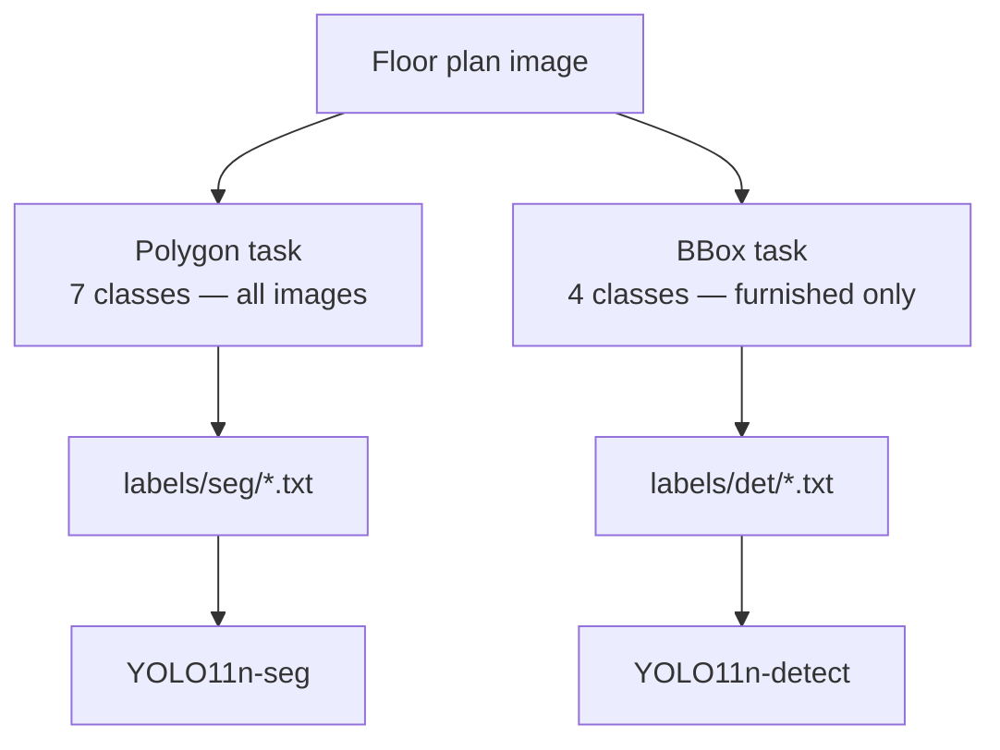

# Prototype 11-Class Training Plan — IMPROVED_MODEL_1

**Version:** 1.0  
**Date:** 2026-06-11  
**Status:** Documentation only — no training, no dataset changes  
**Source analysis:** `docs/CLASS_SUPPORT_ANALYSIS.md`  
**Config:** `data/prototype_11_classes.yaml`

---

## 1. Executive summary

The prototype model targets **11 BIM classes** that balance **dataset support**, **BIM demonstration value**, and **annotation feasibility** on the cleaned corpus (347 images).

| Group | Classes | Annotation | Corpus support |
|-------|---------|------------|----------------|
| Structural | wall, door, window | Polygon | 99–100% |
| Rooms | bedroom, living_room, kitchen, bathroom | Polygon | ~96% |
| Symbols | bed, wc, sink, stove | Bounding box | ~25% (furnished subset) |

This plan supersedes the earlier **3-class structural-only** prototype scope while keeping the same YOLO training toolchain.

---

## 2. Final prototype taxonomy

### YOLO prototype IDs (0–10)

| Proto ID | Class | Production ID | Group | Annotation type | CVAT color |
|---------:|-------|--------------:|-------|-----------------|------------|
| 0 | wall | 0 | structural | **polygon** | `#FF0000` |
| 1 | door | 1 | structural | **polygon** | `#00CC00` |
| 2 | window | 2 | structural | **polygon** | `#0066FF` |
| 3 | bedroom | 5 | rooms | **polygon** | `#FFE066` |
| 4 | living_room | 7 | rooms | **polygon** | `#66CCFF` |
| 5 | kitchen | 9 | rooms | **polygon** | `#FF9999` |
| 6 | bathroom | 10 | rooms | **polygon** | `#66CCCC` |
| 7 | bed | 15 | furniture | **bounding box** | `#8B4513` |
| 8 | wc | 27 | fixtures | **bounding box** | `#E0E0E0` |
| 9 | sink | 31 | fixtures | **bounding box** | `#5F9EA0` |
| 10 | stove | 32 | appliances | **bounding box** | `#FF4500` |

**`nc: 11`** — contiguous IDs for prototype training configs.

Production IDs preserve compatibility with the 37-class master schema (`data/classes.yaml`).

---

## 3. Why these 11 classes

Derived from class support analysis (347 images):

| Class | Images | Support | Rationale |
|-------|-------:|---------|-----------|
| wall, door, window | 347 | High | BIM shell — required for IFC |
| bedroom, living_room, kitchen, bathroom | 334 | High | Room-aware BuildingAnalysis JSON |
| bed, wc, sink, stove | 81–86 | Medium | Top symbols in furnished subset; client-visible interior detail |

**Not included (deferred):** dining_table, wardrobe, sofa — lower priority than `bed` for bedroom-centric demos; add in production Phase 3.

---

## 4. Mixed annotation strategy

### Polygon classes (all images)

Annotate on **every** prototype image:

- wall, door, window
- bedroom, living_room, kitchen, bathroom

**Export:** YOLO 1.1 segmentation → `labels/seg/{train,val}/`

### Bounding box classes (furnished images only)

Annotate **only when the symbol is drawn**:

- bed, wc, sink, stove

On line-drawing-only plans without furniture symbols: **no bbox labels** (negative image for detection head).

**Export:** YOLO detection → `labels/det/{train,val}/`

### Training approach (future — not in scope now)

| Model | Classes | Task |
|-------|---------|------|
| YOLO11n-seg | 0–6 | Instance segmentation |
| YOLO11n-detect | 7–10 | Object detection |

Merge outputs at inference → unified detection JSON for graph builder.

---

## 5. Image selection guidance

Do **not** modify existing datasets. When building a new annotation batch:

| Split | Count | Profile |
|-------|------:|---------|
| Train | 70% | Mix: mostly line-drawing + ≥25% furnished |
| Val | 20% | Hold-out; include 2+ furnished |
| Test | 10% | Optional; for demo only |

**Per batch size:**

| Batch | Line-drawing | Furnished | Notes |
|-------|-------------:|----------:|-------|
| 10 | 7–8 | 2–3 | Minimum viable demo |
| 25 | 18–20 | 5–7 | Recommended pilot |
| 50 | 36–38 | 12–14 | Stable mAP estimates |

Source pool: `dataset_clean/images/` (347 images, read-only reference).

---

## 6. Annotation effort estimation

**Assumptions:** CVAT, one trained annotator, mixed polygon + bbox, QC review +30%.

| Component | Time |
|-----------|-----:|
| Structural polygons (3 classes) | 8–12 min |
| Room polygons (4 classes) | 10–14 min |
| Symbol bboxes (0–4 classes, when present) | 0–10 min |
| **Weighted average per image** | **~32 min** |

Weighting: 75% line-drawing (~28 min) + 25% furnished (~38 min).

### Effort by batch size

| Images | Base hours | +30% QC | Calendar (1 annotator) | Team |
|-------:|-----------:|--------:|-----------------------:|------|
| **10** | 5.3 h | **6.9 h** | 1.0 day | 1 annotator |
| **25** | 13.3 h | **17.3 h** | 2.2 days | 1–2 annotators |
| **50** | 26.7 h | **34.7 h** | 4.5 days | 2 annotators + reviewer |

### Effort breakdown by batch

| Images | Polygon labels (est.) | Bbox labels (est.) | Total instances (est.) |
|-------:|----------------------:|-------------------:|-----------------------:|
| 10 | ~70 room + ~120 structural | ~15–25 symbols | ~200–215 |
| 25 | ~175 + ~300 | ~40–60 symbols | ~515–535 |
| 50 | ~350 + ~600 | ~80–120 symbols | ~1,030–1,070 |

---

## 7. CVAT project setup

1. Create project **IMPROVED_MODEL_1_Prototype_11**
2. Import labels from `data/prototype_11_classes.yaml`
3. Create **two task types** (or one task with both shape types enabled):
   - Polygons: classes 0–6
   - Rectangles: classes 7–10
4. Subset tag: `furnished` vs `line_drawing` for symbol workflow
5. Export seg and det separately per §4

---

## 8. Quality gates (pre-training)

- [ ] All 11 class names match `prototype_11_classes.yaml`
- [ ] Polygon classes present on 100% of batch images
- [ ] Bbox classes only on images where symbols exist
- [ ] No annotation of dimension text / title blocks
- [ ] `wc` ≠ bathroom room polygon (fixture vs space)
- [ ] Val set reviewed by second annotator
- [ ] `nc: 11` verified in dataset yaml before any training run

---

## 9. Expected outcomes (post-training targets)

*For planning only — training not started.*

| Component | Metric target | Risk |
|-----------|---------------|------|
| wall / door / window | mAP50 ≥ 0.75 | Thin lines, door/window confusion |
| rooms | mAP50 ≥ 0.65 | Open-plan boundary ambiguity |
| bed / wc / sink / stove | mAP50 ≥ 0.45 | Small sample size; class imbalance |
| BIM JSON | Valid BuildingAnalysis on val | Graph builder not yet wired |
| vs Gemini | Measurable wall IoU improvement | Gemini baseline not automated |

---

## 10. Related documents

| Document | Purpose |
|----------|---------|
| `data/prototype_11_classes.yaml` | Canonical 11-class config |
| `docs/ANNOTATION_GUIDELINES.md` | Per-class annotation rules (v1.1) |
| `docs/CLASS_SUPPORT_ANALYSIS.md` | Dataset support evidence |
| `data/classes.yaml` | Full 37-class production schema |
| `data/prototype_classes.yaml` | Legacy 3-class config (superseded) |

---

## 11. Next steps (documentation phase complete)

1. Select 10 / 25 / 50 images from `dataset_clean/images/` into a **new** annotation folder (do not alter `dataset_clean/`)
2. Annotate per `docs/ANNOTATION_GUIDELINES.md` §4
3. Export seg + det labels
4. Run training only after QC sign-off
